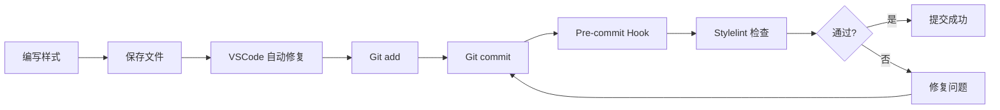

# 7. Stylelint 和样式工具链配置

> Commit: `50c5c44` - feat(style): 集成 Stylelint、Tailwind CSS 和 SCSS 支持

本文档详细说明了项目中样式工具链的配置，包括 Stylelint、Tailwind CSS 和 SCSS 的集成。

## 目录

- [概述](#概述)
- [Stylelint 配置](#stylelint-配置)
- [Tailwind CSS 配置](#tailwind-css-配置)
- [SCSS 支持](#scss-支持)
- [使用指南](#使用指南)
- [VSCode 集成](#vscode-集成)
- [测试文件](#测试文件)
- [FAQ](#faq)

## 概述

### 新增工具

| 工具              | 版本     | 用途               |
| ----------------- | -------- | ------------------ |
| Stylelint         | ^16.26.1 | CSS/SCSS 代码检查  |
| Tailwind CSS      | ^4.1.18  | 原子化 CSS 框架    |
| @tailwindcss/vite | ^4.1.18  | Tailwind Vite 插件 |
| Sass              | ^1.97.1  | CSS 预处理器       |

### 架构说明

```
样式工具链
├── 源文件 (.scss/.vue)
├── Sass 编译器 → CSS
├── Vite + @tailwindcss/vite 插件
├── Stylelint 检查
└── 输出文件
```

> **注意：** 从 Tailwind CSS v4 开始，推荐使用 `@tailwindcss/vite` 插件直接集成到 Vite，而不是通过 PostCSS。这种方式性能更好、配置更简洁。

## Stylelint 配置

### 配置文件

**`stylelint.config.js`**

```javascript
export default {
  extends: [
    'stylelint-config-standard',
    'stylelint-config-standard-scss',
    'stylelint-config-recommended-vue/scss',
  ],
  plugins: ['stylelint-order'],
  overrides: [
    {
      files: ['**/*.vue'],
      customSyntax: 'postcss-html',
      rules: {
        'selector-pseudo-class-no-unknown': [
          true,
          {
            ignorePseudoClasses: ['deep', 'slotted', 'global'],
          },
        ],
      },
    },
    {
      files: ['**/*.scss', '**/*.sass'],
      customSyntax: 'postcss-scss',
    },
  ],
  rules: {
    // 允许驼峰命名的 JS 变量（用于 v-bind()）
    'value-keyword-case': null,

    // 样式块内部语句排序
    'order/order': [
      [
        'dollar-variables', // 1. SCSS 变量
        'custom-properties', // 2. CSS 自定义属性
        'at-rules', // 3. @规则
        'declarations', // 4. CSS 属性
        {
          name: 'supports',
          type: 'at-rule', // 5. @supports
        },
        {
          name: 'media',
          type: 'at-rule', // 6. @media
        },
        {
          name: 'include',
          type: 'at-rule', // 7. @include
        },
        'rules', // 8. 嵌套规则
      ],
      { severity: 'error' },
    ],

    // CSS 属性排序（按功能分组）
    'order/properties-order': [
      // 1. 定位 (Positioning)
      'position',
      'top',
      'right',
      'bottom',
      'left',
      'z-index',

      // 2. 盒模型 (Box Model)
      'display',
      'flex',
      'flex-direction' /* ... */,

      // 3. 排版 (Typography)
      'color',
      'font',
      'font-size' /* ... */,

      // 4. 视觉效果 (Visual)
      'background',
      'border',
      'border-radius' /* ... */,

      // 5. 变换和动画
      'transform',
      'transition',
      'animation',

      // 6. 其他
      'cursor',
      'pointer-events',
      'user-select',
    ],

    // 支持 Tailwind CSS 指令（scss/at-rule-no-unknown 对 CSS/SCSS/Vue 文件均生效）
    'scss/at-rule-no-unknown': [
      true,
      {
        ignoreAtRules: [
          'tailwind',
          'apply',
          'layer',
          'config',
          'variants',
          'responsive',
          'screen',
        ],
      },
    ],
  },
}
```

### 忽略文件

**`.stylelintignore`**

```
# 构建产物
**/dist/
**/build/
**/.output/

# 依赖
**/node_modules/

# 其他
**/.husky/
```

### 支持的文件类型

- ✅ `.css` - 标准 CSS 文件
- ✅ `.scss` / `.sass` - SCSS/Sass 文件
- ✅ `.vue` - Vue 单文件组件的 `<style>` 块
- ❌ `.jsx` / `.tsx` - 不检查（JSX/TSX 使用外部样式文件）

### 关键规则说明

#### 1. Vue 特殊伪类支持

```scss
// ✅ 允许的 Vue 伪类
:deep(.child-component) {
}
:slotted(div) {
}
:global(.utility-class) {
}
```

#### 2. Vue v-bind() 函数

```scss
<script setup>
const themeColor = ref('#42b883')
</script>

<style scoped>
.element {
  // ✅ 允许驼峰命名的变量
  color: v-bind(themeColor);
}
</style>
```

#### 3. 属性排序示例

```scss
.example {
  // ✅ 正确的排序

  // 1. 定位
  position: absolute;
  top: 0;
  left: 0;

  // 2. 盒模型
  display: flex;
  width: 100%;
  padding: 1rem;

  // 3. 排版
  color: #333;
  font-size: 1rem;

  // 4. 视觉
  background: #fff;
  border: 1px solid #ddd;

  // 5. 动画
  transition: all 0.3s;

  // 6. 其他
  cursor: pointer;
}
```

## Tailwind CSS 配置

### 安装位置

Tailwind CSS 仅安装在 `apps/vue3-app`，而不是全局安装。

### 配置方式

Tailwind CSS v4 推荐使用 **Vite 插件方式**，直接集成到 Vite 构建流程中。

**`apps/vue3-app/vite.config.ts`**

```typescript
import { fileURLToPath, URL } from 'node:url'

import { defineConfig } from 'vite'
import vue from '@vitejs/plugin-vue'
import vueJsx from '@vitejs/plugin-vue-jsx'
import vueDevTools from 'vite-plugin-vue-devtools'
import tailwindcss from '@tailwindcss/vite'

export default defineConfig({
  plugins: [vue(), vueJsx(), tailwindcss(), vueDevTools()],
  resolve: {
    alias: {
      '@': fileURLToPath(new URL('./src', import.meta.url)),
    },
  },
})
```

**`apps/vue3-app/src/assets/scss/index.scss`**

```scss
@use 'tailwindcss';
@use './scrollbar';

// 其他全局样式...
```

> **注意：** 使用 `@use` 而非 `@import` 导入 Tailwind CSS，以避免 Sass 废弃警告。`@tailwindcss/vite` 插件会正确处理这个导入。

### 对比：Vite 插件 vs PostCSS

| 对比项         | Vite 插件方式 (推荐)    | PostCSS 方式              |
| -------------- | ----------------------- | ------------------------- |
| **包名**       | `@tailwindcss/vite`     | `@tailwindcss/postcss`    |
| **配置文件**   | vite.config.ts          | postcss.config.js         |
| **处理流程**   | Vite → Tailwind（直接） | Vite → PostCSS → Tailwind |
| **性能**       | ⚡ 更快                 | 较慢                      |
| **配置复杂度** | 🎯 更简洁               | 需要额外配置文件          |

### 如需使用 PostCSS 插件

如果你需要使用其他 PostCSS 插件（如 `postcss-pxtorem`、`postcss-px-to-viewport`），可以同时使用 `@tailwindcss/vite` 和 PostCSS：

```js
// postcss.config.js
export default {
  plugins: {
    // px 转 vw（移动端适配）
    'postcss-px-to-viewport-8-plugin': {
      viewportWidth: 375,
      unitPrecision: 5,
      viewportUnit: 'vw',
    },
    // 或者 px 转 rem
    // 'postcss-pxtorem': {
    //   rootValue: 16,
    //   propList: ['*'],
    // },
  },
}
```

> **注意：** 不需要在 PostCSS 配置中添加 Tailwind，因为已经由 Vite 插件处理了。

### 使用方式

#### 在 Vue SFC 中

```vue
<template>
  <div class="flex items-center justify-center p-4 bg-blue-500">
    <h1 class="text-2xl text-white">Hello Tailwind</h1>
  </div>
</template>
```

#### 使用 @apply

```scss
<style scoped lang="scss">
.custom-button {
  @apply px-4 py-2 bg-blue-500 text-white rounded;

  &:hover {
    @apply bg-blue-600;
  }
}
</style>
```

#### 使用 @layer

```scss
@layer components {
  .btn-primary {
    @apply bg-blue-500 text-white px-4 py-2 rounded;
  }
}
```

## SCSS 支持

### 依赖安装

```json
{
  "devDependencies": {
    "sass": "^1.97.1"
  }
}
```

> **注意：** Vite 内置支持 Sass，只需安装 `sass` 包即可，不需要 `sass-loader`（Webpack 项目才需要）。

### 项目结构

```
apps/vue3-app/src/assets/scss/
├── index.scss        # 全局样式入口
├── mixins.scss       # SCSS Mixins
├── scrollbar.scss    # 滚动条样式
└── stylelint-test.scss  # 测试文件
```

### 现代 SCSS 语法

#### @use 和 @forward

```scss
// ✅ 使用现代语法
@use 'sass:color';
@use 'sass:math';

$primary: #42b883;

.element {
  background: color.adjust($primary, $lightness: 10%);
  padding: math.div(1rem, 2);
}
```

```scss
// ❌ 避免使用旧语法
@import 'colors'; // 不推荐
```

#### Mixins 示例

**`mixins.scss`**

```scss
/** 文本溢出时显示省略号 */
@mixin text-ellipsis {
  overflow: hidden;
  white-space: nowrap;
  text-overflow: ellipsis;
}

@mixin scroll-bar {
  scrollbar-width: none;
}
```

使用：

```scss
@use './mixins' as *;

.text {
  @include text-ellipsis;
}
```

### 在 Vue 组件中使用

```vue
<style scoped lang="scss">
@use 'sass:color';

$primary-color: #42b883;

.component {
  color: $primary-color;

  &:hover {
    color: color.adjust($primary-color, $lightness: -10%);
  }
}
</style>
```

## 使用指南

### 可用命令

```bash
# 检查所有样式文件
pnpm run lint:style

# 自动修复样式问题
pnpm run lint:style:fix
```

### Git Hooks

#### Pre-commit

提交前自动运行（通过 lint-staged）：

```yaml
'*.{js,jsx,ts,tsx}':
  - eslint --fix
  - prettier --write

'*.vue':
  - eslint --fix
  - stylelint --fix
  - prettier --write

'*.{css,scss,sass}':
  - stylelint --fix
  - prettier --write
```

> **说明：** `.vue` 文件单独处理，避免 prettier 被执行两次。

### 工作流程



## VSCode 集成

### 配置说明

**`.vscode/settings.json`**

```json
{
  "editor.codeActionsOnSave": {
    "source.fixAll.eslint": "explicit",
    "source.fixAll.stylelint": "explicit"
  },

  "stylelint.enable": true,
  "stylelint.validate": ["css", "scss", "sass", "vue"],
  "stylelint.snippet": ["css", "scss", "sass", "vue"],

  "css.validate": false,
  "scss.validate": false
}
```

### 必需的 VSCode 插件

- [Stylelint](https://marketplace.visualstudio.com/items?itemName=stylelint.vscode-stylelint) - CSS/SCSS 代码检查
- [Prettier](https://marketplace.visualstudio.com/items?itemName=esbenp.prettier-vscode) - 代码格式化
- [Tailwind CSS IntelliSense](https://marketplace.visualstudio.com/items?itemName=bradlc.vscode-tailwindcss) - Tailwind 智能提示

### 功能特性

- ✅ **实时错误提示** - 编辑时显示 Stylelint 错误
- ✅ **保存时自动修复** - 保存文件时自动修复可修复的问题
- ✅ **代码补全** - Tailwind 类名智能提示
- ✅ **悬停文档** - 鼠标悬停显示样式规则说明

## 测试文件

项目包含完整的测试文件用于验证配置：

### SCSS 测试文件

**`apps/vue3-app/src/assets/scss/stylelint-test.scss`**

验证内容：

- ✅ Tailwind 指令（`@tailwind`, `@apply`, `@layer`）
- ✅ SCSS 现代语法（`@use`, `@forward`）
- ✅ 变量命名（kebab-case）
- ✅ Mixin 和 Include
- ✅ 响应式设计（`@screen`）

### Vue 组件测试文件

**`apps/vue3-app/src/components/StylelintTest.vue`**

验证内容：

- ✅ Vue 伪类（`:deep()`, `:global()`, `:slotted()`）
- ✅ `v-bind()` 函数
- ✅ 语句排序（`order/order`）
- ✅ 属性排序（`order/properties-order`）
- ✅ Tailwind `@apply`

### JSX/TSX 样式处理

**`apps/vue3-app/src/components/StylelintJsxTest.tsx` + `.scss`**

演示正确的做法：

```tsx
// ✅ JSX 组件引入外部样式
import './StylelintJsxTest.scss'

export default defineComponent({
  /* ... */
})
```

```scss
// ✅ Stylelint 检查外部 SCSS 文件
.jsx-test {
  display: flex;
}
```

## FAQ

### Q: 为什么不检查 JSX/TSX 文件？

**A:** JSX/TSX 文件主要包含 JavaScript/TypeScript 代码，不是 CSS。样式应该写在外部 `.scss` 文件中，由 Stylelint 检查外部文件。

### Q: Stylelint 和 Prettier 会冲突吗？

**A:** 不会。Stylelint 负责代码质量检查（如规则、顺序），Prettier 负责代码格式化（如缩进、换行）。两者职责不同，互补。

### Q: 如何禁用某个规则？

**A:** 在 `stylelint.config.js` 中设置规则为 `null`：

```javascript
rules: {
  'rule-name': null,
}
```

或在代码中使用注释：

```scss
/* stylelint-disable rule-name */
.element {
  /* ... */
}
/* stylelint-enable rule-name */
```

### Q: 属性排序规则太严格了，可以关闭吗？

**A:** 可以。删除或注释掉 `order/properties-order` 规则：

```javascript
rules: {
  // 'order/properties-order': [/* ... */],
}
```

但建议保留，统一的排序有助于团队协作和代码可读性。

### Q: 如何在新的应用中使用这些配置？

**A:** 只需安装依赖并配置 Vite 插件：

```bash
# 全局配置（已在根 package.json 中）
# - Stylelint 相关包已安装

# 应用特定配置
cd apps/your-app
pnpm add -D tailwindcss @tailwindcss/vite sass
```

然后在 `vite.config.ts` 中添加 Tailwind 插件：

```typescript
import tailwindcss from '@tailwindcss/vite'

export default defineConfig({
  plugins: [
    // 其他插件...
    tailwindcss(),
  ],
})
```

配置会自动继承根目录的 `stylelint.config.js`。

## 相关文档

- [Stylelint 官方文档](https://stylelint.io/)
- [Tailwind CSS 文档](https://tailwindcss.com/)
- [Sass 文档](https://sass-lang.com/)
- [PostCSS 文档](https://postcss.org/)

## 版本历史

- **v1.0.0** (2025-12-20) - 初始集成
  - 添加 Stylelint 配置
  - 集成 Tailwind CSS
  - 添加 SCSS 支持
  - 创建测试文件
- **v1.0.1** (2025-12-20) - 配置优化
  - 调整 Stylelint extends 顺序
  - 优化 lint-staged 配置避免重复执行 prettier
  - 移除 Vite 项目不需要的 sass-loader
  - 使用 @tailwindcss/postcss 适配 Tailwind CSS v4
- **v1.1.0** (2025-12-21) - 迁移到 Vite 插件
  - 从 `@tailwindcss/postcss` 迁移到 `@tailwindcss/vite`
  - 移除 `postcss.config.js` 配置文件
  - 移除 `autoprefixer` 和 `postcss` 依赖
  - 更新 `vite.config.ts` 添加 Tailwind 插件
  - 性能提升：直接集成到 Vite 构建流程

---

📝 **文档更新时间：** 2025-12-21
🔗 **相关 Commit：** `50c5c440a14477769606f21b47f6d931fed48ea8`
