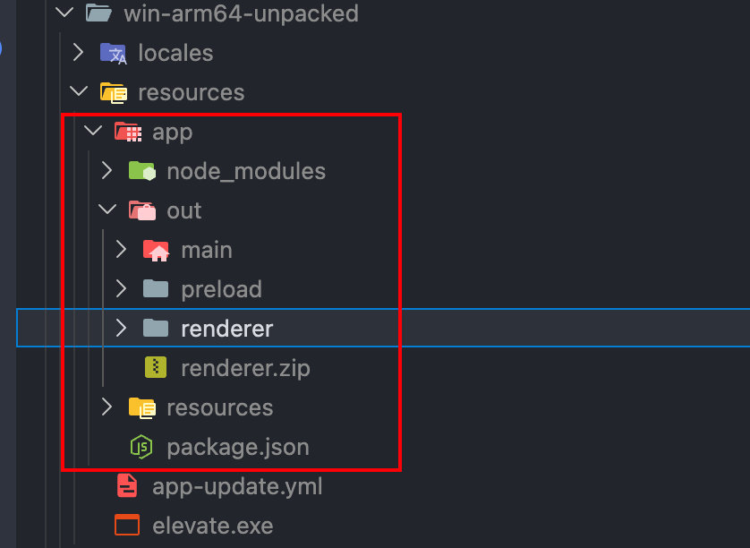
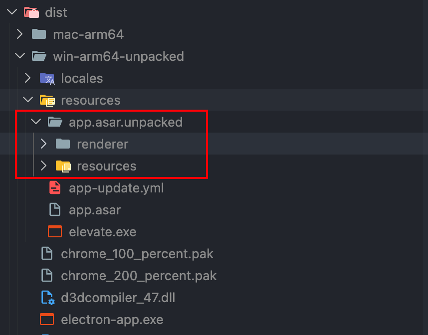

<script setup>
import fullUpdateFlowXml from './drawio/full-update-flow.drawio?raw'
</script>

# Electron 热更新方案

本文说明 Electron 应用的两条更新路径：通过完整安装包做版本升级，以及在不走完整安装包升级时，如何通过替换本地资源实现热更新。

## 更新流程

完整安装包更新覆盖主进程、preload、依赖与渲染进程，适合涉及主进程逻辑、原生模块或 Electron 版本变更的场景。整体分为「检查更新 → 下载 → 校验 → 安装重启」四个阶段：

<ClientOnly>
  <DrawioViewer :data="fullUpdateFlowXml" />
</ClientOnly>

### 全量更新产物上传 OSS

electron-builder 完整打包结束后，`dist/` 下会产出多份文件，但需要上传到 OSS / CDN 作为更新源的只是其中的安装包 + 校验信息 + 元数据。客户端走 electron-updater 时，会先拉 `latest*.yml` 拿到版本号与 `url`，再下载对应的安装包并用 `.blockmap` 做差分校验。

#### Windows

| 必传文件                      | 作用                                                                                                  |
| ----------------------------- | ----------------------------------------------------------------------------------------------------- |
| `<artifactName>.exe`          | NSIS 安装包（artifactName 由 electron-builder 配置决定，例如 `electron-base_PRO_1.0.0_20260514.exe`） |
| `<artifactName>.exe.blockmap` | 安装包的分块哈希，autoUpdater 只下载变化的块以省带宽                                                  |
| `latest.yml`                  | autoUpdater 元数据，含 `version` / `path` / `sha512` / `size`                                         |

#### macOS

| 必传文件                          | 作用                                                             |
| --------------------------------- | ---------------------------------------------------------------- |
| `<artifactName>-mac.zip`          | autoUpdater 实际下载并自动替换的产物（macOS 上走 zip，不走 dmg） |
| `<artifactName>-mac.zip.blockmap` | zip 的分块哈希                                                   |
| `<artifactName>.dmg`              | DMG 安装镜像，仅供用户首次手动安装下载                           |
| `<artifactName>.dmg.blockmap`     | DMG 的分块哈希                                                   |
| `latest-mac.yml`                  | autoUpdater 元数据                                               |

::: tip 路径与架构注意

- `latest.yml` / `latest-mac.yml` 内的 `path` / `url` 字段是相对路径，**上传时保持与 `.yml` 同级目录**，否则 autoUpdater 拉取安装包会 404。
- 不同 CPU 架构（arm64 / x64 / universal）需要分别打包与上传，相同目录下共存时由文件名区分；可选择按架构拆 OSS 路径再分别配置 `publish.url`。
  :::

## 背景：为什么要避开直接替换 app.asar

Electron 打包后通常会在 `resources` 目录下生成 `app.asar`。它在运行时会被 Electron 当成虚拟文件系统读取，大多数 `fs` 与 `require` 场景可以像读普通目录一样工作，但归档文件本身是只读的；如果应用正在运行，直接替换 `app.asar` 也容易受文件占用、签名与平台差异影响。

因此，增量更新一般会把“可变部分”移出 `app.asar`，或者直接关闭 `asar`，让需要替换的内容以真实目录存在。常见的两条路线如下：

| 方案                           | 更新粒度                          | 适用场景                                      |
| ------------------------------ | --------------------------------- | --------------------------------------------- |
| `asar:false`                   | 替换整个 `resources/app` 目录     | 实现最简单，可接受增量包偏大、源码暴露更多    |
| `app.asar.unpacked + app.asar` | 替换 `app.asar.unpacked/renderer` | 主进程保持在 `app.asar`，只热更新渲染进程资源 |

## 方案一：asar:false

`asar:false` 的核心思路是让 electron-builder 不生成 `app.asar`，而是在 `resources` 下保留真实的 `app` 目录。运行中的应用目录可以直接删除、解压、替换，因此流程最直接。

### 打包配置

在 `electron-builder.yml` 中关闭 `asar`：

```js [electron-builder.yml]
files:
  - '!**/.vscode/*'
  - '!src/*'
  - '!electron.vite.config.{js,ts,mjs,cjs}'
  - '!{.eslintignore,.eslintrc.cjs,.prettierignore,.prettierrc.yaml,dev-app-update.yml,CHANGELOG.md,README.md}'
  - '!{.env,.env.*,.npmrc,pnpm-lock.yaml}'
  - '!server/**'
asar: false // [!code ++]
asarUnpack:
  - resources/**
```



后续增量包只需要把新的 `resources/app` 压成 `app.zip`，放到更新服务即可。

### 主进程替换 app 目录

主进程收到 `app.zip` 后，关键是把压缩包落到 `resources` 目录，并把新版本的 `app` 目录解压到同一个 `resources` 目录下：

```js [src/main/ipcRenderer.js]
path.join(app.getAppPath(), '../')
```

这套方案的路径计算依赖 `asar:false`：

- 此时 `app.getAppPath()` 指向 `resources/app`
- 也就是说，`app.zip` 应该解压到 `resources`
- 并保证解压后的目录结构仍然是 `resources/app`。

目录替换完成后，需要重启应用让新的主进程、preload 和渲染进程资源重新加载：

```js [src/main/ipcRenderer.js]
app.relaunch() // 准备重启应用
app.quit() // 关闭当前应用实例，触发重启
```

### 优缺点

| 项目 | 说明                                                                                     |
| ---- | ---------------------------------------------------------------------------------------- |
| 优点 | 实现成本低，主进程、preload、渲染进程都能通过同一个 `app.zip` 更新                       |
| 缺点 | `resources/app` 是真实目录，源码暴露更多；替换时需要整体删除应用目录，失败恢复要额外处理 |

## 方案二：app.asar.unpacked + app.asar

该方案保留默认的 `app.asar`，但把渲染进程产物额外复制到 `app.asar.unpacked/renderer`。应用启动时不再从 `app.asar` 读取 `renderer/index.html`，而是读取 unpacked 目录；热更新时也只替换这个 renderer 目录。

### 分离渲染进程打包

要让渲染进程能够独立增量构建，需要先把原来的 `electron.vite.config.mjs` 拆分成 `main` 与 `renderer` 两份配置，再用一份聚合配置组合起来供完整构建复用。

`build/config/main.js` 仅声明主进程与 preload 的配置：

```js [build/config/main.js]
import { defineConfig, externalizeDepsPlugin } from 'electron-vite'

export const mainConfig = {
  main: {
    plugins: [externalizeDepsPlugin()],
  },
  preload: {
    plugins: [externalizeDepsPlugin()],
  },
}

export default defineConfig(mainConfig)
```

`build/config/renderer.js` 仅声明渲染进程的配置：

```js [build/config/renderer.js]
import path from 'path'
import { defineConfig } from 'electron-vite'
import vue from '@vitejs/plugin-vue'

const getResolvePath = (dir) => path.resolve(process.cwd(), dir)

export const rendererConfig = {
  renderer: {
    resolve: {
      alias: {
        '@': getResolvePath('src/renderer/src'),
      },
    },
    plugins: [vue()],
  },
}

export default defineConfig(rendererConfig)
```

`build/config/electron-vite.js` 把两份配置合并，供完整安装包构建使用：

```js [build/config/electron-vite.js]
import { defineConfig } from 'electron-vite'

import { mainConfig } from './main.js'
import { rendererConfig } from './renderer.js'

export default defineConfig({
  ...mainConfig,
  ...rendererConfig,
})
```

`package.json` 中新增独立构建渲染进程增量包的脚本，开发与完整构建走聚合配置，`build:renderer` 单独走 renderer 配置：

```json [package.json]
{
  "scripts": {
    "dev": "electron-vite dev --watch --config build/config/electron-vite.js", // [!code ++]
    "build": "electron-vite build --config build/config/electron-vite.js", // [!code ++]
    "build:renderer": "electron-vite build --config build/config/renderer.js" // [!code ++]
  }
}
```

至此 `pnpm build:renderer` 会只产出渲染进程文件到 `out/renderer`，为后续打成增量包做好准备。

### 压缩 renderer 插件

`out/renderer` 还需要被压缩成 `renderer.zip` 才能下发。通过自定义一个 Rollup 插件，在 `writeBundle` 阶段把构建产物压缩到 `out/renderer.zip`（跟 renderer 产物同目录最直观，再通过下文的 `electron-builder.yml` 显式排除，避免它被打入 `app.asar`）：

```js [build/plugins/rollup-plugin-compress-renderer.js]
import path from 'path'
import AdmZip from 'adm-zip'

const NAME = 'compress-renderer'

export default function compressRendererPlugin(params = {}) {
  return {
    name: NAME,

    async writeBundle(options) {
      // 默认值
      Object.assign(params, {
        // 输出到 out/renderer.zip，跟 renderer 产物同目录；
        // electron-builder.yml 已在 files 中排除该文件，不会被打入 app.asar
        outputPath: path.join(options.dir, '../renderer.zip'),
      })

      const zip = new AdmZip()
      zip.addLocalFolder(options.dir)
      zip.writeZip(params.outputPath)
      console.log(`${NAME} successful！`)
      console.log(`${NAME} path: ${params.outputPath}`)

      // TODO: 上传OSS
    },
  }
}
```

为了不影响完整构建，渲染进程配置中通过命令行参数 `--compress` 控制插件是否启用：

```js [build/config/renderer.js]
import compressRenderer from '../plugins/rollup-plugin-compress-renderer.js' // [!code ++]

const isCompressRenderer = process.argv.includes('--compress') // [!code ++]

export const rendererConfig = {
  renderer: {
    // ...
    plugins: [vue(), isCompressRenderer && compressRenderer()], // [!code ++]
  },
}
```

最后给 `build:renderer` 脚本附加 `-- --compress`，让独立构建时才触发压缩：

```json [package.json]
{
  "scripts": {
    "build:renderer": "electron-vite build --config build/config/renderer.js", // [!code --]
    "build:renderer": "electron-vite build --config build/config/renderer.js -- --compress" // [!code ++]
  }
}
```

执行 `pnpm build:renderer` 后即可得到 `out/renderer.zip`。

::: warning 产物落地仍需补一步
`out/renderer.zip` 只是构建产物的临时落点，更新服务并不会主动来取。要让客户端真的能下载到新包，还得做一步搬运：

- **本地调试**：手动把它拷贝到更新服务的静态目录（例如示例工程里的 `server/static/renderer.zip`）。
- **生产环境**：把插件里的 `// TODO: 上传OSS` 落实成 OSS / CDN / 文件服务器上传逻辑，或在 CI 里追加一步 `cp` / `oss-cli` 上传。

否则增量包永远停留在本地 `out/` 目录，客户端拉不到。
:::

### electron-builder 配置

初始安装包需要同时包含 `app.asar` 和可替换的 renderer 目录，相对 `asar:false` 方案主要改动如下：

```yaml [electron-builder.yml]
# 直接复制到应用程序的资源目录 // [!code ++]
extraResources: // [!code ++]
  # 指定复制到 app.asar.unpacked 目录 // [!code ++]
  - { from: 'out/renderer', to: 'app.asar.unpacked/renderer' } // [!code ++]

# 打包后会放入到 app.asar 文件中 // [!code ++]
files:
  - '!**/.vscode/*'
  - '!src/*'
  - '!electron.vite.config.{js,ts,mjs,cjs}'
  - '!{.eslintignore,.eslintrc.cjs,.prettierignore,.prettierrc.yaml,dev-app-update.yml,CHANGELOG.md,README.md}'
  - '!{.env,.env.*,.npmrc,pnpm-lock.yaml}'
  - '!server/**'
  - '!out/renderer/**' # 复制到 app.asar.unpacked/renderer // [!code ++]
  - '!out/renderer.zip' # 渲染进程增量包，不能打入 app.asar // [!code ++]

# 不会产生 app.asar 而是一个 app 文件夹 // [!code --]
// [!code --]
asar: false

# 指定创建 asar 存档时要解压的文件 // [!code ++]
# app.asar & app.asar.unpacked 都会有一份 // [!code ++]
asarUnpack:
  - resources/**
```

这里有三个关键点：

- `extraResources` 把 `out/renderer` 复制到最终安装目录的 `resources/app.asar.unpacked/renderer`
- `files` 排除 `out/renderer/**`，避免 renderer 源文件同时进入 `app.asar`
- `files` 排除 `out/renderer.zip`，跟压缩插件的输出位置呼应，确保增量包不会被误打入 `app.asar`

最终结构（以 Windows 产物为例）：

```txt
resources/
├── app-update.yml                   ← 自动更新配置
├── app.asar                         ← 主进程、preload、依赖等稳定部分
├── app.asar.unpacked/
│   ├── renderer/                    ← 由 extraResources 复制，可替换的渲染进程资源
│   └── resources/                   ← 由 asarUnpack: resources/** 解出的真实目录
└── elevate.exe                      ← Windows 平台权限提升辅助文件
```

`asarUnpack: resources/**` 会让命中的文件同时以两种形态存在：一份留在 `app.asar` 里，另一份解压到 `app.asar.unpacked/` 同名路径。Electron 在运行时会优先读取 unpacked 目录中的文件，这对 Node 原生模块、需要走真实文件路径的资源（图标、日志等）尤其重要。



### 启动时加载 unpacked renderer

因为 renderer 已被移到 `app.asar.unpacked`，生产环境的 `loadFile` 也要同步调整：

```js [src/main/index.js]
// 正常模式 - 访问 app.asar 文件 // [!code --]
mainWindow.loadFile(join(__dirname, '../renderer/index.html')) // [!code --]

// 使用 app.asar.unpacked 访问 // [!code ++]
// [!code ++]
const UNPACKED_DIR = join(
  app.getAppPath(), // [!code ++]
  '../app.asar.unpacked/renderer/index.html', // [!code ++]
) // [!code ++]
mainWindow.loadFile(UNPACKED_DIR) // [!code ++]
```

当 `asar` 开启时，`app.getAppPath()` 指向 `resources/app.asar`；拼接 `../app.asar.unpacked/renderer/index.html` 后，就会落到同级的 unpacked renderer 入口。

### 只替换 renderer.zip

主进程将 `renderer.zip` 写入并解压到 `resources/app.asar.unpacked` 下，覆盖原有的 `renderer` 目录：

- 替换路径：`resources/app.asar.unpacked/renderer`
- 重启方案：渲染进程执行 `window.location.reload()` 即可生效。

```js
// app.getAppPath() 指向 resources/app
const UNPACKED_DIR = path.join(app.getAppPath(), '../app.asar.unpacked')
const TMEP_DIR_PATH = path.join(UNPACKED_DIR, 'tempPackage')
const PACKAGE_DIR = path.join(UNPACKED_DIR, 'renderer')

// 读取 zip & 解压文件夹 app
const zip = new AdmZip(zipPath)
zip.extractAllTo(PACKAGE_DIR, true)
// 删除临时目录
fsPromises.rm(TMEP_DIR_PATH, { recursive: true })
```

## 进阶：按环境区分安装包名与快捷方式名

热更新跑通之后，多环境并行（生产 / UAT / 体验等）会带来另一类问题：用户机器上同时存在多个环境的安装包时，安装文件名、桌面快捷方式都长一样，发包、回归、用户反馈都难以对齐。把 `electron-builder.yml` 换成 `electron-builder.config.js`，借助 Node 能力按环境拼名字即可解决。

### 把 yml 配置升级为 js 配置

`electron-builder` 既支持 yml 也支持 js，换成 js 后才能拿到 `process.env`、`process.argv`，再通过 `--mode` 把环境写进文件名。

原 `electron-builder.yml` 的所有打包字段（`files` / `extraResources` / `asarUnpack` / 各平台配置等）都直接搬过来，下面只保留与「环境区分」相关的关键代码：

```js [electron-builder.config.js]
import dayjs from 'dayjs'

/** 打包环境 - [PRO | UAT] */
const env = (function () {
  const mode = /--mode\s+(\w+)|$/.exec(process.env.npm_lifecycle_script)[1]
  return mode ? mode.toUpperCase() : 'PRO'
})()

/** 安装包名 - electron-base_PRO_1.0.0_20241005 */
const artifactName = `\${productName}_${env}_\${version}_${dayjs().format('YYYYMMDD')}`

const config = {
  // ...其它配置从 electron-builder.yml 平移，此处省略

  nsis: {
    artifactName: `${artifactName}.\${ext}`,
    shortcutName: '${productName}',
    // ...其它 nsis 字段
  },
  dmg: {
    artifactName: `${artifactName}.\${ext}`,
  },
}

// 非正式环境，把环境信息也带进快捷方式名
if (env !== 'PRO') {
  config.nsis.shortcutName = artifactName
}

export default config
```

几个关键点：

- `env` 通过解析 `process.env.npm_lifecycle_script` 中的 `--mode` 参数得到，没传则默认 `PRO`。
- `artifactName` 使用 electron-builder 模板字符串占位（`${productName}` / `${version}`）拼接环境名与日期，最终形如 `electron-base_UAT_1.0.0_20241005.exe`。
- 仅在非正式环境覆写 `nsis.shortcutName`，正式环境快捷方式保持纯净的 `${productName}`，避免日常用户看到一串日期和环境标识。

### 配套的 `package.json` 脚本

把渲染进程独立构建脚本拆得更细，每种环境给一条快捷指令；打包脚本统一指向新的 `electron-builder.config.js`：

```json [package.json]
{
  "scripts": {
    "build:renderer": "npm run typecheck:web && electron-vite build -c build/config/renderer.ts", // [!code ++]
    "build:renderer-pro": "npm run build:renderer -- -- --compress", // [!code ++]
    "build:renderer-uat": "npm run build:renderer -- --mode uat -- --compress", // [!code ++]

    "build:win": "npm run build && electron-builder --win", // [!code --]
    "build:win": "npm run build && electron-builder -c electron-builder.config.js --win", // [!code ++]
    "build:win-uat": "npm run build -- --mode uat && electron-builder -c electron-builder.config.js --win", // [!code ++]
    "build:mac": "npm run build && electron-builder --mac", // [!code --]
    "build:mac": "npm run build && electron-builder -c electron-builder.config.js --mac", // [!code ++]
    "build:mac-uat": "npm run build -- --mode uat && electron-builder -c electron-builder.config.js --mac" // [!code ++]
  }
}
```

要点：

- `build:renderer-uat` 用 `-- --mode uat -- --compress` 同时把 `--mode uat` 透传给 electron-vite、把 `--compress` 透传给 rollup 插件。
- 完整安装包脚本（`build:win` / `build:mac` 等）显式 `-c electron-builder.config.js`，让新的 js 配置接管打包流程；UAT 包对应 `build:win-uat` / `build:mac-uat`，构建主进程时同样带上 `--mode uat`。
- 新增 `dayjs` 作为生产依赖，便于在 config 里拼日期。

配上一个空的 `.env.uat` 文件作为 mode 标记，electron-vite 在解析到 `--mode uat` 时就会按 UAT 环境读取相应的 dotenv 文件，渲染进程里通过 `import.meta.env` 即可拿到对应环境的注入。

## 参考资料

- [Electron 增量更新（一） - SegmentFault 思否](https://segmentfault.com/a/1190000039747461)
- [Electron 官方文档：ASAR Archives](https://www.electronjs.org/docs/latest/tutorial/asar-archives)
- [electron-builder 文档：Application Contents](https://www.electron.build/contents.html)
- [electron-builder 文档：Programmatic Usage](https://www.electron.build/configuration/configuration#using-electron-builderyml)
