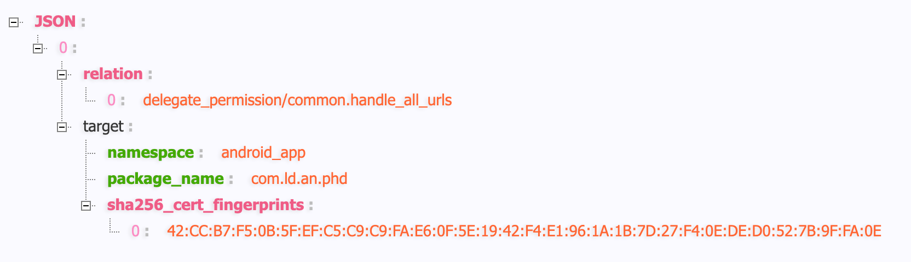
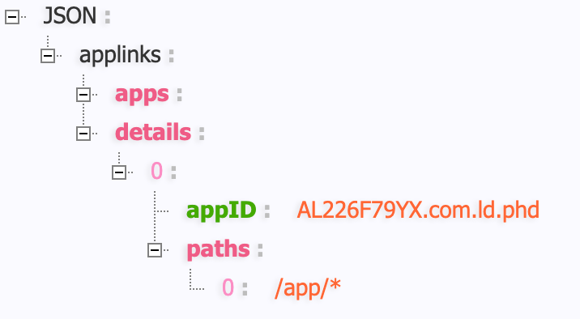

# 移动端深链与应用商店跳转

本文整理 Electron / Web 页面唤起移动端 App、跳转 App Store / Google Play，以及 iOS Universal Links、Android App Links 的配置与排查方法。下面的示例会直接结合 `jrgkfc-app_build` 里的真实实现。

移动端唤起通常不是一个单独链接能解决的问题，而是一套「优先打开 App，失败后进入商店或落地页」的链路。可以把它拆成三层：

| 链路                                | 示例                                                                                                                  | 适用场景                                    | 主要风险                                                     |
| ----------------------------------- | --------------------------------------------------------------------------------------------------------------------- | ------------------------------------------- | ------------------------------------------------------------ |
| 自定义 Scheme                       | `kfc://order/detail?id=1001`                                                                                          | 已安装 App 时快速打开指定页面               | scheme 可被其他 App 抢注，浏览器兼容性不稳定                 |
| Universal Links / Android App Links | `https://app.example.com/order/1001`                                                                                  | 推荐的生产方案，未安装时仍能访问 Web 落地页 | 需要服务端托管校验文件，签名和域名配置必须匹配               |
| 应用商店链接                        | `https://itunes.apple.com/hk/app/id1580884918`、`https://play.google.com/store/apps/details?id=com.kfchk.app.and2021` | App 未安装时引导下载                        | 第三方内置浏览器可能拦截，Google Play 在部分网络环境下不可达 |

推荐顺序是：优先使用 Universal Links / Android App Links；只在兼容旧版本或特定渠道时补充自定义 scheme；最后提供清晰可点击的商店链接作为兜底。

::: warning 浏览器兼容性不要只看 Safari
飞书原始记录里提到：Safari 中模拟点击可用，但 Chrome 中模拟点击不生效；QQ、夸克、Firefox、系统浏览器等在 iOS / Android 上也可能无法按预期唤起 App。实际方案必须以用户主动点击为入口，并给出显式兜底按钮。
:::

## 一、自定义 Scheme

自定义 Scheme 是最基础的唤起方式，形如 `kfc://order/detail?id=1001`。只要 App 已安装就能跳转到指定页面，但它可被其他 App 抢注，部分浏览器也会拦截非 HTTP 协议跳转。项目中注册了 `kfchkhk`（生产）和 `kfchkuat`（UAT）两个 scheme。

### Android 配置

在 `AndroidManifest.xml` 中为 Activity 添加 intent-filter：

```xml [android/app/src/main/AndroidManifest.xml]
<activity
  android:name=".MainActivity"
  android:exported="true">
  <intent-filter>
    <action android:name="android.intent.action.VIEW" />

    <category android:name="android.intent.category.DEFAULT" />
    <category android:name="android.intent.category.BROWSABLE" />

    <data android:scheme="kfchkhk" />
    <data android:scheme="kfchkuat" />
  </intent-filter>
</activity>
```

| 字段                                         | 建议                                           |
| -------------------------------------------- | ---------------------------------------------- |
| `android:scheme`                             | 始终使用小写字母，例如 `kfchkhk`               |
| `android:host`                               | 始终使用小写字母，例如 `order`                 |
| `android:pathPrefix` / `android:pathPattern` | 用来限制具体页面范围，避免一个入口吞掉所有路径 |

### iOS 配置

在 `Info.plist` 中通过 `CFBundleURLSchemes` 注册 scheme：

```xml [ios/kfc/Info.plist]
<key>CFBundleURLSchemes</key>
<array>
  <string>kfchkhk</string>
</array>
```

```xml [ios/kfc/Info.plist]
<key>CFBundleURLSchemes</key>
<array>
  <string>kfchkuat</string>
</array>
```

在 `AppDelegate.m` 中将 URL 转交给 React Native：

```objc [ios/kfc/AppDelegate.m]
if ([RCTLinkingManager application:app openURL:url options:options]) {
  return YES;
}
```

### React Native 接收逻辑

项目里有一个专门的 `YuuOpenApp`，负责把启动时 URL 和运行中 URL 都接住：

```ts [src/utils/YuuOpenApp.ts]
Linking.getInitialURL().then((url) => this.handleYuuScheme({ url }))
Linking.addEventListener('url', this.handleYuuScheme)
```

它会先剥掉 scheme，再解析 query 参数：

```ts [src/utils/YuuOpenApp.ts]
const urlWithoutScheme = url.split('://')[1]
```

路由层在启动时挂载监听：

```ts [src/routes.tsx]
YuuOpenApp.mountListen()
```

### getInitialURL 与 addEventListener 的区别

两者对应 App 的两种启动状态，必须同时注册，否则会漏掉其中一种场景：

|          | `getInitialURL()`                      | `addEventListener('url')`                |
| -------- | -------------------------------------- | ---------------------------------------- |
| 触发时机 | App **冷启动**（未运行状态被链接唤起） | App **已在运行**时收到新链接             |
| 调用方式 | 主动读取，只能取一次，之后返回 `null`  | 持续监听，每次收到链接都触发             |
| 清理     | 不需要                                 | 组件卸载时需调用 `subscription.remove()` |

也可以使用更通用的封装：

```ts [src/linking.ts]
import { Linking } from 'react-native'

export async function getInitialDeepLink() {
  const initialUrl = await Linking.getInitialURL()

  if (!initialUrl) {
    return null
  }

  return new URL(initialUrl)
}

export function listenDeepLink(onUrl: (url: URL) => void) {
  const subscription = Linking.addEventListener('url', (event) => {
    onUrl(new URL(event.url))
  })

  return () => subscription.remove()
}
```

::: warning Android 冷启动时序问题
`getInitialURL()` 在 Android 上可能有时序问题：导航容器尚未初始化时就拿到了 URL，跳转会静默失败。需要等导航容器 ready 后再调用，或将跳转延迟到首屏渲染完成之后。
:::

::: tip 真机验证优先
`Linking.getInitialURL()` 在模拟器中可能返回 `null`。深链、Universal Links 和 App Links 都应该用真机跑完整链路，模拟器只适合做早期联调。
:::

## 二、Universal Links / Android App Links

Universal Links（iOS）和 Android App Links 都基于 HTTPS 域名，本质是让 App 与域名建立双向信任：App 声明自己支持某些域名，域名通过校验文件声明哪些 App 可以接管哪些路径。未安装时链接仍能访问 Web 落地页，是推荐的生产方案。

### Android App Links

**客户端：** 在 `AndroidManifest.xml` 中添加带 `autoVerify` 的 intent-filter：

```xml [android/app/src/main/AndroidManifest.xml]
<activity
  android:name=".MainActivity"
  android:exported="true">
  <intent-filter android:autoVerify="true">
    <action android:name="android.intent.action.VIEW" />

    <category android:name="android.intent.category.DEFAULT" />
    <category android:name="android.intent.category.BROWSABLE" />

    <data
      android:scheme="https"
      android:host="payment.uat.kfc.com.hk"
      android:pathPrefix="/app/" />
  </intent-filter>
</activity>
```

**服务端：** 在固定地址提供 `assetlinks.json`：

```text
https://app.example.com/.well-known/assetlinks.json
```



#### 如何获取 SHA-256 指纹

`sha256_cert_fingerprints` 的来源取决于是否启用了 **Play App Signing**（现在新应用默认开启）：

**启用了 Play App Signing（推荐）**

Google 会用自己的密钥对 APK 重新签名，本地 keystore 的指纹与最终安装包**不同**，必须从 Play Console 获取：

> Play Console → 你的应用 → 发布 → 设置 → **应用签名** → 应用签名密钥证书 → SHA-256

**未启用 Play App Signing（自签名分发）**

从本地 keystore 获取：

```bash
keytool -list -v -keystore your.keystore -alias your-alias
```

**从已安装的 APK 直接读取**

```bash
apksigner verify --print-certs your-app.apk
```

::: warning 最常见的错误
开启了 Play App Signing 却把本地 keystore 的指纹填进 `assetlinks.json`，导致 App Links 验证始终失败、点击 HTTPS 链接只打开浏览器。务必区分「上传证书」和「应用签名证书」。
:::

#### 签名相关的排查重点

| 问题                       | 说明                                                                                                                                       |
| -------------------------- | ------------------------------------------------------------------------------------------------------------------------------------------ |
| 测试包能打开，正式包打不开 | `assetlinks.json` 里的 SHA-256 可能写的是 debug 签名或上传证书，不是 Play App Signing 的应用签名证书                                       |
| 换包名后全部失效           | `package_name` 必须与最终安装包一致                                                                                                        |
| 国内设备验证失败           | 设备无法访问 Google Play 或 Android App Links 验证服务；**安装应用时必须开启 VPN**，否则 `autoVerify` 验证请求被墙，App Links 永远不会生效 |

### iOS Universal Links

**客户端：** 在 Xcode 的 `Signing & Capabilities` 中增加 `Associated Domains`，`kfc.entitlements` 中添加：

```xml [ios/kfc/kfc.entitlements]
<key>com.apple.developer.associated-domains</key>
<array>
  <string>applinks:payment.uat.kfc.com.hk</string>
</array>
```

如果要支持多个子域名，需要分别配置。`app.example.com` 和 `m.example.com` 是两个不同域名，不能只写一个就期待另一个自动生效。

**服务端：** 在固定地址提供 AASA 文件（无 `.json` 后缀，不能重定向）：

```text
https://app.example.com/.well-known/apple-app-site-association
```



`appIDs` 由 `Team ID + Bundle ID` 组成。路径匹配应尽量收敛，不要为了省事把所有路径都交给 App。

在 `AppDelegate.m` 中将活动转交给 React Native：

```objc [ios/kfc/AppDelegate.m]
return [RCTLinkingManager application:app continueUserActivity:userActivity restorationHandler:restorationHandler];
```

::: warning 修改 AASA 后要考虑系统缓存
iOS 会缓存 Associated Domains 的校验结果。修改 AASA 或 Associated Domains 配置后，建议卸载 App 后重新安装，并用真机重新验证。
:::

## 三、应用商店链接

应用商店链接是「App 未安装」时的最终兜底，也是自定义 scheme 跳转失败后最常见的降级目标。

### Android

Android 侧优先拉起应用市场原生协议，失败后回退到 Google Play 网页链接，这也是 `AppUtils.updateVersion()` 里实际采用的策略：

```java [android/app/src/main/java/com/jrg/kfc/utils/AppUtils.java]
// 优先：唤起本机应用市场
intent.setData(Uri.parse("market://details?id=" + context.getPackageName()));
```

```java [android/app/src/main/java/com/jrg/kfc/utils/AppUtils.java]
// 兜底：设备无应用市场时跳转网页版 Google Play
intent2.setData(Uri.parse("https://play.google.com/store/apps/details?id=" + context.getPackageName()));
```

### iOS / App Store

iOS 侧直接跳转 iTunes 链接，URL 中包含地区和应用 ID：

```js [public/OpenKFCApp.html]
appOpenDom.addEventListener('click', function () {
  if (isIOS) {
    window.location.href = 'https://itunes.apple.com/hk/app/id1580884918'
  } else if (isAndroid) {
    window.location.href =
      'https://play.google.com/store/apps/details?id=com.kfchk.app.and2021'
  }
})
```

### H5 落地页的完整兜底逻辑

`public/OpenKFCApp.html` 把「打开 App」这个动作做成了一个可访问的 H5 落地页，完整的优先级链路是：

1. 根据域名区分 UAT / 生产，拼出对应 scheme URL。
2. 手机端优先通过 `<a>` 标签点击拉起 App。
3. 桌面端直接回退到 H5 首页。
4. 用户手动点击图标时，iOS 去 App Store，Android 去 Google Play。

```js [public/OpenKFCApp.html]
var isUAT = location.hostname === 'www.uat.kfc.com.hk'
var appUrl = (isUAT ? 'kfchkuat' : 'kfchk') + `://kff${location.search}`
var H5Url = isUAT ? 'https://www.uat.kfc.com.hk' : 'https://www.kfc.com.hk'

if (isPhone()) {
  document.getElementById('linkApp').href = appUrl
  document.getElementById('linkApp').click()
} else {
  window.location.href = H5Url
}
```

页面还会针对微信和支付宝内置浏览器弹出引导层，提示用户右上角「在浏览器打开」。

如果入口是通用 H5 页面，核心约束是必须由用户手势触发。不要依赖页面加载后自动跳转，也不要把「不可见 iframe + 定时器」当成唯一方案：

```ts [src/utils/open-app.ts]
interface OpenAppOptions {
  appLink: string
  schemeUrl?: string
  storeUrl: string
  fallbackDelay?: number
}

export function openAppWithFallback(options: OpenAppOptions) {
  const { appLink, schemeUrl, storeUrl, fallbackDelay = 1500 } = options
  const startedAt = Date.now()
  const targetUrl = appLink || schemeUrl

  if (!targetUrl) {
    window.location.href = storeUrl
    return
  }

  const fallbackTimer = window.setTimeout(() => {
    const stillOnPage = Date.now() - startedAt < fallbackDelay + 500

    if (stillOnPage) {
      window.location.href = storeUrl
    }
  }, fallbackDelay)

  window.addEventListener(
    'pagehide',
    () => {
      window.clearTimeout(fallbackTimer)
    },
    { once: true },
  )

  window.location.href = targetUrl
}
```

调用时把 Universal Links / Android App Links 放在第一优先级：

```ts [src/pages/download.ts]
openAppWithFallback({
  appLink: 'https://app.example.com/order/1001',
  schemeUrl: 'kfc://order/detail?id=1001',
  storeUrl:
    'https://play.google.com/store/apps/details?id=com.kfchk.app.and2021',
})
```

::: tip 兜底页要可操作
第三方内置浏览器经常拦截 scheme 或忽略模拟点击。落地页上应该同时提供「打开 App」「前往应用商店」「复制链接」三个动作，让用户在异常浏览器里也能继续。
:::

## 打开指定页面

不管是 Android 还是 iOS，最终都要把 URL 参数转成 App 内路由。约定 URL 时建议保持一条规则：

```text
https://app.example.com/order/1001?from=electron
kfc://order/detail?id=1001&from=electron
```

App 启动后只做两件事：

1. 解析 URL，得到业务资源类型、资源 ID 和来源参数。
2. 校验参数合法性，再跳转到对应原生页面或 React Native 页面。

React Native 中可用 `Linking.getInitialURL()` 获取冷启动 URL，用 `Linking.addEventListener('url', handler)` 处理运行中的 URL 事件。

## 调试清单

| 现象                                  | 优先检查                                                                                                                                             |
| ------------------------------------- | ---------------------------------------------------------------------------------------------------------------------------------------------------- |
| iOS 点击 HTTPS 链接只打开网页         | `Associated Domains` 是否包含 `applinks:域名`；AASA 路径是否正确；是否发生 301 / 302；是否重新安装 App                                               |
| iOS 在浏览器地址栏输入 URL 不唤起 App | 这是系统行为，直接在地址栏输入通常会留在浏览器内；请从页面链接、短信、备忘录等真实点击入口测试                                                       |
| Android 点击 HTTPS 链接只打开浏览器   | `android:autoVerify`、`assetlinks.json`、包名、SHA-256 指纹和路径是否匹配；国内设备**安装时必须开启 VPN**，否则验证请求被墙导致 App Links 永远不生效 |
| 自定义 scheme 在某些浏览器无效        | 浏览器可能拦截非 HTTP 协议；改用 Universal Links / Android App Links，并保留商店兜底                                                                 |
| Chrome 模拟点击无效                   | 必须由用户手势触发，按钮点击比脚本自动触发更可靠                                                                                                     |
| Google Play 链接打不开                | 国内设备必须开启 VPN；检查应用是否已在对应地区发布、URL 中的包名是否正确                                                                             |

## 相关链接

- [Electron shell.openExternal](https://www.electronjs.org/docs/latest/api/shell)
- [Android Deep Links](https://developer.android.com/training/app-links?hl=zh-cn)
- [Android `<data>` manifest element](https://developer.android.com/guide/topics/manifest/data-element?hl=zh-cn)
- [Linking to Google Play](https://developer.android.com/distribute/marketing-tools/linking-to-google-play?hl=zh-cn)
- [Apple Supporting associated domains](https://developer.apple.com/documentation/Xcode/supporting-associated-domains)
- [Apple Debugging universal links](https://developer.apple.com/documentation/Technotes/tn3155-debugging-universal-links)
- [React Native Linking](https://reactnative.dev/docs/linking)
- [trip中转页](https://triplink.trip.com/forward/triplink/middlepage)
