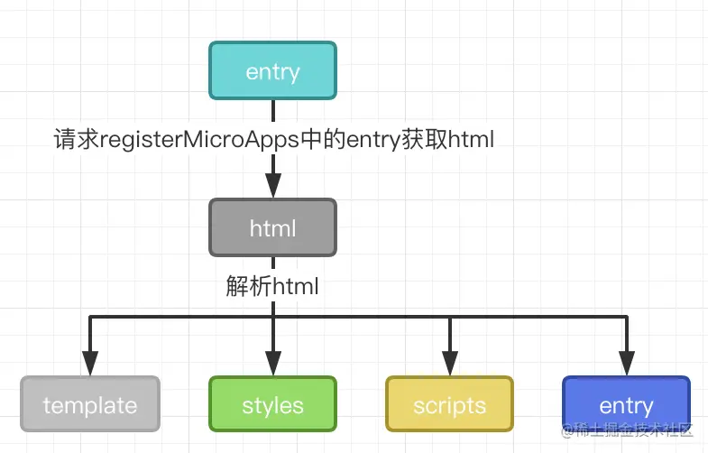
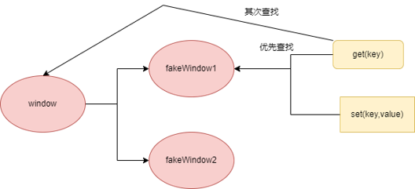

<script setup>
import execScriptsFlowXml from './drawio/qiankun-principle-exec-scripts-flow.drawio?raw'
</script>

# qiankun 微前端原理

本文从应用加载链路解释 qiankun 如何把一个独立子应用加载到主应用中，并最终执行子应用暴露出的生命周期函数。

## 为什么不用 iframe

iframe 在隔离层面几乎是"完美方案"——它给子应用一个独立的浏览上下文，**JS、CSS、DOM 三层都天然隔离**，接入也只需要一行 `<iframe src>`，几乎 0 心智负担。但正是这种"完美隔离"在 SPA 场景下变成了无法接受的代价。

| 维度         | iframe 的代价                                                              |
| ------------ | -------------------------------------------------------------------------- |
| **路由状态** | 主应用刷新后 iframe 内的 URL 状态丢失，前进 / 后退也无法和主应用历史栈联动 |
| **DOM 边界** | 弹窗等组件被困在 iframe 内部，无法覆盖到主应用全局                         |
| **应用通信** | 只能走 `postMessage` / `localStorage` 等迂回通道                           |

## qiankun 核心思想

一句话概括 qiankun 在做什么：

> **监听主应用路由变化，按需加载对应子应用的资源，并在隔离环境中执行子应用的 JS，调用其暴露的生命周期。**

| 关键动作     | 解决的问题                                                    |
| ------------ | ------------------------------------------------------------- |
| **监听路由** | 知道当前应该激活哪个子应用、卸载哪个子应用                    |
| **加载资源** | 把独立部署的子应用 HTML / CSS / JS 拉到主应用页面里           |
| **JS 沙箱**  | 让子应用以为自己独占 `window` 和样式作用域，互不污染          |
| **生命周期** | 用统一协议（`bootstrap` / `mount` / `unmount`）控制子应用启停 |

## 整体链路

qiankun 的核心思路是 **HTML Entry + 生命周期驱动 + 运行时沙箱**。

主应用并不是直接引入子应用的某个 JS 模块，而是把子应用入口当成一个 HTML 页面来加载。qiankun 借助 `import-html-entry` 解析这个 HTML，拿到处理后的 HTML 模板、外部 CSS、外部 JS，并在沙箱中执行入口 JS。入口 JS 执行完成后，qiankun 从导出对象或全局变量中读取 `bootstrap`、`mount`、`unmount` 等生命周期，再交给主应用按路由激活和卸载。

```text
主应用匹配到子应用路由
  ↓
loadMicroApp / registerMicroApps 触发加载
  ↓
请求子应用入口 HTML
  ↓
解析 HTML：收集 CSS、JS、入口脚本
  ↓
拉取外部 CSS，并内联回 HTML 模板
  ↓
创建子应用容器与沙箱
  ↓
按顺序拉取并执行 JS
  ↓
从 entry exports / window[appName] 读取生命周期
  ↓
调用 bootstrap / mount / unmount
```

### 1. 加载并解析入口 HTML

路由命中某个子应用后，主应用通过 qiankun 暴露的 `loadMicroApp()`（手动加载）或 `registerMicroApps()`（注册式自动加载）触发加载流程。qiankun 内部把请求和解析子应用 HTML 的职责委托给 `import-html-entry` 库——这就是它"HTML Entry"模式的核心实现，调用入口是 `importEntry(entry, importEntryOpts)`：

```ts
const { template, execScripts, assetPublicPath, getExternalScripts } =
  await importEntry(entry, importEntryOpts)
```

这一步的产物很关键：

| 字段                 | 作用                                          |
| -------------------- | --------------------------------------------- |
| `template`           | 已处理的 HTML 模板，外部 CSS 会被内联到模板里 |
| `execScripts`        | 脚本执行器，用于在沙箱中执行子应用 JS         |
| `assetPublicPath`    | 子应用资源公共路径，用于补全相对资源地址      |
| `getExternalScripts` | 预拉取外部 JS，便于提前发现入口资源加载问题   |

拿到 HTML 后，`import-html-entry` 调用 `processTpl()` 解析模板，主要做三件事：

1. 收集外部 CSS 地址 `<link rel="stylesheet">`，并把原标签替换成占位注释；
1. 收集外部 JS 地址和内联脚本内容，同样替换成占位注释；
   1. 外部脚本只记录 `src`，不会立刻 fetch，等沙箱创建后由 `execScripts()` 统一请求并通过 eval 执行；
   1. 内联脚本直接保留代码文本，同样进沙箱后再 eval；
1. 把上一步收集到的 `<link>` / `<script>` 相对路径，按子应用 `entry` 补成完整 URL。

例如子应用 HTML 中有：

```html
<link rel="stylesheet" href="/assets/index.css" />
<script src="/assets/vendor.js"></script>
<script src="/assets/index.js" entry></script>
```

当子应用入口是 `http://localhost:8101/` 时，解析后会得到：

```text
styles:
  http://localhost:8101/assets/index.css

scripts:
  http://localhost:8101/assets/vendor.js
  http://localhost:8101/assets/index.js

entry:
  http://localhost:8101/assets/index.js
```



::: tip 为什么要补成完整 URL
子应用 HTML 是在主应用页面里被解析和执行的。如果继续保留 `/assets/index.js` 这种根路径，浏览器会按主应用 origin 解析，资源就可能请求到主应用服务上。本项目的 [Vite 动态修改 base](../qiankun/asset-path) 也在围绕这个问题做进一步治理。
:::

### 2. 外部 CSS 请求后内联到 entry HTML 中

`import-html-entry` 在拿到 CSS 地址后，会请求外部 CSS 内容，并用 `<style>` 替换原来的 `<link>` 占位。

转换前：

```html
<link rel="stylesheet" href="http://localhost:8101/assets/index.css" />
```

转换后：

```html
<style>
  /* http://localhost:8101/assets/index.css */
  .page {
    color: #1677ff;
  }
</style>
```

完成这一步后会生成 `render` 函数，render函数用于把上述的template插入到应用基座上。render函数会在single-spa里的mount生命周期中执行，即放入到registerApplication的app参数的返回的mount属性里。

### 3. 创建 js 沙箱

### 4. 加载外部 JS 并在沙箱中执行

第 1 节里 `processTpl()` 已经把 `<script>` 抽成了一份 URL 列表，但脚本本身还没下载、没执行。沙箱准备就绪后，qiankun 调用 `execScripts(proxy, strictGlobal)`：

<ClientOnly>
  <DrawioViewer :data="execScriptsFlowXml" />
</ClientOnly>

`getExecutableScript` 把每段 JS 文本包成一个 IIFE，再通过 `bind` 把代理对象注入：

```ts
// window.proxy 就是 qiankun 为当前子应用创建的 Proxy 沙箱
;(function (window, self, globalThis) {
  with (window) {
    // 子应用 JS 文本
  }
}).bind(window.proxy)(window.proxy, window.proxy, window.proxy)
```

最终上面包装后的代码会用eval执行。

### 5. 获取生命周期并交给 single-spa 调度

入口脚本跑完后，qiankun 通过 `getLifecyclesFromExports` 在沙箱里寻找子应用暴露的生命周期，按以下优先级回退：

1. **入口脚本的执行结果**：UMD / CommonJS 写法（`module.exports = { bootstrap, mount, unmount }`）下，`execScripts` 把最后一条表达式或 `module.exports` 作为返回值；
1. **沙箱最近被赋值的全局变量**：对应 `window['my-app'] = { bootstrap, mount, unmount }` 这种"挂全局"的写法。`ProxySandbox.set` 会记录最后一次写入的 key（源码字段名 `globalLatestSetProp`），直接从沙箱里取出来；
1. **`window[appName]` 兜底**：上一条没命中时，按应用名再从代理上读一次；

三步都拿不到合法生命周期，qiankun 会抛出 `You need to export lifecycle functions in ${appName} entry`。

合法的生命周期形态：

```ts
export type MicroAppLifecycle = {
  bootstrap: () => Promise<void> | void
  mount: (props: Record<string, unknown>) => Promise<void> | void
  unmount: (props: Record<string, unknown>) => Promise<void> | void
  update?: (props: Record<string, unknown>) => Promise<void> | void
}
```

拿到生命周期后，qiankun 会把它包装成 single-spa 的 parcel 配置交给路由层；之后主应用按路由和应用状态触发：

| 生命周期    | 触发时机                       | 子应用通常做什么                           |
| ----------- | ------------------------------ | ------------------------------------------ |
| `bootstrap` | 子应用首次初始化               | 准备一次性资源，通常保持轻量               |
| `mount`     | 路由命中并需要展示子应用       | 创建框架实例，挂载到主应用分配的容器       |
| `unmount`   | 路由离开、标签关闭或应用被释放 | 卸载框架实例，清理事件、定时器、状态上下文 |
| `update`    | 手动加载场景下更新 props       | 响应主应用传入参数变化                     |

## JS 隔离

子应用的 JS 在主应用页面里执行，意味着默认情况下它对 `window`、`document`、定时器、事件监听都是直接读写的。qiankun 的 JS 隔离要解决的核心问题是：**让子应用以为自己运行在独立的全局环境里，但又能在卸载时把所有副作用清理干净**。

::: tip 参考

- [Garfish：其他副作用](https://www.garfishjs.org/guide/concept/sandbox.html#%E5%85%B6%E4%BB%96%E5%89%AF%E4%BD%9C%E7%94%A8)

:::

### 沙箱到底在解决什么问题

很容易把 JS 沙箱简单理解成"隔离不同子应用之间 `window` 上的全局变量"。这个说法只覆盖了最显眼的一层。更准确的表述是：

> **沙箱是给每个子应用画出一个"可回收的副作用边界"——既阻止运行期互相干扰，更关键的是在卸载时能把所有副作用还原干净。**

它要解决的事可以拆成三层：

1. **运行期隔离**：A 写 `window.lodash = v3`，B 不应该读到。fakeWindow 让每个子应用看到自己的私有全局空间。
1. **卸载时的副作用回收**：定时器、`addEventListener`、动态 `appendChild` 这些**都不在 `window` 上**，但都需要按子应用维度收集与清理。否则子应用卸载后心跳还在跑、事件还在响、DOM/样式还在残留。这就是 patcher 存在的原因。
1. **多实例并存**：`singular: false` 时多个子应用同屏运行，"前后切换不串扰"升级为"同时运行不串扰"。这一层只有每个子应用独立的 fakeWindow 才能支撑。

换个角度看，**沙箱本质上是一份"撤销日志"**：记下子应用从 mount 到 unmount 期间产生的一切修改（写 fakeWindow、注册定时器、挂事件、插 DOM/style），unmount 时按日志反向回放，把页面恢复到挂载前的状态。

### 两种代理沙箱模式

qiankun 基于 `Proxy` 提供了两种沙箱模式，按"单实例 / 多实例"切换：

| 模式                                  | 启用方式                 | 实现原理                                  | 适用场景                   |
| ------------------------------------- | ------------------------ | ----------------------------------------- | -------------------------- |
| `LegacyProxySandbox`<br/>单例代理沙箱 | `singular: true`（默认） | Proxy 拦截 `window` 写入<br/>记录修改快照 | 同一时间只有一个子应用运行 |
| `ProxySandbox`<br/>多例代理沙箱       | `singular: false`        | 每个子应用独立<br/>fakeWindow + Proxy     | 多个子应用同时运行         |

### 1. 代理沙箱：Proxy 拦截每一次全局写入

两种模式都基于 `Proxy`，关键想法是：**不让子应用真的写到 `window`，而是写到一个代理对象上**。

```ts
// 伪代码
class ProxySandbox {
  updatedValueSet = new Set<PropertyKey>()
  fakeWindow: Window = createFakeWindow()
  proxy: Window

  constructor() {
    this.proxy = new Proxy(this.fakeWindow, {
      set: (target, prop, value) => {
        if (this.sandboxRunning) {
          target[prop] = value
          this.updatedValueSet.add(prop)
        }
        return true
      },
      get: (target, prop) => {
        // 优先从 fakeWindow 读，读不到再 fallback 到真实 window
        if (prop in target) return target[prop]
        const value = (window as any)[prop]
        return typeof value === 'function' ? value.bind(window) : value
      },
    })
  }
}
```

::: details `window.proxy` 在源码中哪里赋值？

严格说，`window.proxy = proxy` 这行不在 [umijs/qiankun](https://github.com/umijs/qiankun) 仓库本体里，而在 qiankun 调用的 [import-html-entry](https://github.com/kuitos/import-html-entry) 脚本执行器里。qiankun 负责创建沙箱代理并传给 `execScripts()`，`import-html-entry` 再把这个代理临时挂到真实 `window.proxy` 上。

实际源码入口 1：qiankun 在 [`src/sandbox/proxySandbox.ts`](https://github.com/umijs/qiankun/blob/v2.10.16/src/sandbox/proxySandbox.ts) 中创建 `ProxySandbox.proxy`。下面是保留主干后的源码节选：

```ts [github.com/umijs/qiankun/src/sandbox/proxySandbox.ts]
const proxy = new Proxy(fakeWindow, {
  set: (target, p, value) => {
    // 写入 fakeWindow，并记录最近写入的全局 key
  },
  get: (target, p) => {
    // 优先读 fakeWindow，再回退到真实 window
  },
})

this.proxy = proxy
```

实际源码入口 2：qiankun 在 [`src/loader.ts`](https://github.com/umijs/qiankun/blob/v2.10.16/src/loader.ts) 的 `loadApp()` 中把 `sandboxContainer.instance.proxy` 作为脚本执行用的 `global`，传给 `execScripts()`。下面是保留关键语句后的源码节选：

```ts [github.com/umijs/qiankun/src/loader.ts]
sandboxContainer = createSandboxContainer(...)

// 用沙箱的代理对象作为接下来使用的全局对象
global = sandboxContainer.instance.proxy as typeof window

const scriptExports = await execScripts(global, sandbox && !useLooseSandbox, {
  scopedGlobalVariables: speedySandbox ? cachedGlobals : [],
})
```

实际源码入口 3：真正的 `window.proxy = proxy` 在 [`import-html-entry/src/index.js`](https://github.com/kuitos/import-html-entry/blob/v1.17.0/src/index.js) 的 `getExecutableScript()` 中。它收到 qiankun 传入的 `proxy` 后，先挂到真实全局对象，再生成 `bind(window.proxy)` 包装代码。下面是保留关键语句后的源码节选：

```js [github.com/kuitos/import-html-entry/src/index.js]
const globalWindow = (0, eval)('window')
globalWindow.proxy = proxy

return strictGlobal
  ? `;(function(window, self, globalThis){with(window){;${scriptText}
${sourceUrl}}}).bind(window.proxy)(window.proxy, window.proxy, window.proxy);`
  : `;(function(window, self, globalThis){;${scriptText}
${sourceUrl}}).bind(window.proxy)(window.proxy, window.proxy, window.proxy);`
```

合起来看，伪代码可以简化成这样：

```ts
const sandbox = new ProxySandbox()
const proxy = sandbox.proxy

// qiankun：把沙箱代理传给 HTML Entry 的脚本执行器
execScripts(proxy, true)

// import-html-entry：执行脚本文本前，把 proxy 暂挂到真实 window 上
window.proxy = proxy

eval(`
  (function (window, self, globalThis) {
    with (window) {
      // 子应用 JS 文本
    }
  }).bind(window.proxy)(window.proxy, window.proxy, window.proxy)
`)
```

所以，`vite-plugin-qiankun` 里访问到的 `window.proxy`，来源不是插件自己创建，而是 qiankun 创建的 `ProxySandbox.proxy` 经过 `import-html-entry` 暴露出来的沙箱代理。

:::



### 2. 副作用补丁：DOM、事件、定时器

光代理 `window` 还不够。子应用在运行时还会调用一类有副作用的 API，它们会绕过 `window` 直接污染主应用：

| 副作用类型                                             | qiankun 的处理                                         |
| ------------------------------------------------------ | ------------------------------------------------------ |
| `setTimeout` / `setInterval`                           | 记录每个子应用注册的定时器 ID，`unmount` 时统一 clear  |
| `addEventListener` 挂在 `window` / `document` 上的事件 | 记录监听器列表，`unmount` 时统一 `removeEventListener` |
| `document.body.appendChild(<script>)`                  | 拦截动态脚本，使其走沙箱执行链路                       |
| `document.head.appendChild(<style/link>)`              | 拦截动态样式，使其挂载到子应用容器，便于卸载时移除     |

这些 patch 集中在 qiankun 源码的 `sandbox/patchers` 目录下，统称 **patcher**。每个子应用 `mount` 时安装 patch，`unmount` 时执行 free 函数还原。这就是为什么子应用切换时，**不会出现"上一个子应用的定时器还在跑、监听器还没解绑"的脏状态**——前提是它通过沙箱 patch 的 API 注册的副作用。

::: warning 无法通过劫持进行收集的副作用：持久化存储与跨应用状态

- `localStorage` / `sessionStorage`
- `IndexedDB`
- `cookie`

:::

## CSS 隔离

CSS 隔离的目标和 JS 隔离类似——**让子应用样式只影响自己的 DOM 子树**——但实现路径完全不同。CSS 没有 Proxy 这种通用拦截机制，qiankun 的策略主要是 **DOM 改写** 和 **Shadow DOM** 两条路。

::: tip 参考

- [Module Federation：CSS 隔离方案对比](https://module-federation.io/zh/guide/basic/css-isolate.html)
- [Garfish：样式隔离](https://www.garfishjs.org/guide/concept/sandbox.html#%E6%A0%B7%E5%BC%8F%E9%9A%94%E7%A6%BB)

:::

### 1. 默认行为：内联 + 卸载清理

回顾第 2 节，qiankun 在加载阶段会把外部 CSS 拉取下来并内联成 `<style>` 节点，挂到子应用容器内。配合 patcher 对动态 `<style>` / `<link>` 的拦截，做到：

- 子应用样式节点全部挂在 `container` 子树下
- `unmount` 时容器被销毁，内嵌的所有样式节点一起被移除

**但这只解决了"卸载时清理"问题，没有解决"运行时不污染"问题**。子应用里如果有 `body { background: red }` 这种全局选择器，仍然会作用到主应用页面上。

### 2. `experimentalStyleIsolation`：运行时选择器改写

启用 `sandbox: { experimentalStyleIsolation: true }` 后，qiankun 会遍历子应用所有 `<style>` 节点，对每条规则的选择器加上属性前缀：

```css
/* 原始 */
.btn {
  color: red;
}
body {
  background: #fff;
}

/* 改写后（appName=app1） */
div[data-qiankun='app1'] .btn {
  color: red;
}
div[data-qiankun='app1'] {
  background: #fff;
}
```

缺点：

- 运行时遍历改写，首屏有一次额外开销；
- 弹出层挂在 `document.body` 时仍会逃出容器作用域。
- **不能阻止主应用样式污染子应用**；

#### 编译期等效方案：SCSS 嵌套

```scss
#crm {
  // 原本的 reset / 全局规则全部缩进一层
  * {
    box-sizing: border-box;
  }
  input {
    display: none;
  }
  // 业务样式照常写
  .btn {
    color: red;
  }
}
```

### 3. `strictStyleIsolation`：Shadow DOM 强隔离

启用 `sandbox: { strictStyleIsolation: true }` 后，qiankun 会在子应用容器里创建 Shadow Root，并把子应用模板挂到 Shadow Root 内：

```ts
// 伪代码
const containerElement = document.querySelector(container)
const shadow = containerElement.attachShadow({ mode: 'open' })
shadow.innerHTML = appContent
```

利用浏览器原生的 Shadow DOM 边界，得到双向隔离：

- 主应用 `<head>` 里的样式不会穿过 Shadow Root 影响子应用；
- 子应用样式节点挂在 Shadow Root 内，不会泄漏到主应用。

实现简单且边界清晰，但代价是工程上要处理三个典型问题：

1. **样式注入容器**：组件库（如 antd、antdv）默认把动态生成的样式插到 `document.head`，需要改写成 Shadow Root 内的容器（如 antd 的 `StyleProvider.container`）；
1. **弹出层容器**：`Modal` 默认挂到 `document.body`，会"逃出" Shadow，需要通过 `getPopupContainer` 指回 Shadow 内节点；

### 4. Vue Scoped 编译期组件级隔离

特点：

- **编译期完成**，0 运行时开销；
- 全局规则用 `:global(...)`，相当于退回原始选择器；

它解决的是"组件之间不互相污染"，**对全局选择器（`body`、`html`、`*`）和挂在 `document.body` 的弹出层无能为力**。

### 5. React CSS-in-JS：唯一类名

## 参考资料

- [qiankun](https://umijs.github.io/qiankun/zh)
- [Garfish](https://www.garfishjs.org/index.html)
- [module-federation](https://module-federation.io/zh/)
- [import-html-entry](https://github.com/kuitos/import-html-entry)
- [不懂qiankun原理?这篇文章五张图片带你迅速通晓](https://juejin.cn/post/7202246519080304697)
- [一图吃透Qiankun原理详细](https://juejin.cn/post/7369120920146886691)
