<script setup>
import lifecycleFlowXml from './drawio/vite-plugin-qiankun-lifecycle-flow.drawio?raw'
</script>

# vite-plugin-qiankun 解决了什么问题

本文说明 `vite-plugin-qiankun` 在 Vite 子应用接入 qiankun 时补齐的适配层，以及它和 qiankun 本身的职责边界。

## Vite 产物与 js 沙箱的冲突

qiankun JS 沙箱有一个**隐含前提**：子应用 JS 必须以"字符串文本"的形式被 qiankun fetch 下来，再用 `eval` 包装到下面这种结构里执行：

```ts
// window.proxy 就是 qiankun 为当前子应用创建的 Proxy 沙箱
;(function (window, self, globalThis) {
  with (window) {
    // 子应用 JS 文本
  }
}).bind(window.proxy)(window.proxy, window.proxy, window.proxy)
```

链路成立的两个前提：**拿得到 JS 文本** + **走 eval**。这样 `bind` 重定向 `this` / 形参，`with(window)` 兜底裸全局名，写入才会被 proxy 劫持到 fakeWindow，真实 `window` 才能保持干净。

Vite 默认产物结构性地打破了这个前提——而且打破方式是**两难**的：要么走不通 eval，要么走通了却绕过沙箱。

### 路 A：把 `<script type="module">` 喂给 eval —— 直接抛 SyntaxError

Vite 默认输出的入口是原生 ES Module：

```html
<script type="module" src="/assets/index.[hash].js"></script>
```

入口文件里全是 `import` / `export` 语法。这些语法**只能在 ES Module 上下文里出现**，塞进 `eval()` / `new Function()` 会直接抛错：

```text
Uncaught SyntaxError: Cannot use import statement outside a module
```

### 路 B：放弃包装让浏览器原生加载 —— JS 沙箱集体逃逸

`vite-plugin-qiankun` 把 `<script type="module">` 改写成 `import('xxx.js')` 之后，eval 是能跑了（外层只是个普通函数调用），但**真正执行子应用代码的是浏览器原生 ESM loader**：

- 模块由浏览器 loader 直接 fetch、解析、执行，`import-html-entry` 拿不到文本，更没机会包装；
- ES Module 自带严格模式 + 顶级模块作用域，里面的 `window` 始终绑定真实 `window`，没有任何外层闭包能用 `bind` / `with` 重定向；
- `import` 链上每个子模块都按同样规则被浏览器加载，沙箱永远碰不到。

直接后果是子应用代码里所有"全局副作用"都落到真实 `window`：

```ts
// 子应用某个模块顶层
window.userId = 'sub-app-123' // 直接写真实 window，proxy 拦不到
addEventListener('resize', onResize) // 监听器挂在真实 window，unmount 后残留
setInterval(tick, 1000) // 定时器同理，主应用页面会一直执行
document.title = 'sub' // 文档级副作用，不在 JS 沙箱兜底范围
```

qiankun unmount 子应用时，按设计应该靠 proxy 记录的"写过哪些 key"批量回滚，但这些写入根本没经过 proxy——**unmount 也清理不掉**。

## qiankun 需要什么

qiankun 主应用调度子应用的方式很朴素：在子应用 JS 跑完后，从 `window[appName]` 拿到一组生命周期函数，按 `bootstrap → mount`（路由切走时再 `unmount`）顺序串行 `await`。子应用对 qiankun 的"对外接口"就只剩这几个函数：

```ts
type QiankunLifeCycle = {
  bootstrap: (props: LifecycleProps) => void | Promise<void>
  mount: (props: LifecycleProps) => void | Promise<void>
  unmount: (props: LifecycleProps) => void | Promise<void>
  update?: (props: LifecycleProps) => void | Promise<void>
}

type LifecycleProps = {
  container?: HTMLElement
  [key: string]: unknown
}
```

qiankun 内部 `loadApp` 的执行链路简化后大致是：

```ts
const { template, execScripts } = await importEntry(entry) // import-html-entry
mountContainer.innerHTML = template // 挂 HTML 模板

const exports = await execScripts(sandboxProxy) // 包装 + eval 全部 JS
const lifecycles = getLifecyclesFromExports(exports, appName, sandboxProxy)
// 入口 exports → globalLatestSetProp → window[appName] 三层兜底

await lifecycles.bootstrap(props) // 首次加载
await lifecycles.mount(props) // 挂载到 container
// ... 用户在主应用切走路由 ...
await lifecycles.unmount(props) // 卸载并清理副作用
```

- 传统 webpack 子应用走 `output.libraryTarget: 'umd'`，把入口模块顶层 `export const mount = ...` 直接挂成 UMD 导出。
- Vite 的产物是原生 ESM，模块作用域是封闭的，**根本不会在 `window[appName]` 上挂任何东西**——`vite-plugin-qiankun` 实现。

## 插件具体补了哪几层

`vite-plugin-qiankun` 只补四件关键事：注册真实生命周期、同步占位生命周期、把 ESM 入口改成动态 `import()`、在入口加载后回填占位生命周期。对应源码都集中在 [`src/index.ts`](https://github.com/tengmaoqing/vite-plugin-qiankun/blob/master/src/index.ts) 和 `helper.ts`。

<ClientOnly>
  <DrawioViewer :data="lifecycleFlowXml" />
</ClientOnly>

### 1. 入口注册真实生命周期

子应用入口通过 `renderWithQiankun()` 暴露真实生命周期：

```ts [apps/vue3-history/src/main.ts]
import {
  renderWithQiankun,
  qiankunWindow,
} from 'vite-plugin-qiankun/dist/helper'

if (!qiankunWindow.__POWERED_BY_QIANKUN__) {
  renderApp()
}

renderWithQiankun({
  mount(props) {
    microAppContext.setProps(props as QiankunLifecycleProps)
    renderApp()
  },
  bootstrap() {},
  update() {},
  unmount() {
    app?.unmount()
    app = null
    microAppContext.reset()
  },
})
```

`renderWithQiankun()` 的职责很简单：在 qiankun 环境中，把真实生命周期写到全局映射里，等待插件后续回填。

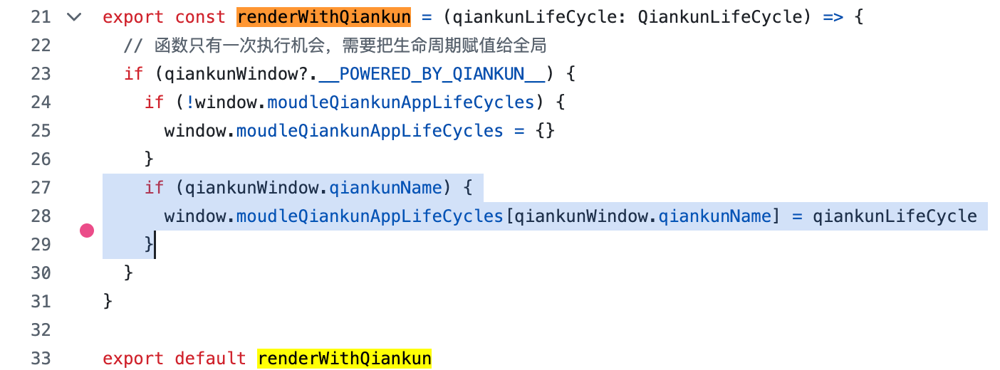

### 2. 同步 js 注入占位生命周期

qiankun 执行完入口脚本会立刻同步读取 `window[appName]`，但 Vite ESM 入口要等浏览器 `import()` 才执行完，那时真实生命周期还没注册。为了把这条同步链路接通，插件预先注入一段**普通 `<script>`**生命周期：

<div style="display: grid; grid-template-columns: 1fr 1fr; gap: 16px; align-items: start;">
  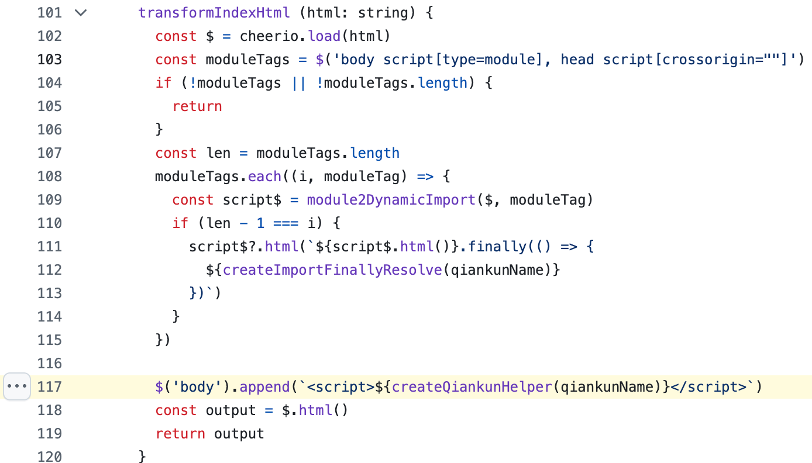
  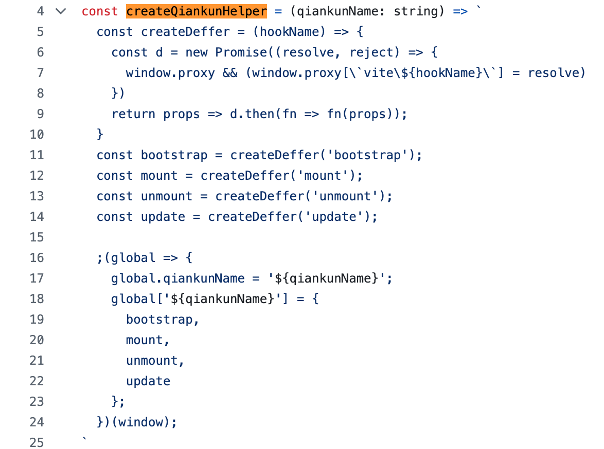
</div>

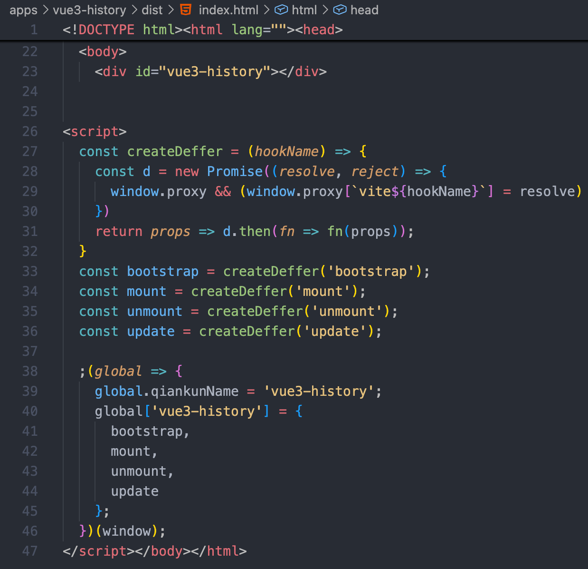

这段脚本的关键设计：

- 普通 `<script>`，会被 `import-html-entry` 收集后放进 qiankun JS 沙箱执行；脚本里的 `global['${qiankunName}'] = { bootstrap, mount, unmount, update }` 实际写到**JS沙箱代理**上；
- qiankun 后续执行 `getLifecyclesFromExports()` 时，会从入口执行结果、最近写入的全局变量或 `window[appName]` 里读取生命周期；这里读到的就是这段脚本提前写入的占位生命周期；
- 每个占位生命周期返回 `deferred.promise`，真实回调还没到时先挂起，等入口模块加载完成后再继续。

### 3. 把 module script 改成动态 import()

Vite 入口默认是 module script。它适合浏览器原生 ESM loader，但不适合 qiankun 的 JS 沙箱 eval 通道：

```html
<script type="module" src="/src/main.ts"></script>
```

插件在 `transformIndexHtml()` 里扫描两类脚本，并逐个交给 `module2DynamicImport()`：

- `<script type="module">`：Vite 入口模块；
- `<script crossorigin="">`：Vite build 后可能出现的入口脚本。

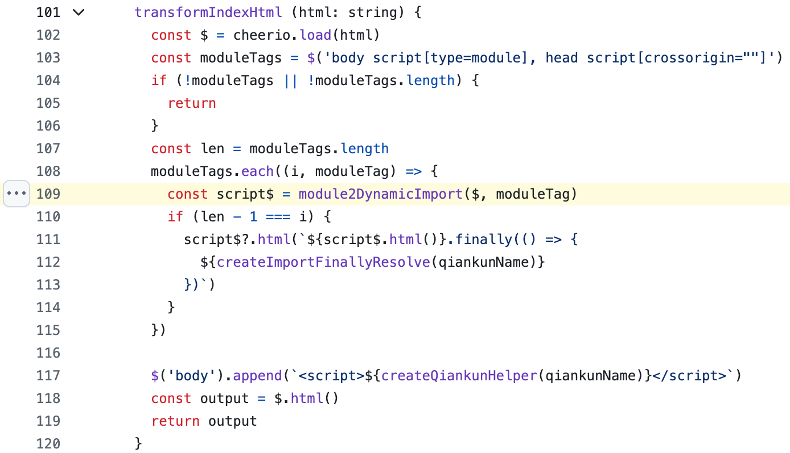

`module2DynamicImport()` 对单个脚本只做三步：

1. 读取原来的 `src`；
2. 移除 `src` 和 `type`，让它变成普通 script；
3. 把脚本内容改成 `import('原 src')`。

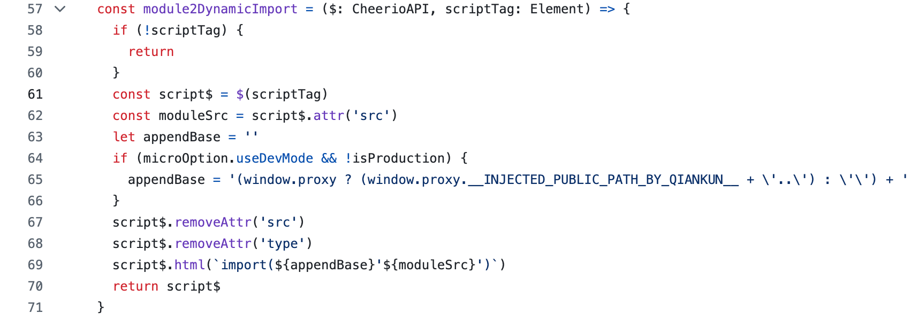

也就是从：

```html
<script type="module" src="/src/main.ts"></script>
```

变成：

```html
<script>
  import('/src/main.ts')
</script>
```

改写后，qiankun eval 的只是普通 script 里的 `import()` 调用，不会直接解析 ESM 顶层语法；真正的 `/src/main.ts` 仍由浏览器原生 ESM loader 加载执行。

### 4. 入口加载完成后回填真实生命周期

`transformIndexHtml()` 会遍历 module script，最后一个入口脚本后追加 `.finally(...)`。入口模块加载完成并执行 `renderWithQiankun()` 后，`.finally(...)` 读取全局映射，再调用第 2 层暴露的 setter：

<div style="display: grid; grid-template-columns: 1fr 1fr; gap: 16px; align-items: start;">
  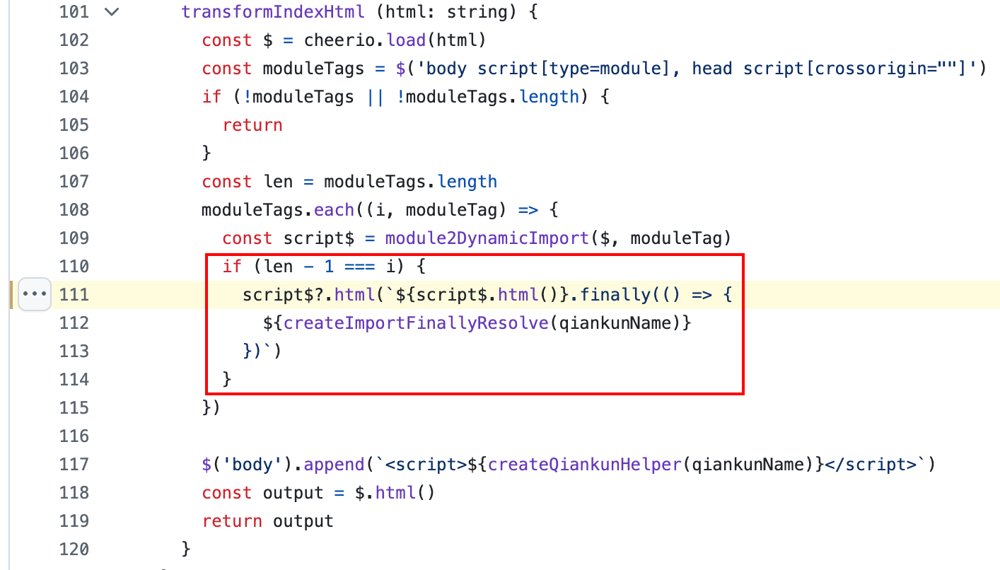
  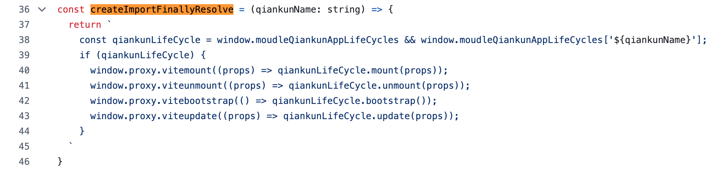
</div>

构建产物 HTML 里入口脚本最终长这样：

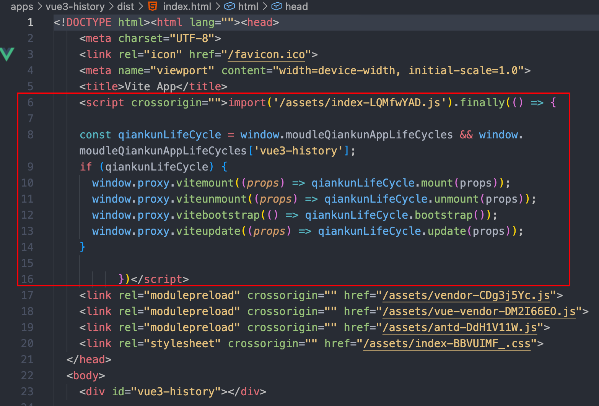

## 提供 qiankunWindow，显式访问沙箱代理

```js [node_modules/vite-plugin-qiankun/dist/helper.js]
var qiankunWindow = typeof window !== 'undefined' ? window.proxy || window : {}
```

运行时 `qiankunWindow` 实际拿到的就是 qiankun JS 沙箱暴露出来的代理对象。详见 [《qiankun 原理》代理沙箱：Proxy 拦截每一次全局写入](./qiankun-principle#_1-代理沙箱-proxy-拦截每一次全局写入)。

## useDevMode：dev 阶段让 HMR 绕开 qiankun JS 沙箱

::: tip 一句话总结
dev 阶段要同时解决两件事：

- `server.origin` 提供子应用 dev server 的 origin，但不会自动改写 HTML 中已有的根路径；
- `useDevMode` 负责改写 `@vite/client` 这类 dev module script：既完成路径拼接，也把会被 qiankun JS 沙箱 eval 报错的 ESM 改成普通脚本里的动态 `import()`。
  :::

### server.origin 只影响开发阶段生成的资源 origin

Vite dev server 默认会在 HTML 里注入 HMR client 和入口模块：

```html
<script type="module" src="/@vite/client"></script>
<script type="module" src="/src/main.ts"></script>
```

子应用配置里设置 `server.origin`：

```ts [packages/vite-config/src/micro.ts]
server: {
  origin: `http://localhost:${port}`,
}
```

它的作用是给开发调试阶段**由 Vite 生成或运行时再请求的资源 URL** 提供 origin，例如 HMR WebSocket、后续动态加载的 chunk、模块运行时派生出来的资源地址等。这样这些请求能回到子应用自己的 dev server，而不是落到主应用 origin。

但 `server.origin` 不能处理 HTML 模板里已经写好的资源属性。也就是说，下面这类 `src` / `href` 根路径不会因为配置了 `server.origin` 就自动变成 `http://localhost:8101/...`：

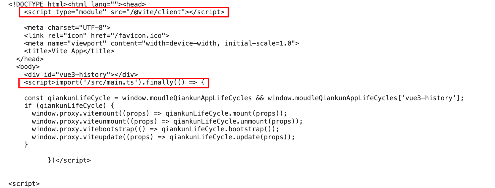

通过主应用的 `htmlProcessor.ts` 把 HTML 属性静态改成绝对地址：

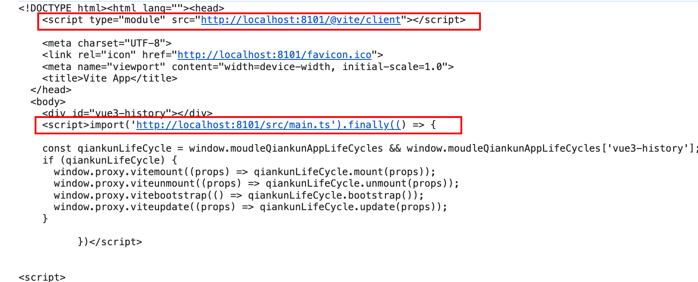

或者开启 `vite-plugin-qiankun` 的 `useDevMode` 改成普通脚本里的动态 `import()`：

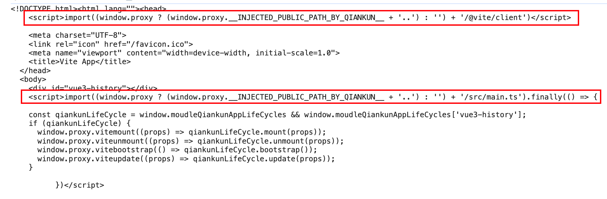

### module script 进入沙箱会报错

qiankun 加载子应用 HTML 时，会通过 `import-html-entry` 把 `<script>` 收集起来，再包装成普通脚本文本放进 JS 沙箱执行。这个执行通道不是浏览器的 ESM loader，本质上是 normal script eval。

可 `@vite/client` 和 `/src/main.ts` 都是 ES Module，里面有 `import`、`import.meta.hot` 等 ESM 语法。它们如果被当作普通脚本 eval，就会报：

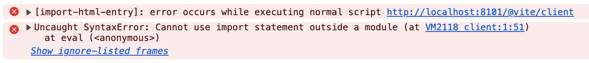

### useDevMode 做了什么

对照 [`vite-plugin-qiankun/src/index.ts`](https://github.com/tengmaoqing/vite-plugin-qiankun/blob/master/src/index.ts#L80) 可以看到，改写核心就是 `module2DynamicImport()`：

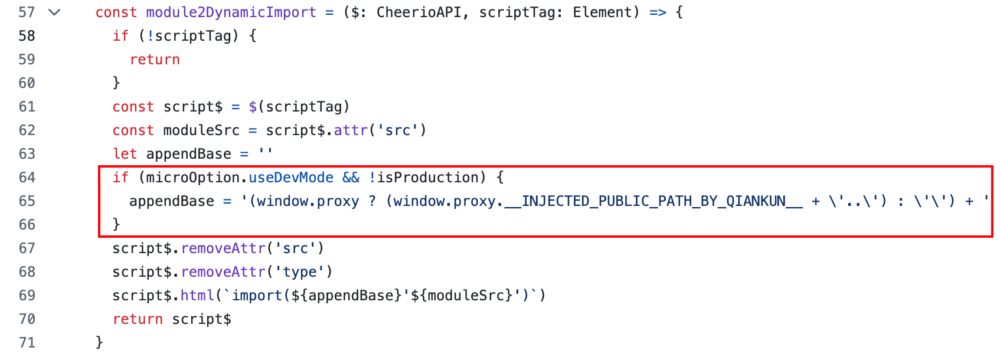

它把 module script：

```html
<script type="module" src="/@vite/client"></script>
```

改成：

```html
<script>
  import(
    (window.proxy
      ? window.proxy.__INJECTED_PUBLIC_PATH_BY_QIANKUN__ + '..'
      : '') + '/@vite/client'
  )
</script>
```

1. 外层 `<script>` 已经不是 module，qiankun 沙箱 eval 它时只会看到一个普通的 `import()` 函数调用，不会直接解析 ESM 顶层语法；
1. 内层 `import()` 再交给浏览器原生 ESM loader 去加载 `@vite/client`，因此 `import.meta.hot`、WebSocket、模块热更新这些 Vite HMR 能力都按原生模块语义执行。

这里的路径拼接不是 `server.origin` 自动完成的，而是 `useDevMode` 生成的 `window.proxy.__INJECTED_PUBLIC_PATH_BY_QIANKUN__ + '..' + '/@vite/client'` 在运行时完成的。

### 两个改写入口

`useDevMode` 相关改写分两处发生：

| 脚本                  | 改写入口                  | 作用                                                                                 |
| --------------------- | ------------------------- | ------------------------------------------------------------------------------------ |
| `@vite/client`        | `configureServer` 中间件  | 在 dev HTML 响应发出前，把 Vite HMR client 改成普通脚本里的 `import()`               |
| `/src/main.ts` 等入口 | `transformIndexHtml` 阶段 | 把子应用入口模块改成 `import()`，并在最后一个入口后追加 `.finally(...)` 回填生命周期 |

源码里 `configureServer` 只在 `useDevMode` 打开时处理 `@vite/client`：

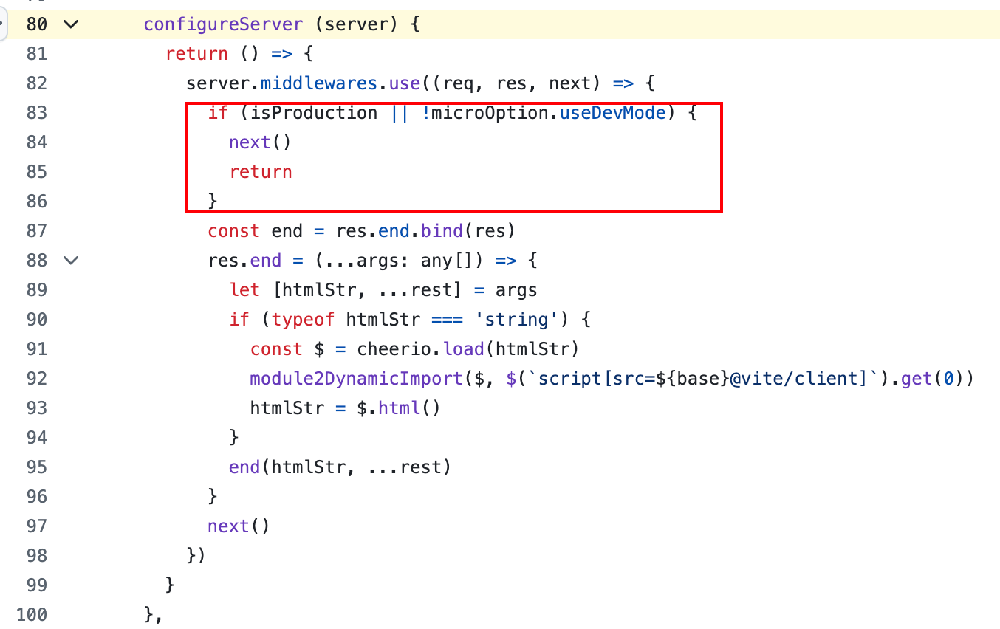

入口模块则由 `transformIndexHtml` 处理，并通过 `.finally(...)` 接回同步占位生命周期：

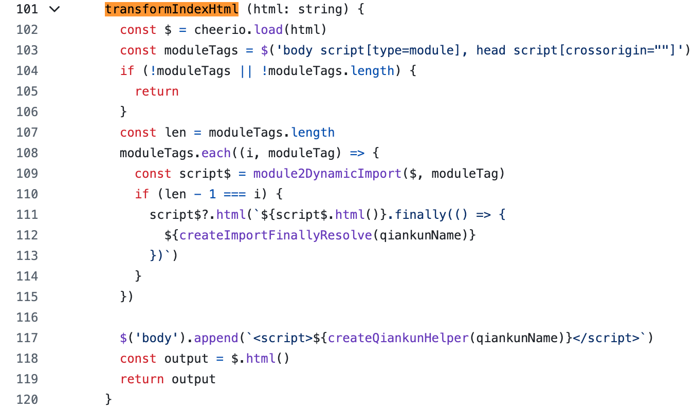

`.finally(...)` 衔接的是前文 [同步注入占位生命周期](#_2-同步注入占位生命周期) 暴露在 `window.proxy.vitemount / viteunmount / ...` 上的 setter，机制与生产构建一致。

## 参考资料

- [为什么 qiankun 不能和 vite 一起使用？](https://segmentfault.com/a/1190000042738311)
- [Vite：Advanced Base Options](https://vite.dev/guide/build#advanced-base-options)
- [qiankun：Introduction](https://umijs.github.io/qiankun/guide/)
