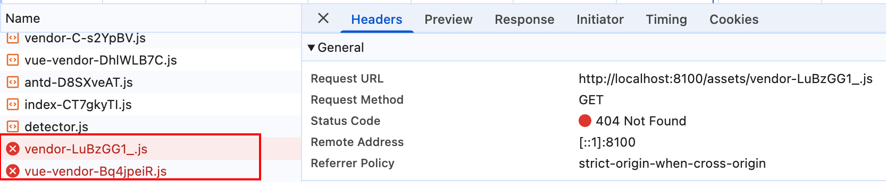
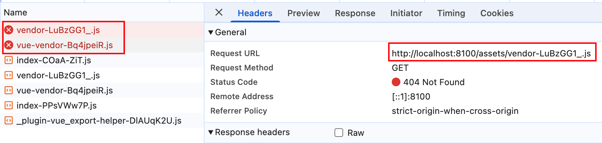
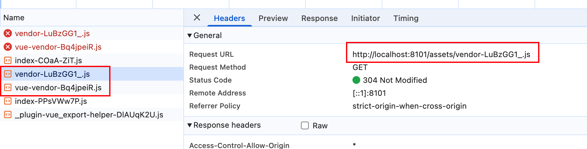
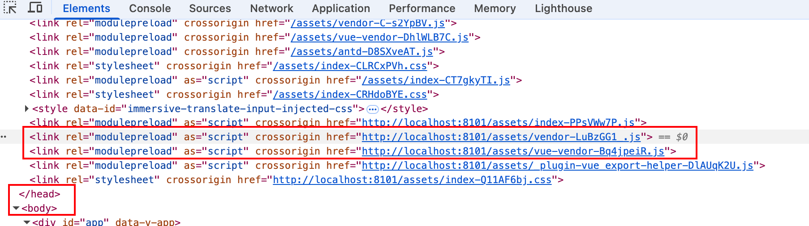
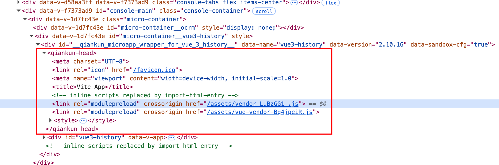
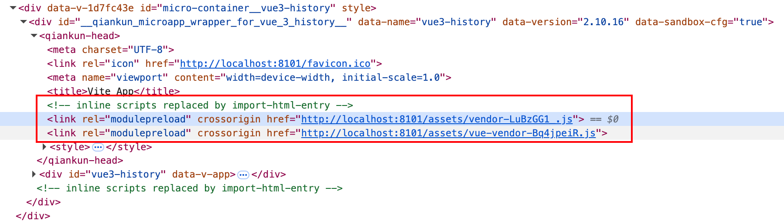

# Vite 构建拆包策略

本文说明主应用与 qiankun 子应用在 Vite 构建拆包上的策略：两者均使用**函数形式** `manualChunks`，配合 `vendor` 兜底分组，将大型稳定依赖从业务代码中独立出来；子应用额外需要 `renderBuiltUrl` 与 HTML 模板改写两层机制，才能让拆包产物在 qiankun 宿主页面中正确加载。

> 两层机制的根因分析与完整实现细节，参见 [Vite 动态修改 base](../qiankun/asset-path)。

## 主应用拆包

### 使用函数形式 manualChunks

主应用（`apps/main-app`）依赖体积较大的第三方库，通过 `manualChunks` 将它们拆成独立 chunk，利用浏览器长期缓存：

```ts [apps/main-app/vite.config.ts]
build: {
  rollupOptions: {
    output: {
      manualChunks(id) {
        if (!id.includes('node_modules')) return
        if (/node_modules\/(vue|vue-router|pinia)\//.test(id)) {
          return 'vue-vendor'
        }
        if (
          /node_modules\/(ant-design-vue|@ant-design\/icons-vue)\//.test(id)
        ) {
          return 'antd'
        }
        return 'vendor'
      },
    },
  },
},
```

| Chunk        | 内容                                           | 说明                               |
| ------------ | ---------------------------------------------- | ---------------------------------- |
| `vue-vendor` | vue + vue-router + pinia                       | 框架核心，几乎不变，长期缓存       |
| `antd`       | ant-design-vue + @ant-design/icons-vue         | 组件库入口及图标库                 |
| `vendor`     | 其余 node_modules（dayjs、qiankun 等传递依赖） | 其他第三方依赖兜底，避免散落到主包 |

## 子应用拆包

子应用采用与主应用相同的函数形式，含 `vendor` 兜底：

```ts [apps/vue3-history/vite.config.ts]
build: {
  rollupOptions: {
    output: {
      manualChunks(id) {
        if (!id.includes('node_modules')) return
        if (/node_modules\/(vue|vue-router|pinia)\//.test(id)) {
          return 'vue-vendor'
        }
        if (
          /node_modules\/(ant-design-vue|@ant-design\/icons-vue)\//.test(id)
        ) {
          return 'antd'
        }
        return 'vendor'
      },
    },
  },
},
```

但子应用不能像主应用那样直接配置 `manualChunks` 就完事，拆包后会引入新的问题，需要两层机制配合才能安全使用。

### 背景：拆包后的资源路径问题

qiankun 子应用运行在主应用的沙箱环境里，没有自己独立的域名。Vite 构建时默认把资源路径写成 `/assets/...` 根路径形式，在独立运行时这没问题，但嵌入 qiankun 后这些路径会解析到**主应用域名**，导致 404。

对于 JS 模块内部引用的 chunk 地址，Vite 提供了 `experimental.renderBuiltUrl` 钩子，可以把静态路径改写为运行时表达式：

```ts [apps/vue3-history/vite.config.ts]
experimental: {
  /**
   * 替代静态 base 配置，将资源路径解析推迟到运行时。
   *
   * 主应用需在加载子应用前注入 window.__assetsPath。
   * @see apps/main-app/src/utils/microApp/assetsPath.ts
   */
  renderBuiltUrl(filename, { hostType }) {
    // CSS 中引用的图片保持相对路径
    // async chunk CSS 以 <link> 加载，url() 相对 CSS 文件自身 URL 解析，无需改写
    if (
      hostType === 'css' &&
      /\.(png|jpe?g|gif|svg|webp|woff2?|ttf|otf|eot)$/i.test(filename)
    ) {
      return { relative: true }
    }
    // JS/CSS 运行时动态路径 // [!code focus]
    if (hostType === 'js' || hostType === 'css') { // [!code focus]
      return { // [!code focus]
        runtime: `window.__assetsPath(${JSON.stringify(env.VITE_APP_NAME)},${JSON.stringify(filename)})`, // [!code focus]
      } // [!code focus]
    } // [!code focus]
    return { relative: true }
  },
},
```

但 `renderBuiltUrl` 只覆盖 **JS 运行时里的 chunk 地址**，不会改写直接写在 `index.html` 字符串里的根路径。启用 `manualChunks` 拆包后，构建产物的 `index.html` 里会出现两类新的根路径资源：

<!-- prettier-ignore -->
```html [apps/vue3-history/dist/index.html]
<script crossorigin="">
  import('/assets/index-COaA-ZiT.js').finally(() => { // [!code focus]
    const qiankunLifeCycle =
      window.moudleQiankunAppLifeCycles &&
      window.moudleQiankunAppLifeCycles['vue3-history']
    if (qiankunLifeCycle) {
      window.proxy.vitemount((props) => qiankunLifeCycle.mount(props))
      window.proxy.viteunmount((props) => qiankunLifeCycle.unmount(props))
      window.proxy.vitebootstrap(() => qiankunLifeCycle.bootstrap())
      window.proxy.viteupdate((props) => qiankunLifeCycle.update(props))
    }
  })
</script>
<link rel="modulepreload" crossorigin="" href="/assets/vendor-LuBzGG1_.js"> <!-- [!code focus] -->
<link rel="modulepreload" crossorigin="" href="/assets/vue-vendor-Bq4jpeiR.js"> <!-- [!code focus] -->
<link rel="stylesheet" crossorigin="" href="/assets/index-KlKjbc8W.css"> <!-- [!code focus] -->
```

高亮行里的 `/assets/...` 同样会被解析到主应用域名，导致错误请求。


### 现象：HTML 模板里会同时看到一条对的请求和一条错的请求




这是两条不同链路同时存在的结果：

- 一条是 HTML 模板原始写下来的 `/assets/...`，如果不改写，会请求主应用域名
  
- 另一条是入口 JS 内部由 `window.__assetsPath(...)` 生成的正确子应用地址
  

`htmlProcessor.ts` 的作用就是把前者也统一改写成子应用绝对地址，消除错误请求。

### 解决方案：HTML 模板改写

主应用通过 qiankun 的 `getTemplate` 钩子接入 `htmlProcessor.ts`，将 HTML 模板中所有根路径资源统一改写为子应用绝对地址：

```ts [apps/main-app/src/utils/microApp/registry.ts]
configuration: {
  getTemplate: (tpl: string) => processDynamicImport(tpl, entry),
}
```

`processDynamicImport` 依次对两类内容做改写：HTML 标签属性中的 `href`/`src`，以及 inline script 中的 `import()` 调用；只处理根路径（`/assets/...`），相对路径和绝对 URL 原样保留。

两层机制的职责划分：

| 机制               | 处理范围                                            |
| ------------------ | --------------------------------------------------- |
| `renderBuiltUrl`   | JS 运行时里的 chunk 地址（`__vite__mapDeps` 等）    |
| `htmlProcessor.ts` | HTML 模板里的 `href`/`src` 属性与 inline `import()` |

两层配合后，子应用可以安全使用 `manualChunks`。

> `htmlProcessor.ts` 的完整实现与 `isRewritableUrl` 判断逻辑，参见 [Vite 动态修改 base → 主应用：HTML 模板补丁](../qiankun/asset-path#主应用html-模板补丁)。

::: details 为什么修复后 modulepreload 只出现在 qiankun-head 里


`import-html-entry` 在解析 HTML 模板时，对 `<link>` 标签有如下处理策略：

```js [node_modules/import-html-entry/esm/process-tpl.js]
const LINK_PRELOAD_OR_PREFETCH_REGEX = /\srel=('|")?(preload|prefetch)\1/
```

只有 `rel="preload"` 和 `rel="prefetch"` 会被替换为注释占位符，`rel="modulepreload"` **不匹配该正则**，因此会保留在模板字符串里，最终以 DOM 节点形式插入 `qiankun-head`。

整个流程如下：

1. `htmlProcessor.ts`（`getTemplate` 钩子）将 `href="/assets/vendor.js"` 改写为 `href="http://localhost:8101/assets/vendor.js"`
2. `import-html-entry` 处理模板：`rel="modulepreload"` 保留原样（不被 strip）
3. 改写后的 `<link rel="modulepreload" href="http://localhost:8101/...">` 插入 `qiankun-head`
4. JS 运行时的 `__vitePreload` 在 `appendChild` 前先执行去重检查：

```js [node_modules/vite/dist/node/chunks/config.js]
else if (document.querySelector(`link[href="${dep}"]${cssSelector}`)) return;
```

发现 DOM 中已存在相同 href 的 `<link>` 节点，**直接跳过**，不会创建重复节点，也不会发出额外请求。

未修复时（href 仍为 `/assets/...`），模板里的 modulepreload 指向主应用域名（404），运行时的 `__vitePreload` 指向子应用域名（200）——两者 URL 不同，去重检查无法命中，导致两次请求、一次失败。

:::

## 依赖分析工具

使用 `rollup-plugin-visualizer` 可视化每个 chunk 的构成，辅助判断拆包策略是否合理：

```ts [vite.config.ts]
import { visualizer } from 'rollup-plugin-visualizer'

plugins: [
  visualizer({
    open: true,
    filename: 'dist/stats.html',
    gzipSize: true,
  }),
]
```

::: tip 依赖已安装在根目录，无需单独安装
`rollup-plugin-visualizer` 已作为根目录 `devDependencies`，各子应用可直接导入，无需在各自的 `package.json` 中重复声明。

:::
