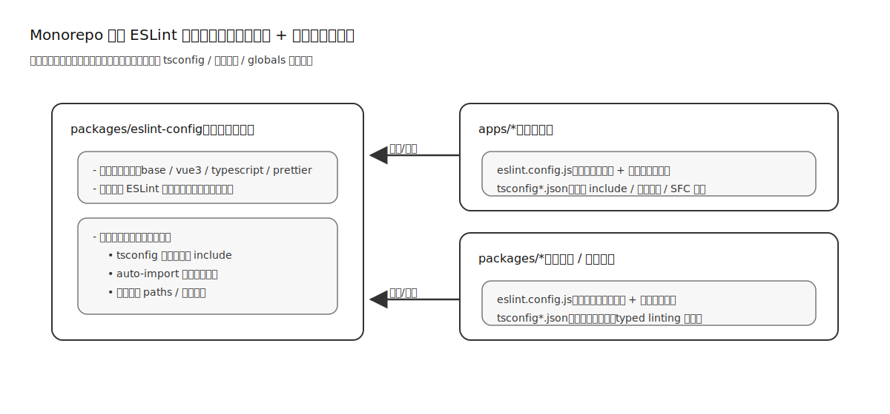
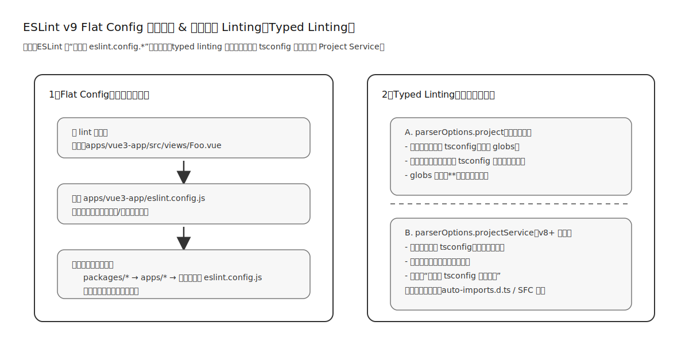

# 架构与设计理念

本仓库将 ESLint 的规则与最佳实践沉淀为独立包 `@breeze/eslint-config`，同时在 `apps/*`、`packages/*` 的子项目内各自维护 `eslint.config.js` 与 `tsconfig*.json`。这一设计并不是“拆得越细越好”，而是为了在 Monorepo 场景下同时满足：

- 统一规则（避免每个项目规则漂移）
- 类型感知（Typed Linting）可靠可用
- 与自动生成代码（如 `unplugin-auto-import`）兼容
- 避免根目录全局 ESLint 配置在子项目间互相干扰

## TL;DR

- 共享配置包统一规则与依赖
- 子项目薄配置注入 tsconfig 边界与 globals
- typed linting 依赖清晰项目边界，避免误报与性能抖动

## 示意图

下图把本仓库的 ESLint 架构拆分方式画成“共享配置包 + 子项目薄配置”的形式（与 Turborepo 的推荐结构一致）：

图 1：强调“共享配置包负责规则统一，子项目负责注入上下文”。

下图说明 ESLint v9 Flat Config 的“向上查找”机制，以及 typed linting 在 monorepo 下常见的两种接入方式：

图 2：解释为什么需要就近配置与清晰的 tsconfig 边界。

## 为什么不在根目录做一个全局 ESLint + 单一 tsconfig

在 Monorepo 里，如果在根目录用一个 `eslint.config.js` 配合一个“万能” `tsconfig.json` 去覆盖所有子项目，通常会遇到两类问题：

- **边界过宽**：为了覆盖所有项目，`include` 往往变得很大，lint 性能下降，且容易引入跨包的类型冲突。
- **边界过窄**：如果为了性能收窄 `include`，就会漏掉子项目特有的生成文件（如 `auto-imports.d.ts`、SFC），导致大量误报。
- **上下文差异**：各子项目的 globals、路径别名、tsconfigRootDir 不同，一个根配置无法同时满足。

## 先对齐 TypeScript Monorepo 的基本思路

从 TypeScript Monorepo 的通用实践来看，我们需要解决的是“包与包之间如何被正确识别为模块、以及类型系统如何在边界内高效工作”。常见路线是：

- Workspaces：通过 pnpm/yarn/npm 的 workspace 把子项目连接成真正的模块依赖关系
- 项目边界：每个子项目维护自己的 `tsconfig`（extends 共享 base），明确 include 与生成文件
- Project References：在需要更快的增量构建/跨项目类型引用时引入 project references

同时，文章也强调：Path Aliases 虽然能缩短 import 路径，但它并不等价于“模块化连接”，长期更推荐用 workspace + 包 exports 的方式组织依赖关系。

## 与 Turborepo 推荐的 ESLint 结构一致

Turborepo 的 ESLint 指南推荐在 Monorepo 中采用“配置包 + 子项目各自配置”的结构：

- `packages/eslint-config`：存放共享规则与依赖，按需导出多个配置（例如 base / react / vue / next 等）
- `apps/*`、`packages/*`：各自提供一个薄的 `eslint.config.js`，组合共享配置并注入项目上下文

本仓库的 `@breeze/eslint-config` 与各子项目 `eslint.config.js` 的分工就是这个思路的落地版本：共享层解决一致性与可组合性，子项目层解决“路径、生成文件、tsconfig 边界”等上下文差异。

## ESLint v9 Flat Config 的“向上查找”机制

在 Flat Config 下，ESLint 会从被 lint 的文件所在目录开始查找 `eslint.config.*`，如果当前目录没有，就向父目录继续查找直到仓库根。

这意味着两点：

- 根目录可以放一个“尽量通用”的默认配置（不建议塞入所有子项目的 tsconfig/globals）
- 当某个子项目需要不同的规则、不同的 TS 配置边界或不同的 globals 时，直接在该子项目放置自己的 `eslint.config.js`，就可以覆盖/扩展根配置，而不会影响其它子项目

## 与参考文档对齐的结构建议

Turborepo 的 ESLint 指南强调“共享配置包 + 子项目各自配置”的结构，并推荐把 ESLint 依赖集中在配置包中。这与本仓库的设计一致：

- `packages/eslint-config` 负责统一规则与依赖
- `apps/*`、`packages/*` 以薄配置注入项目上下文（tsconfig 边界、globals、生成文件）

该结构的好处是：规则一致、配置可组合、缓存命中更稳定，也便于在 Flat Config 下做“就近覆盖”。

### 1) 自动导入（unplugin-auto-import）导致的“项目上下文差异”

本仓库的子应用启用了 `unplugin-auto-import`，会生成两类与“类型”和“全局变量”强相关的产物：

- `src/types/auto-imports.d.ts`：用于 TypeScript 类型补全与编译
- `.eslintrc-auto-import.json`：用于 ESLint globals（避免把 auto import 的标识符当作未定义变量）

这些文件是“按子项目生成”的：每个子应用的路径、启用的 imports、生成位置都不同，因此它们天然需要在对应子项目的 tsconfig / eslint config 内被显式纳入。比如：

- 子项目的 `tsconfig.app.json` 会把 `src/types/auto-imports.d.ts` 加入 include，确保类型系统可见
- 子项目的 `eslint.config.js` 会读取 `.eslintrc-auto-import.json` 并注入 `languageOptions.globals`

如果只依赖根目录的统一配置，很容易出现：

- ESLint 的类型服务未按“正确子项目”解析（规则误报/漏报）
- globals/类型声明文件未被纳入（出现大量 `no-undef` 或类型相关误报）

### 2) Typed Linting 强依赖“正确的 tsconfig 边界”

类型感知规则需要 TypeScript Program 或等价能力。Monorepo 下“正确的 tsconfig 边界”非常关键：

- 每个子项目有自己的 `tsconfigRootDir`、include、paths、vue/sfc 支持等
- 根目录用一个 tsconfig 想覆盖全部，往往会变成“要么 include 太大、性能差且易冲突；要么 include 太小、漏掉子项目生成文件/特殊入口”

本仓库使用了 TypeScript ESLint 的 Project Service 思路来降低配置成本，但它依然要求“以子项目为单位”维护清晰的 TS 边界，才能保证类型规则的稳定与性能。

## Typed Linting 的两种模式与取舍

类型感知 linting 主要有两种接入方式：

### parserOptions.project（传统方式）

可以通过 `parserOptions.project` 指向一个或多个 tsconfig 路径（支持 globs）。在 monorepo 下常见做法是：

- 每个 package/app 自己有 `tsconfig.json`
- 根目录额外提供一个 `tsconfig.eslint.json`（专用于 lint 的 include 范围）

需要注意的是：过宽的 glob（例如 `**/tsconfig.json`）可能导致 lint 性能下降，建议使用更窄的 glob（例如 `packages/*/tsconfig.json`）。

### parserOptions.projectService（Project Service，v8+ 推荐）

Project Service 旨在减少 monorepo 场景下手动维护 project 列表的成本，自动发现就近的 tsconfig，并与编辑器的类型检查逻辑更一致。它并不消除“项目边界”的重要性：每个子项目依然需要维护自己的 tsconfig include（尤其是 auto-import 生成文件、SFC 等）。

> typescript-eslint 官方说明：使用 `projectService` 时，monorepo 不需要额外的配置；只有在使用 `parserOptions.project` 时才需要参考 monorepo 专项指南。

### 官方建议（当你选择 parserOptions.project）

- **只有一个根 tsconfig**：如果 `include` 覆盖了需要 lint 的文件，可直接使用；否则建议新增 `tsconfig.eslint.json`，专门覆盖 lint 范围。
- **每个包一个 tsconfig**：用 `project` 数组指定路径（优先窄 glob），避免 `**` 带来的性能问题。
- **大型 monorepo 注意内存**：官方提示在多包场景可能触发 OOM，建议先评估；必要时改为根 `tsconfig.eslint.json` 或分包 lint。

## 为什么泛型/跨包类型更容易在 Monorepo 里踩坑

ESLint 天生是“以单文件为单位”的工具。要正确理解 TypeScript 的泛型与跨包类型，需要 `@typescript-eslint/parser` 获得足够的项目上下文（也就是 typed linting 能提供的 Program/服务能力）。

如果 TS 配置边界不清晰或选错了 tsconfig，常见表现是：

- 类型感知规则误报/漏报（例如把可推导类型当成 any/unknown，或反过来）
- 与 import/paths/workspace 解析相关的错误变得难以定位
- 性能不稳定（某些文件触发大范围类型加载）

因此，本仓库坚持“共享规则包 + 子项目明确 tsconfig 边界”的设计：尽量把“类型上下文”限制在正确的子项目范围内。

实践上，社区更推荐“共享规则 + 包级薄配置”的混合模式，并结合 TypeScript Project References 来建立跨包类型边界；这也是当前结构能稳定支撑泛型/跨包类型解析的关键原因。

## 路径解析与 import 规则（可选）

若项目启用了 `eslint-plugin-import` 且使用了路径别名/跨包导入，通常需要配合 `eslint-import-resolver-typescript` 才能正确解析 workspace 内部模块。否则会出现 `import/no-unresolved` 等误报。

## 任务与缓存（可选）

若使用 Turborepo/Nx 等任务编排工具，建议将 `lint` 任务设置为依赖 `^lint`，让配置包或上游依赖变更时，lint 缓存能够正确失效。

## 现在的拆分方式是什么

### 共享层：@breeze/eslint-config

`@breeze/eslint-config` 负责提供可复用的规则组合（base / vue3 / typescript / prettier / ignores）。它解决的是“规则统一”问题，而不负责知道某个具体子项目的：

- tsconfig 文件位置与结构
- auto-import 的生成文件路径
- 项目别名 paths

### 子项目层：apps/_ 与 packages/_ 自己的 eslint.config.js

每个子项目负责把“项目上下文”注入到共享配置上，例如：

- 指定 `parserOptions.tsconfigRootDir`
- 合并 auto-import globals
- 按项目需要做少量规则覆写

这种模式的好处是：

- 共享规则统一、升级集中
- 每个项目的类型边界明确，typed linting 更可靠
- 自动生成文件（auto-imports.d.ts 等）能在正确的范围内被纳入

## 为什么根目录不做“一个配置统管一切”

结合上面的通用思路，你可以把本仓库的取舍理解为：

- 根目录负责“共享 base”：例如 `tsconfig.base.json` 这类跨项目通用的 compilerOptions
- 每个子项目负责“声明边界”：`tsconfig*.json` 的 include/paths/生成文件，和 `eslint.config.js` 的 globals/tsconfigRootDir
- 共享 ESLint 包负责“规则模块化”：把可复用的规则组合做成稳定 exports，子项目只做最小注入

这样做的核心收益不是“少写配置”，而是让 TypeScript/ESLint 在 Monorepo 下能始终以正确的项目上下文运行：既避免把整个仓库一次性塞进同一个类型程序（性能与冲突），也避免漏掉子项目特有的生成文件与配置入口（准确性）。

## 与 typed-linting 文档的关系

typed linting 章节主要解释了启用类型感知规则与 Project Service 的收益；本篇强调“为什么需要按子项目维护配置边界”，两者共同支撑 Monorepo 下的稳定 ESLint 体验。

## 参考

- [ESLint](https://turborepo.dev/docs/guides/tools/eslint)
- [How to use Eslint v9 in a monorepo with flat config file format](https://medium.com/@felipeprodev/how-to-use-eslint-v9-in-a-monorepo-with-flat-config-file-format-8ef2e06ce296)
- [The Ultimate 2025 Guide to ESLint Generics in Monorepos](https://junkangworld.com/blog/the-ultimate-2025-guide-to-eslint-generics-in-monorepos)
- [Monorepo Configuration](https://typescript-eslint.io/troubleshooting/typed-linting/monorepos/)
