# Vite 动态修改 base

本文说明 qiankun 场景下子应用静态资源（图片、字体、JS chunk、CSS）路径失效的根因，以及本项目的完整解决方案。

## 整体结构

```
apps/
├── main-app/src/assets/scss/
│   ├── fonts.scss        ← 声明 @font-face，验证字体资源路径
│   └── index.scss        ← 引入全局字体样式入口
├── main-app/src/utils/microApp/
│   ├── registry.ts        ← 注册表，组装 frameworkConfiguration
│   ├── assetsPath.ts      ← 注入 window.__assetsPath
│   ├── cssProcessor.ts    ← 拦截 CSS fetch，改写 url() 路径
│   └── htmlProcessor.ts   ← 改写 HTML 模板中的动态 import() 路径
└── vue3-history/
    ├── src/views/AssetPathTest/index.vue ← 资源路径验证页（含字体示例）
    └── vite.config.ts     ← renderBuiltUrl：构建时输出运行时路径表达式
```

## 为什么路径会失效

::: danger 根因一句话
**URL 的解析基准由"当前执行上下文所在的页面"决定，而不是由"资源所在的服务器"决定。** qiankun 把子应用的代码搬到了主应用的页面上执行，但浏览器不知道这件事——它只认当前页面的 origin。
:::

子应用**独立运行**时，资源路径相对于自己的 origin（`http://sub-app.com`）解析，一切正常。

进入 qiankun 后，整个加载链路发生了本质改变：

1. 主应用通过 **`fetch`** 把子应用的 HTML 拉取为**字符串**
2. qiankun 解析该字符串，将 `<script>` / `<style>` / `<link>` 提取出来
3. 这些资源被**注入主应用的 `document`** 中执行

> 步骤 3 是关键：一旦 script/style 在主应用 `document` 中执行，浏览器对所有**相对路径**的解析基准就从子应用的 origin（`localhost:8101`）悄然切换成了主应用的 origin（`localhost:8100`）。<br>
> <span style="font-weight: bold; color: var(--vp-c-danger-1);">子应用静态资源的"origin"就此丢失。</span>

这引发了两类**结构性**问题：

---

**问题一：JS 动态 import 路径**

Vite 代码分割（code splitting）产生的
<span style="color: var(--vp-c-danger-1); font-weight: bold;">异步 chunk在构建时以相对路径</span>写入 HTML 模板：

```js
import('./assets/LazyDetail-xxx.js') // 相对路径，无任何域名信息
```

qiankun 将这段 HTML 注入主应用后，浏览器发起模块请求时，会将该相对路径拼接到**主应用**的 origin 上——子应用的懒加载路由、异步组件全部 404。

::: warning 为什么 `<script src>` 不受影响，而 `import()` 会出问题？
qiankun 会改写 HTML 模板中 `<script src="...">` 的绝对路径，但对 **`<script>` 块内部的字符串字面量**（如 `import('./...')`）无能为力。Vite + qiankun 插件在构建产物中注入的入口脚本恰好属于后者，因此漏网。
:::

- 打包后的入口 js 文件
  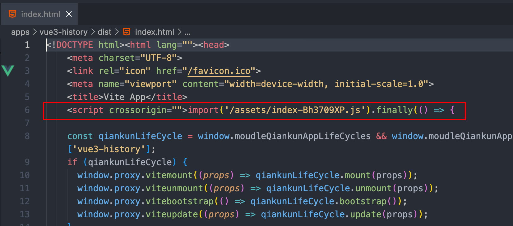
  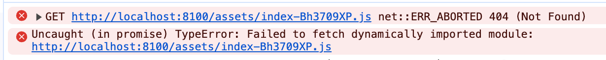
  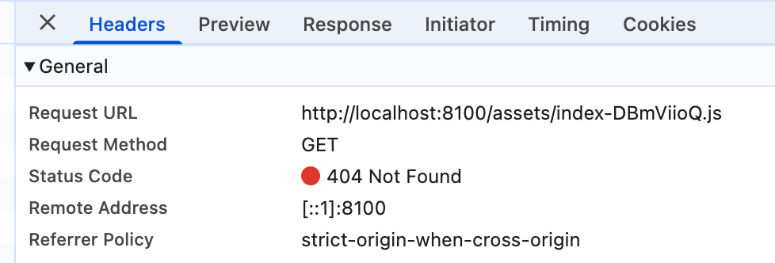
- 组件动态导入
  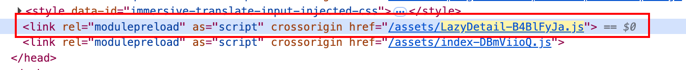
  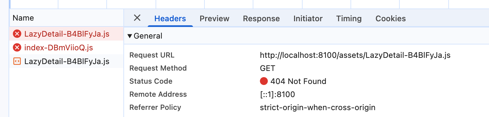

---

**问题二：CSS 中的图片 / 字体路径**

Vite 默认开启 [`build.cssCodeSplit`](https://cn.vitejs.dev/config/build-options#build-csscodesplit)，异步 chunk 关联的 CSS 会被单独提取，由 Vite 运行时（`__vitePreload`）在懒加载触发时动态创建 `<link rel="stylesheet">` 元素插入 `document.head`。**这类 CSS 不经过 qiankun 的 fetch 流程**，不会被内联。

而子应用初始 HTML 中**静态声明的** `<link rel="stylesheet">`（通常是全局样式、CSS 变量、字体等入口 CSS），则由 `import-html-entry` 在解析 HTML 时主动 fetch，并将 CSS 文本**内联为 `<style>` 标签**注入主应用 `document`——这是 qiankun 实现 CSS 沙箱的工作方式。

::: warning 内联 `<style>` 与外链 `<link>` 的 url() 解析差异

- **外链 `<link>`**：浏览器知道样式表的 origin，`url(...)` 相对于 CSS 文件地址解析 → 正确。
- **内联 `<style>`**：没有自身 URL，浏览器以**主应用页面 URL** 为基准，`url(...)` 变成主应用目录下的路径 → 404。

:::

<div style="display: grid; grid-template-columns: 0.5fr 1fr; gap: 16px; align-items: start;">
  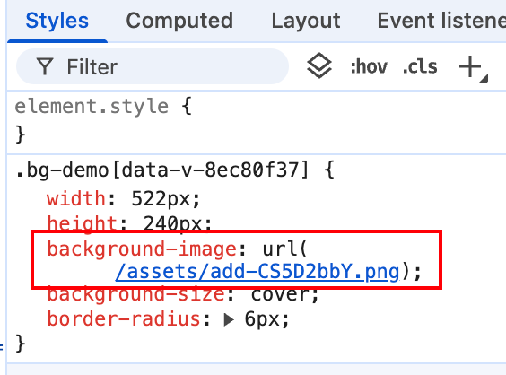
  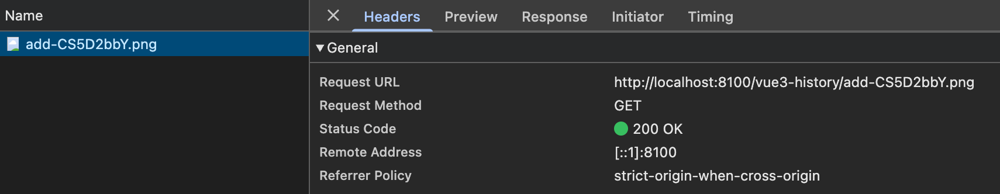
</div>

## 为什么不用静态 base

将子应用 `vite.config.ts` 的 `base` 配置为绝对地址可以解决路径问题：

```ts [apps/vue3-history/vite.config.ts]
export default defineConfig({
  base: 'http://localhost:8101', // 简单，但有局限
})
```

这种方式的问题：

- 开发、测试、生产环境的域名不同，需要构建时区分
- 子应用部署域名变更时必须重新构建
- <span style="color: var(--vp-c-danger-1); font-weight: bold;">同一份构建产物无法在不同主应用环境下复用</span>

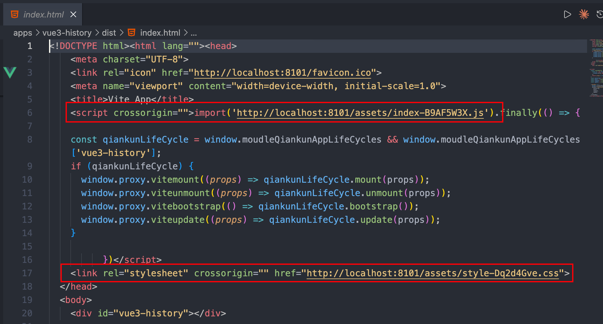
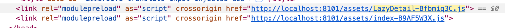
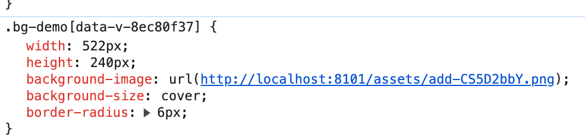

## 运行时动态路径协议

本项目通过 Vite `experimental.renderBuiltUrl` API 与 `window.__assetsPath` 全局协议解决这一问题：**构建产物中不包含具体域名**，资源路径在运行时由主应用动态计算。

协议约定：

- **子应用**：构建时将资源路径替换为 `window.__assetsPath(appName, filename)` 调用表达式
- **主应用**：在加载子应用前注入 `window.__assetsPath` 的具体实现，根据注册的子应用 entry 计算完整 URL

各层分工如下：

| 层             | 文件               | 职责                                          |
| -------------- | ------------------ | --------------------------------------------- |
| 子应用构建     | `vite.config.ts`   | `renderBuiltUrl`：JS/CSS 路径输出运行时表达式 |
| 主应用运行时   | `assetsPath.ts`    | 注入 `window.__assetsPath` 的实现             |
| HTML 模板处理  | `htmlProcessor.ts` | 改写 HTML 中漏掉的动态 `import()` 路径        |
| CSS fetch 拦截 | `cssProcessor.ts`  | 改写 CSS 文本中的图片 / 字体相对路径          |

### 子应用：配置 Vite renderBuiltUrl

`renderBuiltUrl` 是 Vite 的实验性 API，**只在构建（`vite build`）阶段生效**，在开发模式（`vite dev`）下完全不触发。它介入每个资源 URL 的生成，可以返回一个**运行时表达式字符串**（`runtime`）代替静态路径。

::: tip base / server.origin / renderBuiltUrl 的区别

| 配置项           | 作用时机      | 影响范围                                          |
| ---------------- | ------------- | ------------------------------------------------- |
| `base`           | dev + build   | 所有资源路径，构建时写死为静态前缀                |
| `server.origin`  | 仅 dev server | 开发时资源 URL 前缀，不影响构建产物               |
| `renderBuiltUrl` | 仅 build      | 构建产物中资源 URL 的生成方式，可输出运行时表达式 |

- 本项目是使用 `renderBuiltUrl` 处理生产构建的资源路径；
- `server.origin: 'http://localhost:8101'` 只负责开发时让资源路径带上正确的子应用域名。

两者互为补充，覆盖不同阶段。
:::

```ts [apps/vue3-history/vite.config.ts]
experimental: {
  renderBuiltUrl(filename, { hostType }) {
    // CSS 中引用的图片保持相对路径
    // async chunk CSS 以 <link> 加载，url() 相对 CSS 文件自身 URL 解析，无需改写
    if (
      hostType === 'css' &&
      /\.(png|jpe?g|gif|svg|webp|woff2?|ttf|otf|eot)$/i.test(filename)
    ) {
      return { relative: true }
    }
    // JS/CSS 运行时动态路径
    if (hostType === 'js' || hostType === 'css') {
      return {
        runtime: `window.__assetsPath(
          ${JSON.stringify(env.VITE_APP_NAME)},
          ${JSON.stringify(filename)}
        )`,
      }
    }
    return { relative: true }
  },
},
```

CSS 中的图片和字体都保持相对路径，有两层原因：

1. **技术限制**：`renderBuiltUrl` 输出的 runtime 表达式只能嵌入 JS 中执行，CSS 文本里无法运行 JS。
2. **无需改写**：Vite 默认启用 `cssCodeSplit`，每个异步 chunk 的 CSS 单独提取为独立文件，由 Vite 运行时（`__vitePreload`）以 `<link href="http://sub-app.com/assets/xxx.css">` 的形式加载。该 `href` 由 `renderBuiltUrl` 保证是绝对 URL，浏览器对 `<link>` 样式表内部的 `url()` 会相对于 **CSS 文件自身的 URL** 解析，而非页面 URL，路径天然正确。

::: details 为什么 HTML 中的动态 import() 无法被 renderBuiltUrl 覆盖

`renderBuiltUrl` 处理的是**构建产物中的静态资源引用**，例如 JS 文件顶部的 `import` 语句和 CSS `url()`。但 qiankun 的 `vite-plugin-qiankun` 插件会在构建阶段向 HTML 注入一段入口脚本：

```html
<script>
  import('/assets/index-DBmViioQ.js').finally(() => { ... })
</script>
```

这个 `import('/assets/index-DBmViioQ.js')` 是插件直接写入 HTML 的字符串字面量，路径以 `/` 开头，不经过 `renderBuiltUrl`。在 qiankun 主应用上下文中执行时，会相对于主应用域名解析，导致 404。这就是为什么需要 `processDynamicImport` 在 `getTemplate` 钩子中对 HTML 模板进行二次处理。

:::

### 主应用：window.\_\_assetsPath

`assetsPath.ts` 负责在主应用侧实现 `window.__assetsPath`，并在加载子应用前注入到全局。

```ts [apps/main-app/src/utils/microApp/assetsPath.ts]
import { microApps } from './registry'

/** 格式化子应用入口 URL */
export const normalizeMicroAppEntryBase = (entry: string) => {
  if (!entry) return ''
  return entry
    .replace(/\/[^/]*\.html$/, '') // 'https://app/index.html' -> 'https://app'
    .replace(/\/$/, '') //'https://app/' -> 'https://app'
}

const microAppAssetBaseMap = microApps.reduce<Record<string, string>>(
  (map, app) => {
    map[app.name] = normalizeMicroAppEntryBase(app.entry)
    return map
  },
  {},
)

export const resolveMicroAppAssetUrl = (appName: string, filename: string) => {
  const base = microAppAssetBaseMap[appName]
  if (!base) return filename

  // 兼容 filename 可能带前导 /，统一输出单斜杠 URL
  return `${base}/${filename.replace(/^\//, '')}`
}

/**
 * 全局注入（子应用）资源路径解析函数。
 *
 * - 子应用 `renderBuiltUrl` 会在构建阶段产出 `window.__assetsPath(...)`
 * - 主应用在加载子应用前提供具体解析逻辑
 */
export const installMicroAppAssetRuntime = () => {
  window.__assetsPath = resolveMicroAppAssetUrl
}
```

**为什么需要 `filename.replace(/^\//, '')`**

`window.__assetsPath` 可能收到两种形态的 `filename`：

| 调用来源                            | `filename` 形态             | 示例                        |
| ----------------------------------- | --------------------------- | --------------------------- |
| 构建产物中 `__vite__mapDeps` 调用   | `assets/...`（无前导 `/`）  | `assets/index-DiEL3xZ7.js`  |
| `getTemplate` 改写 HTML 入口 import | `/assets/...`（有前导 `/`） | `/assets/index-DzBdh9QA.js` |

第二种情况来自 `index.html` 入口模板中 `vite-plugin-qiankun` 注入的脚本：

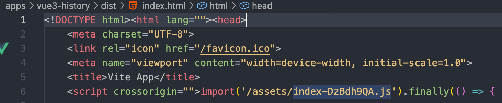

`processDynamicImport` 将其改写为：

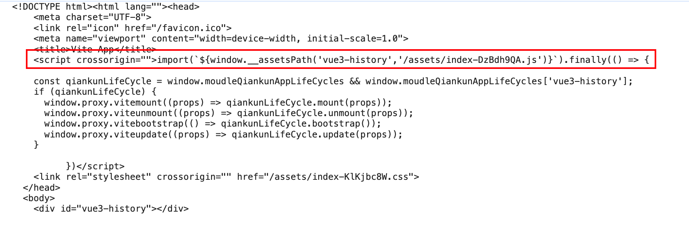

若 `window.__assetsPath` 直接拼接：

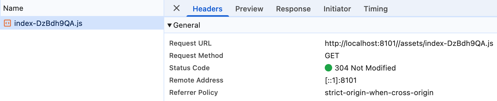

**这会污染 `index-DzBdh9QA.js` 的 `import.meta.url`，进而引发对 `index-DiEL3xZ7.js` 的两次请求。**

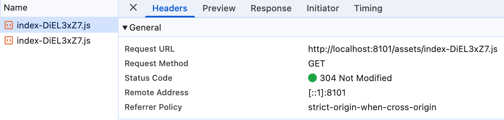
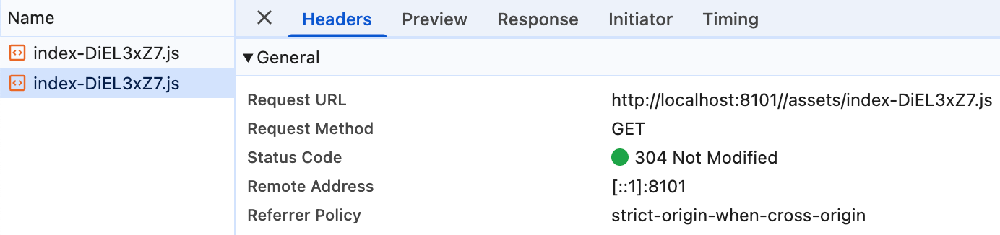

::: warning 双斜杠如何传播并导致两次请求

`index-DzBdh9QA.js` 加载自 `http://localhost:8101//assets/index-DzBdh9QA.js`，它的 `import.meta.url` 也是这个双斜杠地址。该文件内部对 `index-DiEL3xZ7.js` 存在**两条独立的加载路径**，URL 计算基准不同：

**路径一：`__vite__mapDeps` 预加载（单斜杠）**

```js
// __vite__mapDeps 中存的是 window.__assetsPath 的调用结果
window.__assetsPath(“vue3-history”, “assets/index-DiEL3xZ7.js”)
//                                   ↑ 无前导 /，拼接后单斜杠
→ “http://localhost:8101/assets/index-DiEL3xZ7.js”
```

`Hfe` 函数（`function(e,t){ return new URL(e,t).href }`）接收到的是已经是绝对 URL，`new URL(绝对URL, base)` 原样返回，`<link rel=”modulepreload”>` 最终是**单斜杠**地址。

**路径二：动态 `import()` 执行（双斜杠）**

```js
// 构建产物中的相对路径 import
import(“./index-DiEL3xZ7.js”)
// 浏览器以 import.meta.url 为基准解析
new URL(“./index-DiEL3xZ7.js”, “http://localhost:8101//assets/index-DzBdh9QA.js”)
→ “http://localhost:8101//assets/index-DiEL3xZ7.js”  // 继承了双斜杠
```

两个 URL 字符串不同，浏览器视为不同请求，**无法复用预加载缓存**：

| 请求   | 来源                            | URL                                               |
| ------ | ------------------------------- | ------------------------------------------------- |
| 请求 1 | `__vite__mapDeps` modulepreload | `http://localhost:8101/assets/index-DiEL3xZ7.js`  |
| 请求 2 | 动态 `import(“./...”)` 执行     | `http://localhost:8101//assets/index-DiEL3xZ7.js` |

:::

`filename.replace(/^\//, '')` 在拼接前去掉前导 `/`，入口模块加载地址变为单斜杠，`import.meta.url` 恢复正常，双斜杠不再传播：

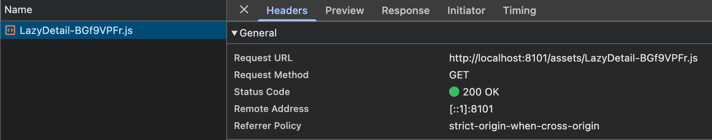

### 主应用：cssFetchInterceptor CSS 路径拦截

通过配置 qiankun 的 `fetch` 钩子，拦截子应用初始 HTML 中静态 `<link rel="stylesheet">` 对应的 CSS 文件请求。qiankun 会将这些 CSS fetch 后内联为 `<style>` 标签，内联后 `url()` / `@import` 中的相对路径会相对主应用页面 URL 解析，导致资源 404。拦截器在 CSS 文本返回前将相对路径改写为绝对路径。

```ts [apps/main-app/src/utils/microApp/cssProcessor.ts]
export const cssFetchInterceptor: typeof window.fetch = (url, ...args) => {
  if (typeof url !== 'string' || !url.endsWith('.css')) {
    return window.fetch(url, ...args) // 非 CSS 请求直接透传
  }

  // 从 CSS 文件 URL 推导资源基路径，无需额外配置
  const base = url.substring(0, url.lastIndexOf('/') + 1)

  return Promise.resolve({
    async text() {
      const res = await window.fetch(url, ...(args as [RequestInit?]))
      let css = await res.text()
      css = replacePathInCSS(css, (path) => {
        if (path.startsWith('data:')) return path // base64 不处理
        return base + path
      })
      return css
    },
  } as unknown as Response)
}
```

`replacePathInCSS` 覆盖 CSS 中所有引用资源的语法形式：

| 模式                              | 示例                   |
| --------------------------------- | ---------------------- |
| `@import '...'` / `@import "..."` | `@import './font.css'` |
| `url('...')` / `url("...")`       | `url('./image.png')`   |
| `url(...)` 无引号                 | `url(./icon.svg)`      |

::: tip 仅拦截 qiankun fetch 的 CSS，不影响异步 chunk
`configuration.fetch` 替换的是 `import-html-entry` 内部调用的 `fetch`，**只作用于 qiankun 主动拉取的资源**（初始 HTML 中静态声明的 `<link>`）。运行时由 `__vitePreload` 通过 DOM API 插入的异步 chunk CSS 不经过此钩子，不受影响。
:::

**为什么“理论上”入口 CSS 不会出现 `url()`（但子应用有例外）**

Vue 组件的样式通过 `<style scoped>` 或 `<style module>` 编写，Vite 在构建时将其提取为 async chunk CSS，与组件代码一同按需加载，**不会进入入口 CSS**。

真正会进入入口 CSS（即被 qiankun fetch 内联的部分）只有全局样式文件，例如：

```ts
// main.ts
import './assets/main.css'
import 'some-ui-library/dist/style.css'
```

在“纯 Vite + 新项目规范”下，这类全局样式通常只包含 CSS 变量、排版重置、主题色等规则，`url()` 出现概率较低。

但在**子应用接入场景**里，下面两类情况很常见，不能按“入口 CSS 无 `url()`”处理：

- 子应用自定义 `iconfont`：例如在全局样式中引入 `iconfont.css`，其中 `@font-face` 通常包含 `url('./iconfont.woff2')`。这会进入入口 CSS，若被 qiankun 内联后不改写路径，字体请求可能相对主应用地址解析。
- 兼容旧系统 webpack 样式：历史项目常见 `style-loader` 或运行时注入 `<style>` 文本（内联 CSS）。这类 CSS 里的 `url()` 同样可能引用相对路径资源，且不一定经过 qiankun 的 `fetch` 钩子。

因此，“理论上不会出现 `url()`”只适用于理想化的新项目默认链路；在微前端落地中应默认按“可能存在 `url()`”做防御。

::: info 为什么仍然保留 cssFetchInterceptor
即便当前项目入口 CSS 不含 `url()`，`cssFetchInterceptor` 作为**低成本兜底**仍然有保留价值：

- 未来引入第三方 UI 库时，其入口 CSS 可能包含字体文件的 `url()` 引用（如 `@font-face`）
- 子应用自定义 `iconfont`、全局背景图等资源路径在 qiankun 内联后可能失去原始解析基准
- 旧 webpack 项目的样式迁移阶段，常出现“部分 CSS 外链、部分 CSS 内联”的混合状态，风险更高

拦截器已有完整实现，注册成本极低（一行配置），可以覆盖“qiankun 通过 `fetch` 拉取并内联”的 CSS 场景，防止新增依赖后出现难以排查的样式 404。  
对于旧 webpack 的运行时内联 `<style>`（不走 `fetch`）场景，则需要在子应用侧额外治理（如统一静态资源前缀、尽量抽离为外链 CSS、或在注入前做文本改写）。
:::

### 主应用：HTML 模板动态 import 处理

通过 qiankun 的 `getTemplate` 钩子处理子应用 HTML 模板，将其中的 `import("./xxx.js")` 替换为调用 `window.__assetsPath` 的模板字符串形式。

```ts [apps/main-app/src/utils/microApp/htmlProcessor.ts]
export const processDynamicImport = (tpl: string, appName: string): string => {
  // 开发环境已配置 server.origin
  if (import.meta.env.DEV) return tpl

  return tpl.replace(
    /import\((["'])([^"']+)(["'])\)/g,
    (_, quote1, url, quote2) =>
      `import(\`\${window.__assetsPath('${appName}',${quote1}${url}${quote2})}\`)`,
  )
}
```

替换效果示例：

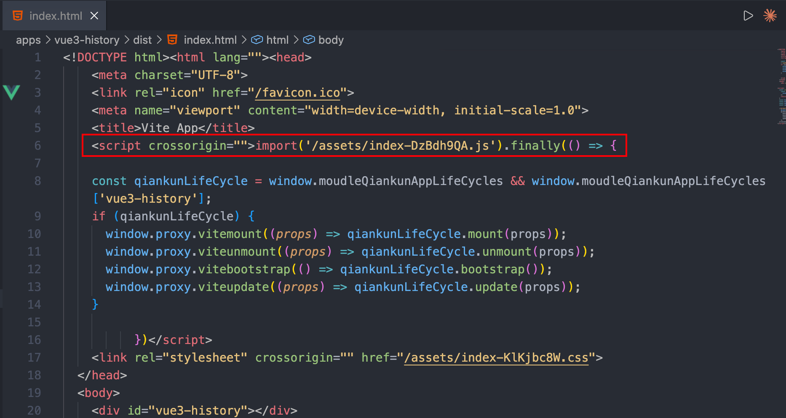


## ❓为什么不需要禁用 build.cssCodeSplit

::: info **过去的误判**：
生产环境中可以观察到子应用的 async chunk CSS 以 `<link>` 形式被插入主应用的 `head`，直觉上容易误判为"样式跑到主应用里了，会污染其他子应用"。

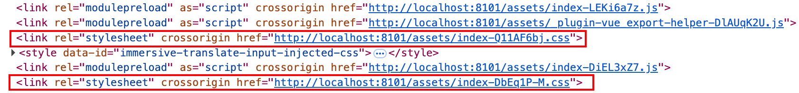

为了规避这个现象，早期配置了 `build.cssCodeSplit: false`，将所有样式合并进入口 CSS，再由 `cssFetchInterceptor` 统一处理路径。**但这个前提判断是错的。**
:::

理解这一点，需要知道 **qiankun 只劫持初始 HTML 中静态声明的资源**：

- `import-html-entry` 解析子应用 HTML 时，将静态 `<link rel="stylesheet">` 通过 `fetch` 钩子拉取并**内联为 `<style>`**，`url()` 路径由此失去原始 origin（需要 `cssFetchInterceptor` 改写）
- `__vitePreload` 在运行时以 `document.createElement + appendChild` 动态插入的 async chunk CSS，**完全绕过 qiankun 的 fetch 钩子**，以原生 `<link>` 加载

| CSS 来源                                                  | 是否经过<br/> qiankun 劫持 | 加载结果                                   | `url()` 解析基准      |
| --------------------------------------------------------- | -------------------------- | ------------------------------------------ | --------------------- |
| HTML 中静态声明的<br/> `<link rel="stylesheet">`          | ✅ 是                      | `import-html-entry` <br/>内联为 `<style>`  | **主应用页面 URL** ❌ |
| Vite 异步 chunk JS/CSS<br/>（`__vitePreload` 运行时注入） | ❌ 否                      | `<link>` / `<script>` <br/>直接插入 `head` | **文件自身 URL** ✅   |

**无法劫持，也不需要处理**，原因在于两点：

1. **正确解析 url() 路径**：async chunk CSS 以 `<link href="绝对URL">` 加载（`href` 由 `renderBuiltUrl` 保证），浏览器对 `<link>` 样式表内 `url()` 相对于 CSS 文件自身 URL 解析，与主应用页面 URL 无关。
2. **样式不会污染**：Vue `<style scoped>` 在编译期为每条规则附加唯一的 `[data-v-xxxxxxxx]` 属性选择器，作用域锁定在组件内部，即使 `<link>` 插入主应用 `head`，规则也不会泄漏到其他组件或子应用。

::: warning 禁用 cssCodeSplit 的实际代价
`cssCodeSplit: false` 把 async chunk CSS 强行塞进入口 `<link>`，使其落入 qiankun 劫持范围，反而制造了本不存在的问题：

- **首屏体积增大**：（入口 CSS 体积暴增）所有页面的样式一次性全量下载，即使大多数路由从未访问
- **抹除 Vite code splitting 的收益**：async chunk 的按需加载优势完全消失
- **与 cssFetchInterceptor 强耦合**：CSS 合并进入口后必须依赖拦截器改写路径，两者绑定在一起，任一失效均会导致样式资源 404
  :::

## ❓子应用卸载后 link 标签残留

子应用 unmount 后，主应用 `head` 中会保留 `__vitePreload` 运行时插入的 `<link>` 标签：

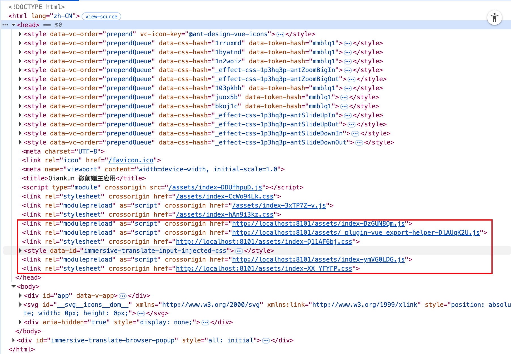

**为什么 qiankun 无法移除它们**

qiankun 沙箱的职责范围是 **JS 全局变量隔离**（window proxy）和 **`<style>` 标签的生命周期管理**（由 qiankun 自身注入的样式）。对于子应用代码在运行时通过 `document.head.appendChild` 插入的 `<link>` 元素，qiankun 不做追踪，unmount 时也不会清理。

**为什么残留没有影响**

| 标签                         | 残留影响                                                                                                                                    |
| ---------------------------- | ------------------------------------------------------------------------------------------------------------------------------------------- |
| `<link rel="modulepreload">` | 仅是浏览器预加载提示，不执行代码、不挂载组件，留在 `head` 完全惰性                                                                          |
| `<link rel="stylesheet">`    | CSS 规则全部带有 `[data-v-xxxxxxxx]` scoped 选择器，只匹配携带该属性的元素；子应用卸载后对应 DOM 节点已移除，CSS 规则无匹配目标，实际不生效 |

两类标签的 `href` 均为内容寻址的哈希文件名，若子应用再次挂载，浏览器直接命中缓存，不会产生额外网络请求。

## ❓Dev 环境 style 插入主应用 head（无需处理）

开发环境（`vite dev`）下，样式由 Vite HMR 客户端以 `<style data-vite-dev-id="...">` 的形式动态注入 `document.head`。在 qiankun 场景中看到 style 节点出现在主应用 `head`，属于 **Vite 的预期行为**，不是异常。

<div style="display: grid; grid-template-columns: 0.63fr 0.36fr; gap: 16px; align-items: start;">
  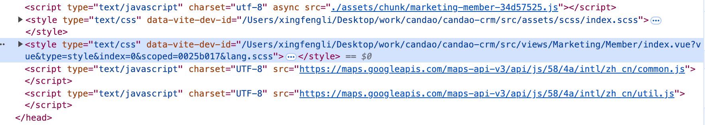
  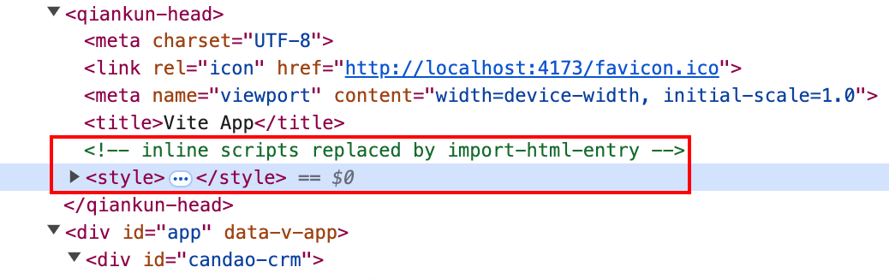
</div>

当前项目不需要对该现象做额外处理，原因是：

1. **仅发生在开发环境**：生产构建不会走这套 HMR 注入机制，线上行为由构建产物的 `<link>` / `chunk` 加载机制决定。
2. **路径不受影响**：开发环境已通过 `server.origin` 提供正确资源来源；生产环境由 `renderBuiltUrl + window.__assetsPath` 兜底，关注点是资源 URL 正确性，而不是 style 节点位于哪个 `head`。
3. **样式污染风险可控**：业务样式以 Vue `scoped` 为主，规则带 `[data-v-xxxx]` 作用域；即使 style 节点位于主应用 `head`，也不会无边界扩散到其他子应用。

::: tip 什么时候才需要处理
只有在开发环境已经出现“可复现的样式串扰或覆盖”时，才需要针对具体样式来源做治理（例如全局 reset、第三方库全局样式），而不是因为“style 出现在主应用 head”这个现象本身去改加载机制。
:::

## 相关链接

- [Vite renderBuiltUrl](https://cn.vitejs.dev/guide/build#advanced-base-options)
- [Vite build.modulePreload](https://cn.vitejs.dev/config/build-options#build-modulepreload)
- [qiankun loadMicroApp — FrameworkConfiguration](https://qiankun.umijs.org/zh/api#loadmicroappapp-configuration)
- [import-html-entry fetch 钩子](https://github.com/kuitos/import-html-entry)
- [vite-plugin-qiankun：生产环境动态替换资源路径支持](https://github.com/tengmaoqing/vite-plugin-qiankun/issues/16)
- [qiankun issue：请求自动转换 CSS 中相对路径为完整链接](https://github.com/umijs/qiankun/issues/2014#issuecomment-1085552127)
- [qiankun issue：希望提供 CSS 后处理参数处理相对路径](https://github.com/umijs/qiankun/issues/981#issuecomment-714218539)
- [qiankun issue：子应用 CSS url() 相对路径加载失败](https://github.com/umijs/qiankun/issues/808#issuecomment-692652178)
