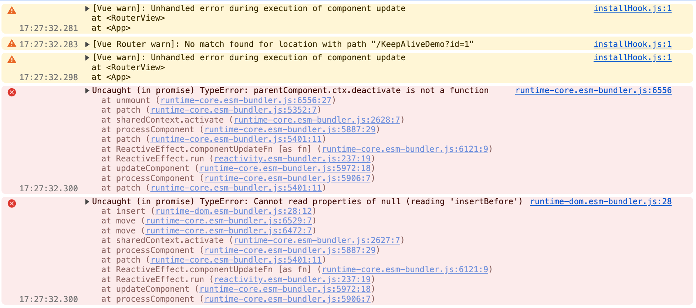

<script setup>
import keepAliveDefinitionUsageFlowXml from './drawio/keep-alive-definition-usage-flow.drawio?raw'
import keepAliveListeningLifecycleXml from './drawio/keep-alive-listening-lifecycle-break.drawio?raw'
import keepAliveBlankTransitionCycleXml from './drawio/keep-alive-blank-transition-cycle.drawio?raw'
</script>

# 子应用 KeepAlive 缓存机制

本文说明微前端场景下子应用页面缓存的实现原理。

## 背景：Vue KeepAlive 的原生限制

Vue 的 `<KeepAlive>` 组件以**组件名**（`component.name`）作为缓存 key。这意味着，同一个路由组件无论以什么 query 参数被访问，在 Vue 看来都是同一个组件——`/KeepAliveDemo?id=1` 与 `/KeepAliveDemo?id=2` 只会共用一个缓存实例，而不是各自独立缓存。

这在多页签场景下会导致两类问题：

- **状态串扰**：用户在页签 A 填写了表单（`?id=1`），再打开页签 B（`?id=2`），两个页签共用同一份组件状态，切回 A 时看到的其实是 B 最后一次修改后的内容
- **无法精确清理**：关闭某个页签时，`<KeepAlive :include>` 只能按组件名 `KeepAliveDemo` 整体控制，无法只清理某一个 `fullPath` 对应的缓存实例

::: details 复现这个限制

```vue [apps/vue3-history/src/App.vue]
<RouterView v-slot="{ Component }">
  <KeepAlive>
    <component :is="Component" />
  </KeepAlive>
</RouterView>
```

那么 `/KeepAliveDemo?id=1` 和 `/KeepAliveDemo?id=2` 虽然 URL 不同，但在 Vue 看来仍然都是同一个 `KeepAliveDemo` 组件，结果不是"各自缓存一份"，而是**共用同一个组件实例**。

当前 demo 就是直接把 `apps/vue3-history/src/App.vue` 改成了上面这段写法。实际访问 `http://localhost:8100/vue3-history/KeepAliveDemo` 后，按页面上的"进入案例 A / B"做操作，可以稳定复现下面的现象：

- 先进入案例 A（`/KeepAliveDemo?id=1`）并输入"案例 A 草稿"
- 再切到案例 B（`/KeepAliveDemo?id=2`）时，输入框会直接带出 A 的内容
- 在 B 中改成"案例 B 草稿"后再回 A，A 里看到的也会变成 B 的最新内容
- 页面上的 `sessionId` 始终不变，日志里只会看到 `id=1 -> id=2 -> id=1` 的路由切换，没有出现新的页面实例
  :::

## 解决思路：Wrapper 组件 + fullPath 缓存 key

`useKeepAlive` 的核心思路来源于 [Vue 社区的一个方案](https://github.com/vuejs/core/pull/4339#issuecomment-1238984279)：

在渲染时将实际组件包裹进一个以 `route.fullPath` 命名的 wrapper 函数组件。`<KeepAlive :include>` 维护所有已打开 tab 的 fullPath 列表，每个页面按自己的 fullPath 独立缓存，互不干扰。

::: info 关于 `fullPath` 的两种视角
这套机制里，页面身份的传递与定位始终围绕 `fullPath` 展开，但主应用和子应用看到的 `fullPath` 并不在同一个坐标系。

**两种视角对比**

| 视角   | 路由基准                                           | 示例                               |
| ------ | -------------------------------------------------- | ---------------------------------- |
| 主应用 | 以站点根 `/` 为基准，带 `activeRule` 前缀          | `/vue3-history/KeepAliveDemo?id=1` |
| 子应用 | 以 `createWebHistory(activeRule)` 的 `base` 为基准 | `/KeepAliveDemo?id=1`              |

**边界转换**

跨应用通信时，坐标转换均在子应用侧完成：

| 方向                                                  | 转换方式                                                         |
| ----------------------------------------------------- | ---------------------------------------------------------------- |
| 子应用（通知） → 主应用（关闭 tab）                   | `router.resolve(fullPath).href`<br/>子应用将本地路径转为宿主路径 |
| 主应用（移除 tab 后） → 子应用（清理 KeepAlive 缓存） | `stripActiveRule(fullPath, activeRule)`<br/>子应用还原为本地路径 |

**统一标识**

除上述边界转换外，整条链路都以 `fullPath` 作为页面的唯一标识：

- 主应用 `tabBar.tabs` 的 key → 详见[标签栏状态管理 · addTab](./tab-bar-store#addtab)
- 运行时事件 `payload.fullPath` → 详见[应用间的通信 · Tab 管理通信](./runtime-events#tab-管理通信)
- 子应用 `tabSet` / `wrapperMap` 的 key → 详见本文 [useKeepAlive 实现](#usekeepalive-实现)
  :::

## useKeepAlive 实现

### tabSet 与 include

所有已打开 tab 的 fullPath 存入 `tabSet`，`include` 直接派生自它。

```ts [packages/bridge-vue/src/hooks/useKeepAlive.ts]
/** 当前已打开的 tab 的 fullPath 集合，驱动 KeepAlive include */
const tabSet = ref(new Set<string>())

/** 传给 `<KeepAlive :include>` 的缓存名列表 */
const include = computed(() => Array.from(tabSet.value))

watch(
  () => route.fullPath,
  (fullPath) => {
    if (!matchActiveRule(microAppContext?.activeRule)) return // [!code focus]
    if (!route.name) return // [!code focus]
    if (tabSet.value.has(fullPath)) return
    tabSet.value.add(fullPath)
  },
  { immediate: true },
)
```

watch 中有两层守卫：

- `matchActiveRule`：当前子应用未激活时（URL 前缀不匹配）直接跳过，防止其他子应用的路由变化写入本应用的缓存
- `!route.name`：URL 不属于本子应用时 vue-router 无法匹配路由，`route.name` 为 `undefined`，作为第二层兜底防止脏数据写入

### Wrapper 组件封装

`wrapperMap` 以 `fullPath` 为 key 缓存 wrapper 对象，确保同一路径复用同一个 wrapper 实例，避免每次渲染都创建新对象而导致缓存失效：

```ts [packages/bridge-vue/src/hooks/useKeepAlive.ts]
const wrapKeepAliveComponent = (component: VNode | null | undefined) => {
  // 没有组件名的不需要缓存
  if (!component || !(component.type as { name?: string }).name) {
    return component
  }

  const wrapperName = route.fullPath
  let wrapper = wrapperMap.get(wrapperName)
  if (!wrapper) {
    wrapper = {
      name: wrapperName,
      render() {
        return component
      },
    }
    wrapperMap.set(wrapperName, wrapper)
  }
  return h(wrapper)
}
```

::: warning 为什么要用 wrapperMap 而不是直接修改组件 name？
直接修改 VNode 上的 `type.name` 会污染组件定义对象（所有实例共享），导致副作用。`wrapperMap` 通过创建独立的匿名 wrapper 组件绕开了这个问题。
:::

## 定义与使用总流程图

<ClientOnly>
  <DrawioViewer :data="keepAliveDefinitionUsageFlowXml" />
</ClientOnly>

## 为什么不能使用 router.listening

[`router.listening`](https://router.vuejs.org/zh/api/interfaces/Router.html#Properties-listening) 是 Vue Router 提供给微前端场景的低级 API，设为 `false` 后 router 停止响应浏览器 history 事件，`route` 不再更新。微前端中常用它隔离非激活子应用的路由干扰——只让当前激活子应用的 router 响应 URL 变化。

然而这个"隔离"会破坏 KeepAlive 的生命周期。

### 跨系统切换时 KeepAlive 生命周期无法触发

`onDeactivated` / `onActivated` 依赖 RouterView 的组件切换，RouterView 的组件切换依赖 `route` 响应式对象更新。一旦 `router.listening = false`，`route` 被冻结，RouterView 不再切换组件，KeepAlive 的 deactivate/activate 周期就此中断：

<ClientOnly>
  <DrawioViewer :data="keepAliveListeningLifecycleXml" />
</ClientOnly>

| 场景               | 期望触发                        | 实际触发  |
| ------------------ | ------------------------------- | --------- |
| 子应用内部页面跳转 | `onDeactivated` → `onActivated` | ✅ 正常   |
| 切换到其他子应用   | `onDeactivated`                 | ❌ 不触发 |
| 切回当前子应用     | `onActivated`                   | ❌ 不触发 |

依赖 `onActivated` 做数据刷新、依赖 `onDeactivated` 保存草稿的逻辑在跨系统切换后全部失效，表现与没有 KeepAlive 完全相同。

### 本项目的处理方式：保留 listening 并利用"空白跳转"

本项目**不使用** `router.listening = false`，让所有子应用的 router 始终保持监听，路由干扰通过 `beforeEach` 守卫过滤：

```ts [packages/bridge-vue/src/router/dynamicRouteGuard.ts]
router.beforeEach((to) => {
  // 当前 URL 不属于本应用，直接放行无需注册
  if (!matchActiveRule(activeRule)) return
  // ...
})
```

切换到其他子应用时，本子应用的 router 仍响应 URL 变化，但新 URL 匹配不到任何路由，`RouterView` 的 `Component` 变为 `undefined`——页面短暂变为空白（用户不可见，qiankun 此时已隐藏容器）。这次"空白跳转"是 KeepAlive 正常工作的关键：

<ClientOnly>
  <DrawioViewer :data="keepAliveBlankTransitionCycleXml" />
</ClientOnly>

组件从"有"变"无"再变"有"，KeepAlive 完成完整的 deactivate → activate 周期。若用 `router.listening = false` 阻止了这次**空白**跳转，组件会一直停留在渲染状态，KeepAlive 反而**不会**触发这两个钩子。

## 附录：按参数类型精细控制缓存 key 的旧方案

当前实现对所有路由统一使用 `fullPath` 作为 wrapper 名，是最简单也最可靠的方案。

如果业务上需要区分"有 query/params 的路由用 fullPath 缓存，无参数的路由用路由名缓存（与 Vue 原生行为一致）"，可以使用以下旧方案。

### shouldWrapByFullPath

判断路由是否需要按 fullPath 独立缓存，取决于它是否携带 query 参数或动态 path 参数：

```ts
/** 是否需要按 fullPath 独立缓存实例 */
const shouldWrapByFullPath = ({
  query,
  params,
}: Pick<RouteLocationNormalized, 'query' | 'params'>) => {
  // /list?page=2（query）
  // /order/123（动态参数 /o/:orderId）
  return Object.keys({ ...query, ...params }).length > 0
}
```

| 情形               | 缓存 key                               | 说明                       |
| ------------------ | -------------------------------------- | -------------------------- |
| 无 query 无 params | 路由 `name`（如 `KeepAliveDemo`）      | 与 Vue 原生行为一致        |
| 有 query 参数      | `fullPath`（如 `/KeepAliveDemo?id=1`） | 每个 query 组合独立缓存    |
| 有动态 path 参数   | `fullPath`（如 `/order/123`）          | 每个参数值对应独立缓存实例 |

### tabMetaMap

```ts
type TabMeta = {
  /** KeepAlive include 使用的名称 */
  cacheName: string | undefined
  /** 是否需要用 wrapper 包装（有 query 参数时为 true） */
  shouldWrap: boolean
}

const tabMetaMap = ref(new Map<string, TabMeta>())

const include = computed(() =>
  Array.from(
    new Set(
      [...tabMetaMap.value.values()]
        .map(({ cacheName }) => cacheName)
        .filter(Boolean),
    ),
  ),
)

watch(
  () => route.fullPath,
  (fullPath) => {
    if (!route.name || tabMetaMap.value.has(fullPath)) return
    const routeLocation = router.resolve(fullPath)
    const shouldWrap = shouldWrapByFullPath(routeLocation)
    const cacheName = shouldWrap
      ? fullPath
      : typeof routeLocation.name === 'string'
        ? routeLocation.name
        : undefined
    tabMetaMap.value.set(fullPath, { cacheName, shouldWrap })
  },
  { immediate: true },
)
```

### wrapKeepAliveComponent

```ts
const wrapKeepAliveComponent = (component: VNode | null | undefined) => {
  if (!component || !(component.type as { name?: string }).name)
    return component

  const meta = tabMetaMap.value.get(route.fullPath)
  if (!meta?.shouldWrap) return component

  const wrapperName = route.fullPath
  let wrapper = wrapperMap.get(wrapperName)
  if (!wrapper) {
    wrapper = {
      name: wrapperName,
      render() {
        return component
      },
    }
    wrapperMap.set(wrapperName, wrapper)
  }
  return h(wrapper)
}
```

### BUGFIX：关闭当前激活页时 KeepAlive 卸载时序冲突

使用旧方案时，存在一个与 `shouldWrap` 逻辑相关的时序 bug。

复现路径（`apps/vue3-history/src/views/KeepAliveDemo/index.vue`）：

1. 进入 `/vue3-history/KeepAliveDemo`
2. 点击"进入顺序 A"，切到 `/KeepAliveDemo?id=1&type=coupon`
3. 点击"请求关闭当前 Tab"
4. 主应用关闭该 tab，跳回 `/vue3-history/KeepAliveDemo`

**表现**：控制台出现以下报错，内容区直接空白：



#### 原因分析

这是一个跨层时序问题。主应用的 `tabBar.removeTab` 先触发 `router.push(target)`，随后几乎同步地 `emitTabRemove({ fullPath })`，但两者作用于不同的层：

- `emitTabRemove` 立即到达子应用
- `router.push` 的变化需经过 qiankun → 浏览器 history 事件 → 子应用 router 三层传递，是异步的

结果是子应用收到 `TAB_REMOVE` 时，`route.fullPath` 往往还停留在被关闭的路径上。若此时直接执行 `cleanupTab(fullPath)`，`tabMetaMap.delete(fullPath)` 同步触发 `include` 重算，KeepAlive 立即尝试卸载 wrapper——而此时目标页（`/KeepAliveDemo`）与被关闭页（`/KeepAliveDemo?id=1&type=coupon`）是**同一个底层组件**，KeepAlive 正处于"卸载 wrapper 实例 + 激活原始实例"的中间状态，引发冲突：

```
Unhandled error during execution of component update
parentComponent.ctx.deactivate is not a function
Cannot read properties of null (reading 'insertBefore')
```

> 若跳回完全不同的组件，渲染上下文已切换，KeepAlive 不会产生同实例冲突，此报错不会出现。

`await router.push(target)` 也无法修复这个问题——它只保证了主应用侧的导航 Promise 完成，无法保证子应用的 `route.fullPath` 已更新。真正可靠的判断条件是"子应用是否已经离开这个 `fullPath`"。

#### 修复方式

清理动作延后到安全时机。在关闭当前激活页时不立即清理，而是通过 `watch(() => route.fullPath, { once: true })` 等子应用路由真正切走后再执行 `cleanupTab(fullPath)`：

<!-- prettier-ignore -->
```ts
const cleanupTab = (fullPath: string) => {
  tabMetaMap.value.delete(fullPath)
  wrapperMap.delete(fullPath)
}

const removeTab = (fullPath: string) => {
  if (fullPath === route.fullPath) { // [!code focus]
    watch( // [!code focus]
      () => route.fullPath, // [!code focus]
      () => cleanupTab(fullPath), // [!code focus]
      { once: true }, // [!code focus]
    ) // [!code focus]
    return // [!code focus]
  } // [!code focus]

  cleanupTab(fullPath)
}
```

::: info 新方案为何不再需要此修复
当前实现所有路由都用 `fullPath` 包 wrapper，`/KeepAliveDemo` 和 `/KeepAliveDemo?id=1&type=coupon` 对应的是**两个不同的 wrapper 组件**，KeepAlive 将它们视为不同组件，切换时不会产生"同实例冲突"，因此无需延迟清理。
:::
