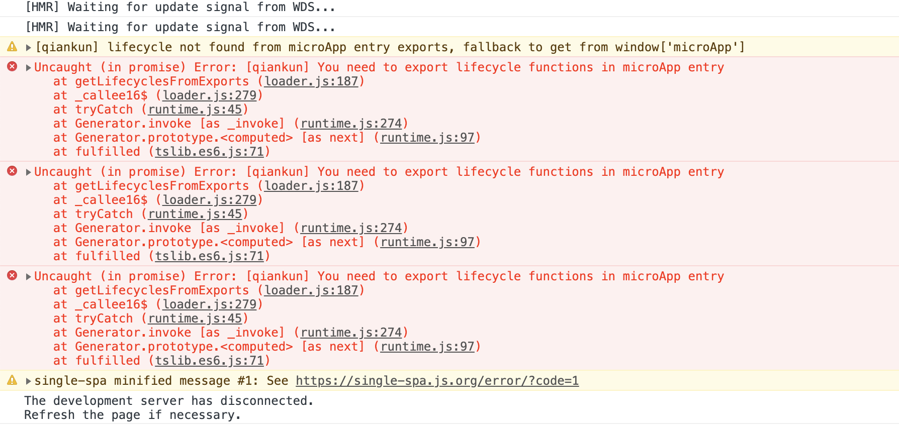
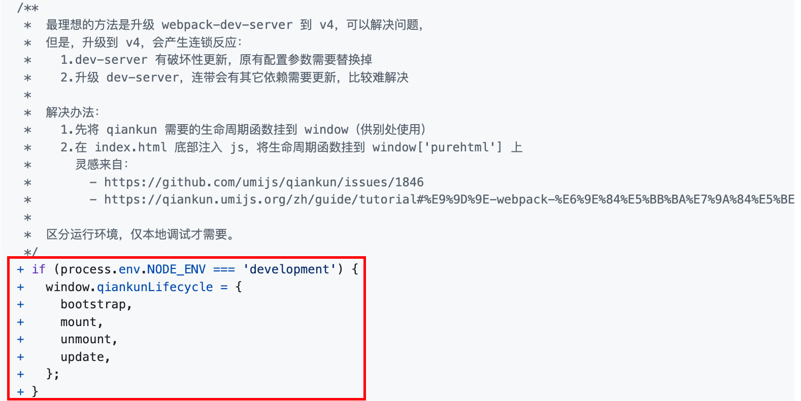
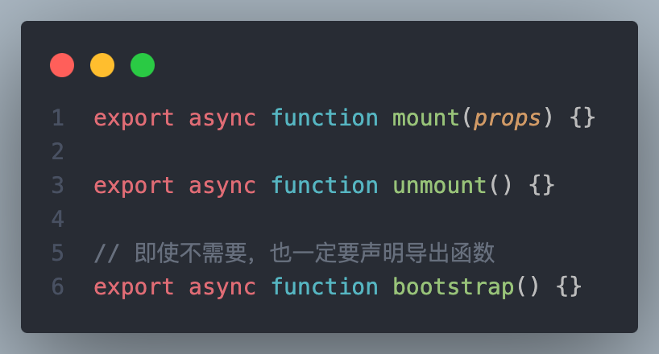
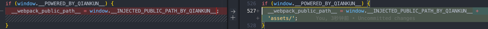
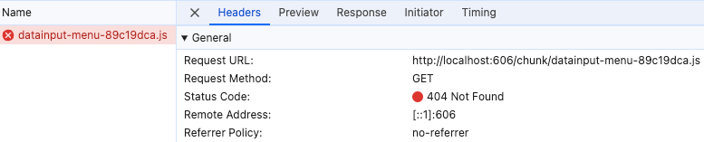
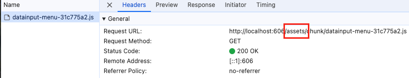
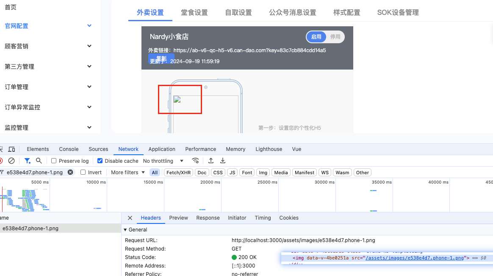
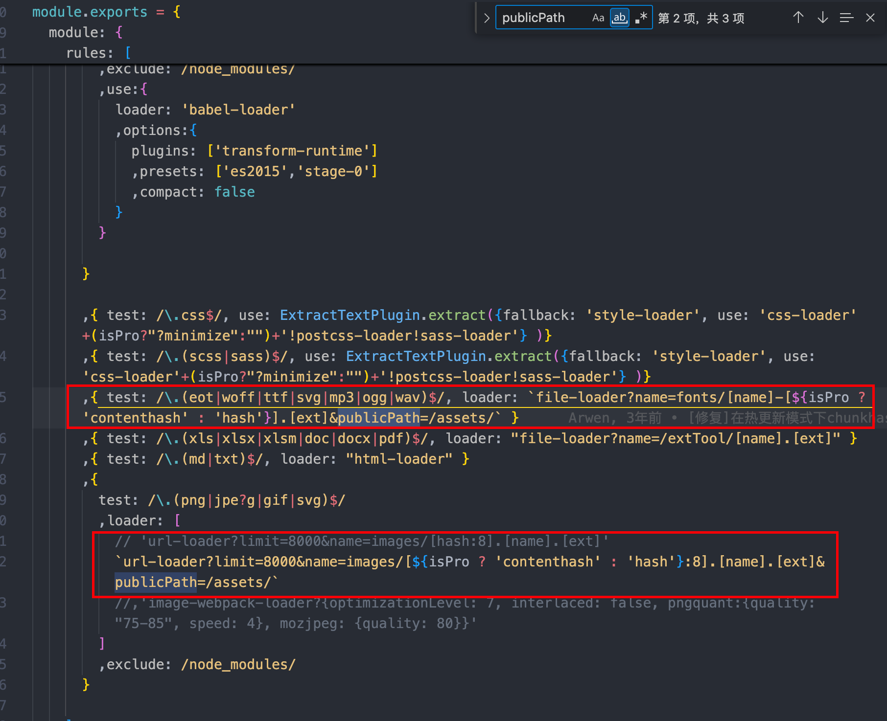

# OCRM 接入问题排查

本文不是泛泛整理 qiankun 常见坑，而是结合 OCRM 这套 **Webpack + Vue2** 微前端接入链路，复盘 3 类真实出现过的问题：

- `Application died in status LOADING_SOURCE_CODE`
- `js` 加载时路径丢失
- 静态资源 `404`

对应的关键配置文件如下：

- 构建脚本：[build-qiankun.js](/Users/xingfengli/Desktop/work/candao/core/core-build-local/scripts/build-qiankun.js)
- Webpack 初始化配置：[webpack.init.js](/Users/xingfengli/Desktop/work/candao/core/core-build-local/scripts/webpack.init.js)
- OCRM 子应用入口：[config.js](/Users/xingfengli/Desktop/work/candao/core/core-fooms/projects/candao-ocrm/index/config.js)

## 这套构建链路实际做了什么

在 OCRM 的 qiankun 构建模式下，关键不是“额外写几行生命周期”，而是同时满足了下面 3 个条件：

1. 产物被打成 **UMD 微应用**，而不是普通单页应用脚本。
2. 入口文件真正导出了 `bootstrap / mount / unmount`。
3. 运行时通过 `__webpack_public_path__` 把资源基地址切到 qiankun 注入的子应用 entry 上。

这 3 个条件分别落在这几处代码：

```js [/Users/xingfengli/Desktop/work/candao/core/core-build-local/scripts/build-qiankun.js]
const config = merge(webpackConfig, {
  output: {
    library: 'ocrm',
    libraryTarget: 'umd',
    jsonpFunction: `webpackJsonp_ocrm`,
  },
})
```

```js [/Users/xingfengli/Desktop/work/candao/core/core-build-local/scripts/webpack.init.js]
output: {
  filename: `[name]-[hash:8].js`,
  chunkFilename: `chunk/[name]-[hash:8].js`,
  publicPath:'./assets/',
},
```

```js [/Users/xingfengli/Desktop/work/candao/core/core-fooms/projects/candao-ocrm/index/config.js]
if (window.__POWERED_BY_QIANKUN__) {
  __webpack_public_path__ =
    window.__INJECTED_PUBLIC_PATH_BY_QIANKUN__ + 'assets/'
}

export async function mount(props) {
  window.__microAppProps = props
  renderApp(props)
}

export function unmount() {
  vm.$destroy()
  vm = null
}

export async function bootstrap() {}
```

理解了这一点，下面 3 个问题就不再是孤立问题，而是一条链路上的不同故障表现。

## Application died in status LOADING_SOURCE_CODE

完整报错通常是：

```txt
Application died in status LOADING_SOURCE_CODE: You need to export the functional lifecycles in xxx entry
```

### 现象

子应用资源已经开始加载，但在 `LOADING_SOURCE_CODE` 阶段直接失败，qiankun 提示入口文件没有导出生命周期函数。





### 在 OCRM 里的真实根因

对这套 Webpack Vue2 子应用来说，单纯“页面能启动”并不够。qiankun 实际要求的是：

1. 构建产物要以 **UMD library** 形式暴露出来。
2. 入口模块要真的导出生命周期函数。

也就是说，这个报错在 OCRM 里通常意味着以下两类问题之一：

- 走错了构建链路，没有使用 `build-qiankun.js` 注入 `library / libraryTarget / jsonpFunction`。
- 入口文件没有按 qiankun 约定导出 `bootstrap / mount / unmount`，或者实际入口并不是 [config.js](/Users/xingfengli/Desktop/work/candao/core/core-fooms/projects/candao-ocrm/index/config.js:698) 这一份。

当前代码里，这两部分都已经补齐：

- [build-qiankun.js](/Users/xingfengli/Desktop/work/candao/core/core-build-local/scripts/build-qiankun.js:6) 将产物声明为 `library: 'ocrm'`、`libraryTarget: 'umd'`
- [config.js](/Users/xingfengli/Desktop/work/candao/core/core-fooms/projects/candao-ocrm/index/config.js:706) 明确导出了 `mount`
- [config.js](/Users/xingfengli/Desktop/work/candao/core/core-fooms/projects/candao-ocrm/index/config.js:791) 明确导出了 `unmount`
- [config.js](/Users/xingfengli/Desktop/work/candao/core/core-fooms/projects/candao-ocrm/index/config.js:797) 明确导出了 `bootstrap`

### 修复结论

在这套项目里，遇到 `LOADING_SOURCE_CODE` 时不要先怀疑业务代码，优先检查这两件事：

1. 是否使用了 qiankun 专用构建脚本，而不是普通构建脚本。
2. 最终被加载的入口文件里，是否真的导出了 3 个生命周期函数。

Feishu 里的结论“配置完整的生命周期”放到 OCRM 场景里，可以具体理解为：



- UMD 暴露方式正确
- 生命周期导出完整
- `mount` 里使用 `props.container` 挂载，而不是始终挂到全局 `#app`

### 参考链接

- [qiankun FAQ: Application died in status LOADING_SOURCE_CODE](https://qiankun.umijs.org/zh/faq#application-died-in-status-loading_source_code-you-need-to-export-the-functional-lifecycles-in-xxx-entry)
- [qiankun issue #1092](https://github.com/umijs/qiankun/issues/1092#issuecomment-1109673224)

## JS 加载时路径丢失

### 现象

子应用脚本已经发起加载，但请求 URL 缺少预期的子应用前缀，最终落到了错误的地址。



<div style="display: grid; grid-template-columns: 1fr 1fr; gap: 16px; align-items: start;">
  
  
</div>

### 在 OCRM 里的真实根因

OCRM 的 Webpack 默认配置在 [webpack.init.js](/Users/xingfengli/Desktop/work/candao/core/core-build-local/scripts/webpack.init.js:12) 里是：

```js
output: {
  filename: `[name]-[hash:8].js`,
  chunkFilename: `chunk/[name]-[hash:8].js`,
  publicPath:'./assets/',
},
```

这说明普通构建下，chunk 地址默认是**相对路径**。当子应用独立运行时，这没问题；但进入 qiankun 后，HTML 和脚本是在主应用上下文里执行的，`./assets/` 的解析基准就可能跑到主应用页面上，导致异步 chunk、JSONP chunk 或运行时依赖请求全部偏到错误域名。

OCRM 当前的修复不是改 HTML，而是在入口最早阶段重写 Webpack 运行时的资源基地址：

```js [/Users/xingfengli/Desktop/work/candao/core/core-fooms/projects/candao-ocrm/index/config.js]
if (window.__POWERED_BY_QIANKUN__) {
  __webpack_public_path__ =
    window.__INJECTED_PUBLIC_PATH_BY_QIANKUN__ + 'assets/'
}
```

这行代码的作用是把原本的 `./assets/` 改成“qiankun 注入的 entry 地址 + assets/”，从而让后续 JS chunk 都相对子应用自身部署地址加载，而不是相对主应用页面加载。

### 修复结论

对 OCRM 这套 Webpack Vue2 子应用来说，`js` 路径丢失的关键不是 Vite 那种 `renderBuiltUrl`，而是：

1. 保留 Webpack 的 chunk 切分能力。
2. 在 qiankun 环境下注入正确的 `__webpack_public_path__`。
3. 确保这段注入逻辑发生在任何异步 chunk 请求之前。

如果这段逻辑丢了，或者执行时机晚了，症状通常就是 Feishu 截图里这种“脚本开始加载，但地址前缀不对”。

### 参考链接

- [umi issue #11388](https://github.com/umijs/umi/issues/11388)
- [umi issue #11340](https://github.com/umijs/umi/issues/11340)
- [参考文章](https://www.jianshu.com/p/c880b59823a6)

## 资源 404

### 现象

子应用进入 qiankun 后，图片、字体或其他静态资源返回 404。

<div style="display: grid; grid-template-columns: 0.4fr 0.6fr; gap: 16px; align-items: start;">
  
  
</div>

### 在 OCRM 里的真实根因

这个问题在 OCRM 里比“JS 路径丢失”更具体，因为 `webpack.init.js` 对图片和字体单独写死了 loader 级别的 `publicPath`：

```js [/Users/xingfengli/Desktop/work/candao/core/core-build-local/scripts/webpack.init.js]
{ test: /\.(eot|woff|ttf|svg|mp3|ogg|wav)$/, loader: `file-loader?name=fonts/[name]-[${isPro ? 'contenthash' : 'hash'}].[ext]&publicPath=/assets/` }

{
  test: /\.(png|jpe?g|gif|svg)$/,
  loader: [
    `url-loader?limit=8000&name=images/[${isPro ? 'contenthash' : 'hash'}:8].[name].[ext]&publicPath=/assets/`
  ]
}
```

这里的 `&publicPath=/assets/` 会把资源地址直接写成根路径 `/assets/...`。独立部署时它可能还能工作，但一旦嵌进 qiankun，这个 `/assets/...` 就会指向**主应用域名**的根目录，而不是 OCRM 子应用自己的资源目录，于是就出现 404。

OCRM 的 qiankun 构建脚本专门做了一个修补动作：把 loader 里的硬编码 `&publicPath=/assets/` 去掉。

```js [/Users/xingfengli/Desktop/work/candao/core/core-build-local/scripts/build-qiankun.js]
config.module.rules.map((item) => {
  if (item.loader) {
    if (typeof item.loader === 'string') {
      item.loader = item.loader.replace(/&publicPath=\/assets\//, '')
    } else if (Array.isArray(item.loader)) {
      item.loader = item.loader.map((loader) => {
        return loader.replace(/&publicPath=\/assets\//, '')
      })
    }
  }
  return item
})
```

去掉之后，图片和字体资源就不再强制写死到 `/assets/`，而是回到 Webpack 全局 `publicPath` 体系里，再由 `__webpack_public_path__` 在 qiankun 运行时统一接管。

### 修复结论

OCRM 里的资源 404 实际上是两层问题叠加：

1. Webpack 全局 `publicPath` 需要在 qiankun 环境下动态切换。
2. `file-loader` / `url-loader` 不能再额外写死 `/assets/`。

也就是说，单独保留 `__webpack_public_path__` 还不够；如果 loader 级别还在强行输出 `/assets/...`，图片和字体依旧会 404。这也是为什么 OCRM 要同时保留：

- [config.js](/Users/xingfengli/Desktop/work/candao/core/core-fooms/projects/candao-ocrm/index/config.js:698) 的 `__webpack_public_path__` 注入
- [build-qiankun.js](/Users/xingfengli/Desktop/work/candao/core/core-build-local/scripts/build-qiankun.js:14) 对 loader `publicPath` 的删除

### 参考链接

- [qiankun issue #619](https://github.com/umijs/qiankun/issues/619#issuecomment-643881530)
