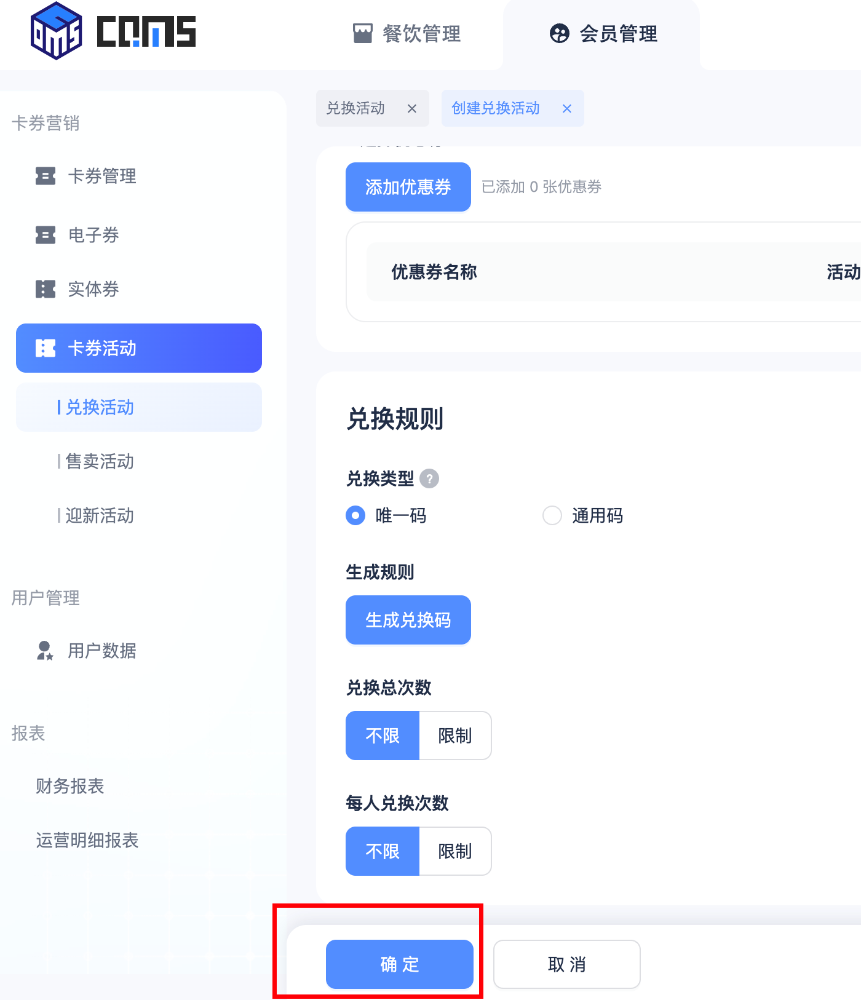
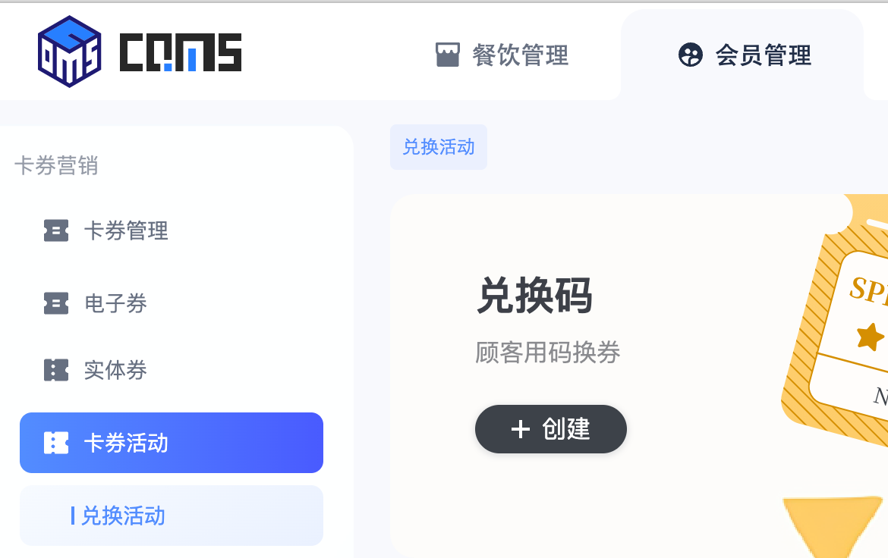

<script setup>
import runtimeEventsCompleteFlowXml from './drawio/runtime-events-complete-flow.drawio?raw'
</script>

# 应用间的通信

在 qiankun 微前端架构中，主应用与子应用运行在同一个浏览器标签页，共享同一个 `window` 对象。本项目利用这一特性，通过挂载在 `window` 上的单例对象建立了一条轻量的事件总线，实现双向通信。

## 通信基础设施

### 全局单例

事件总线的核心挂载在 `window.QiankunRuntime.channel` 上，主子应用均可直接访问；详见 [QiankunRuntime](./runtime.md#qiankunruntime)。

```ts [packages/runtime/src/QiankunRuntime.ts]
import { EventEmitter2 } from 'eventemitter2'

export class QiankunRuntime {
  public channel = new EventEmitter2()
}
```

`channel` 是一个 [EventEmitter2](https://github.com/EventEmitter2/EventEmitter2) 实例。主子应用通过它相互监听和发出事件。

### 事件约定

主子应用的事件名与 Payload 定义统一收敛在 `packages/runtime/src/events.ts` 中：

- 集中定义事件名常量及其对应的 Payload 类型；
- 主应用和子应用都只依赖这份共享定义，而不直接依赖彼此实现。

```ts [packages/runtime/src/events.ts]
export const RUNTIME_EVENTS = {
  /** 子应用请求主应用关闭 tab */
  TAB_REMOVE_REQUEST: 'tab:remove:request',
  /** 主应用关闭 tab 时通知子应用清除 KeepAlive 缓存 */
  TAB_REMOVE: 'tab:remove',
} as const

export interface TabRemoveRequestPayload {
  fullPath: string
  /** 关闭后跳转到该 tab 的来源页（由主应用 addTab 时记录） */
  goToSource?: boolean
}

export interface TabRemovePayload {
  fullPath: string
}
```

## Tab 管理通信

Tab 管理是目前唯一的通信场景，由子应用发起请求、主应用响应并反向通知。

### 完整通信流程

<ClientOnly>
  <DrawioViewer :data="runtimeEventsCompleteFlowXml" />
</ClientOnly>

### 主应用

- 主应用在 `App.vue` 启动时调用 `setupRuntimeChannels()` 注册监听。
- `removeTab()` 在删除 tab 后，会调用 `emitTabRemove()` 通知子应用清理对应页面的 KeepAlive 缓存。详见 [标签栏状态管理](./tab-bar-store.md#removetab)。

```ts [apps/main-app/src/utils/channel.ts]
const channel = window.QiankunRuntime.channel

/** 注册主应用运行时通信监听 */
export const setupRuntimeChannels = () => {
  channel.on(
    RUNTIME_EVENTS.TAB_REMOVE_REQUEST,
    (payload: TabRemoveRequestPayload) => {
      useTabBarStore().removeTab(payload)
    },
  )
}

/** @see {@link RUNTIME_EVENTS.TAB_REMOVE} */
export const emitTabRemove = (payload: TabRemovePayload) => {
  channel.emit(RUNTIME_EVENTS.TAB_REMOVE, payload)
}
```

### 子应用

子应用通过 `@breeze/bridge-vue` 提供的封装函数收发事件，无需直接操作 `window.QiankunRuntime.channel`。

#### `requestRemoveTab`

最底层的封装，直接向 channel 发出事件：

```ts [packages/bridge-vue/src/hostBridge/tab.ts]
export const requestRemoveTab = (payload: TabRemoveRequestPayload) => {
  window.QiankunRuntime.channel.emit(RUNTIME_EVENTS.TAB_REMOVE_REQUEST, payload)
}
```

#### `requestRemoveTabByRoute`

```ts [packages/bridge-vue/src/hostBridge/tab.ts]
/** 按子应用路由位置请求主应用关闭 tab */
export const requestRemoveTabByRoute = ({
  router,
  fullPath,
  ...payload
}: RequestRemoveTabByRouteOptions) => {
  // 默认关闭当前路由 // [!code focus]
  fullPath ??= router.currentRoute.value.fullPath // [!code focus]
  requestRemoveTab({
    fullPath: router.resolve(fullPath).href, // [!code focus]
    ...payload,
  })
}
```

**路径转换必要性**：子应用内的路径如 `/KeepAliveDemo`，挂载到主应用后对应 `/vue3-history/KeepAliveDemo`。主应用 `tabBar.tabs` 的 key 是主应用视角的完整路径，因此必须先转换再发送。

:::tip
使用 `router.resolve()` 包含一个包含任何现有 base 的 href 属性。详情查看 [vue-router](https://router.vuejs.org/zh/api/interfaces/Router.html#Methods-resolve)
:::

使用场景：点击表单页（创建兑换活动）底部的按钮关闭页面，需要返回（兑换活动）列表页（首次打开此 tab 时的来源路由）

<div style="display: flex; justify-content: center; align-items: center; gap: 4vw;">
  
  
</div>

```ts [apps/vue3-history/src/views/KeepAliveDemo/Detail.vue]
import { useRouter } from 'vue-router'

const router = useRouter()

requestRemoveTabByRoute({
  router,
  goToSource: true,
})
```

#### `useTabRemoveListener`

在子应用组件中监听主应用的关闭通知：

```ts [packages/bridge-vue/src/hostBridge/tab.ts]
/**
 * 监听主应用关闭 tab 事件
 *
 * 自动过滤非当前子应用的事件，并将主应用路径还原为子应用本地路径后回调。
 * 在组件 mounted 时注册监听，unmounted 时自动清除。
 */
export const useTabRemoveListener = (
  context: MicroAppContext,
  onRemove: (localFullPath: string) => void,
) => {
  const handler = ({ fullPath }: TabRemovePayload) => {
    const { activeRule } = context
    if (!matchActiveRule(activeRule)) return // [!code focus]
    onRemove(stripActiveRule(fullPath, activeRule)) // [!code focus]
  }

  onMounted(() => {
    window.QiankunRuntime.channel.on(RUNTIME_EVENTS.TAB_REMOVE, handler) // [!code focus]
  })
  onUnmounted(() => {
    window.QiankunRuntime.channel.off(RUNTIME_EVENTS.TAB_REMOVE, handler)
  })
}
```

`useTabRemoveListener` 做了两件关键的事：

1. **过滤**：多个子应用共享同一个 channel，每个子应用收到事件后先检查 `activeRule` 是否与当前 URL 匹配，非本应用的事件直接忽略
2. **路径还原**：主应用发出的 `fullPath` 带有 `activeRule` 前缀（如 `/vue3-history/KeepAliveDemo`），还原为子应用内的本地路径（如 `/KeepAliveDemo`）
