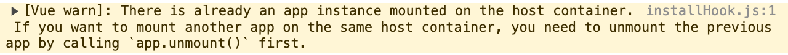
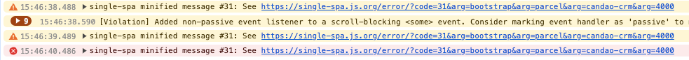
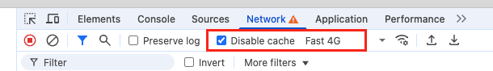
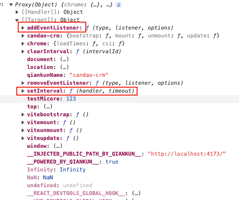

# 常见问题与解决方案

记录接入 qiankun 微前端过程中遇到的问题及对应解决方案。

## Vue 警告：宿主容器已有应用实例挂载

### 问题

在 qiankun 环境下，`app.mount('#app')` 直接传字符串选择器时，Vue 会在**全局 document** 范围内查找目标节点：

此时可能命中页面上已经被挂载过的同名 ID 节点，导致以下警告：



### 解决方案

优先从 `props.container` 内部查找挂载节点，仅在独立运行时回退到字符串选择器：

```ts
const rootId = `#${import.meta.env.VITE_APP_NAME}`
const rootContainer = microAppContext.container?.querySelector(rootId) || rootId
app.mount(rootContainer)
```

> 参考：[qiankun 官方 FAQ](https://qiankun.umijs.org/zh/faq#application-died-in-status-not_mounted-target-container-with-container-not-existed-after-xxx-mounted)

## single-spa #31：Lifecycle function's promise did not resolve or reject

### 问题

手动加载微应用时，如果上一个子应用还没有完成挂载，就快速切换到下一个子应用，可能触发 single-spa 的 `#31` 错误：



在当前项目里，这类问题在频繁切换 tab 或路由时更容易复现。

### 原因

`loadMicroApp` 返回的子应用实例是异步挂载的。如果上一个应用仍处于 `mount` / `bootstrap` 过程中，主应用又开始加载另一个子应用，single-spa 可能判定前一个生命周期超时，从而抛出：



本质上，这是**两个子应用生命周期并发交错**导致的状态竞争问题。

### 解决方案

在切换到下一个子应用前，先等待上一个子应用的 `mountPromise` 完成；如果它已经失败，则主动执行卸载清理，再继续后续切换。

当前项目在 [microApp.ts](/Users/xingfengli/Desktop/work/github/qiankun_monorepo/apps/main-app/src/stores/microApp.ts:71) 中采用了这套处理：

```ts
watch(
  activeMicroApp,
  async (newApp, oldApp) => {
    // 等待前一个应用挂载完成，防止切换过快导致加载失败
    // TODO: #31: Lifecycle function's promise did not resolve or reject
    if (oldApp?.name) {
      await loadedMicroApps.get(oldApp.name)?.mountPromise.catch(async () => {
        await unmountMicroAppInstance(oldApp.name)
      })
    }

    if (!newApp || loadedMicroApps.has(newApp.name)) return
    try {
      const microApp = loadMicroApp(newApp, newApp.configuration)
      loadedMicroApps.set(newApp.name, microApp)
      await microApp.mountPromise
    } catch (error) {
      await unmountMicroAppInstance(newApp.name)
      console.error(`[MicroApp] 子应用 ${newApp.name} 挂载失败`, error)
    }
  },
  { immediate: true },
)
```

这段逻辑的关键点有两个：

1. 切换前等待旧应用挂载完成，避免生命周期并发冲突。
2. 新应用挂载失败时主动卸载，避免残留半初始化实例影响后续切换。

### 参考链接

- [single-spa error #31](https://single-spa.js.org/error/?code=31&arg=bootstrap&arg=parcel&arg=candao-crm&arg=4000)
- [qiankun issue #2469](https://github.com/umijs/qiankun/issues/2469)
- [umijs/plugins issue #817](https://github.com/umijs/plugins/issues/817)
- [CSDN: Lifecycle function's promise did not resolve or reject](https://blog.csdn.net/Lyrelion/article/details/119245884)
- [qiankun issue #1734](https://github.com/umijs/qiankun/issues/1734)

## 定时器与事件监听销毁

### 问题

在 qiankun 场景里，子应用如果直接使用全局 `window` 注册 `setInterval`、`addEventListener` 等副作用，通常会担心两件事：

1. 子应用卸载后，定时器和事件监听是否还残留在主应用环境中。
2. 多次挂载/卸载后，是否会出现重复监听、重复轮询或内存泄漏。

Feishu 原始记录里，这一类问题归纳为“定时器 & 监听销毁”：



### 推荐做法

在 qiankun 子应用中，优先显式使用 `qiankunWindow` 提供的运行时对象，而不是直接依赖全局 `window`。尤其是下面这些能力：

- `window`
- `setInterval`
- `addEventListener`

这样做的目的不是改变业务逻辑，而是把副作用尽量绑定到 qiankun 的运行时上下文，便于在子应用卸载时一起回收。

示意写法如下：

```ts
import { qiankunWindow } from 'vite-plugin-qiankun/dist/helper'

const timer = qiankunWindow.setInterval(() => {
  // do something
}, 1000)

const onResize = () => {
  // do something
}

qiankunWindow.addEventListener('resize', onResize)

export const cleanup = () => {
  qiankunWindow.clearInterval(timer)
  qiankunWindow.removeEventListener('resize', onResize)
}
```

### 当前项目

当前项目已经在子应用入口使用了 `qiankunWindow` 判断是否运行在 qiankun 环境中，见 [main.ts](/Users/xingfengli/Desktop/work/github/qiankun_monorepo/apps/vue3-history/src/main.ts:9)：

```ts
import {
  renderWithQiankun,
  qiankunWindow,
} from 'vite-plugin-qiankun/dist/helper'

if (!qiankunWindow.__POWERED_BY_QIANKUN__) {
  renderApp()
}
```

如果后续在子应用中新增全局定时器、窗口事件或文档级监听，建议沿用同样的思路，统一基于 `qiankunWindow` 注册，并在 `unmount` 阶段显式清理。

### 参考链接

- [qiankun issue #52: clearInterval 是否可以做的更加灵活](https://github.com/umijs/qiankun/issues/52)
